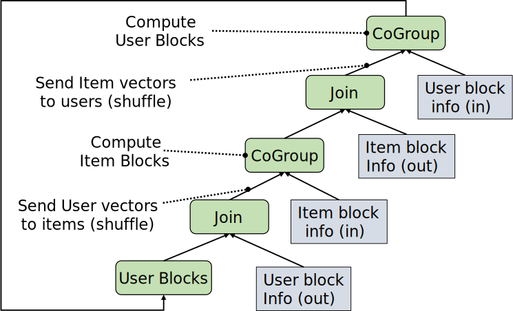
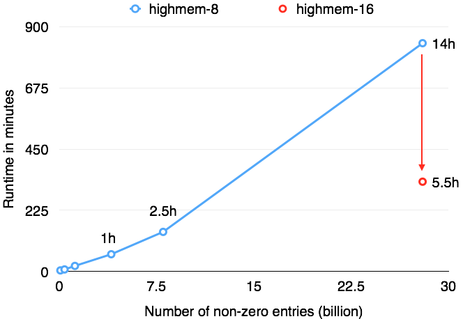

# Computing Recommendations at Extreme Scale with Apache Flink™

Posted on Mar 18th, 2015 by	[Till Rohrmann](http://data-artisans.com/author/till/)

Note: This article is a summary of the more detailed article How to factorize a 700 GB matrix with Apache Flink™.

注意：这篇文章是一篇总结，详情参考长文[《使用Apache Flink如何对700GB的矩阵进行因式分解》](http://data-artisans.com/als.html)

## Recommender Systems and Matrix Factorization

Recommender Systems are a very successful application of large scale data processing. They are used to recommend new items of interest to users of a service, such as new movies on Netflix, or shopping articles on Amazon. Recommender systems have become an essential part of most web-based services to enhance the user experience.

A powerful approach for implementing recommenders are the so called “latent factor models”, a special case of the collaborative filtering techniques, which exploit the similarity between user tastes and item characteristics: If user A andB are similar, then items liked by user A make good recommendations for userB. These latent factor models have become known to a wider audience as the most successful technique in the Netflix Prize competition (see here for a good summary). The central step is to compute a low-rank factorization of the sparse rating matrix into a user- and an item matrix:

## 推荐系统和矩阵因式分解

在大数据处理应用中，推荐系统是一个十分成功的应用。其操作过程是将用户感兴趣的商品（item）推荐给TA可以视为是给用户提供服务，比如：Netflix上的一个新电影，Amazon上的一篇购物文章。推荐系统在提高用户体验角度上，已经成为web服务中的核心部分。

推荐系统的一种功能强大的实现方式被称为“潜在因素模型--latent factor models”，[协同过滤技术](http://www.prem-melville.com/publications/recommender-systems-eml2010.pdf)的一个特例，它充分利用了用户偏好和商品特征之间的相似度：如果用户A和B是相似的，那么用户A喜欢的商品对于B来说是一个很好的推荐。这个潜在因素模型作为一项成功的技术被广泛的认知是由于Netflix Prize竞赛（综述看[这里](http://www2.research.att.com/~volinsky/papers/ieeecomputer.pdf)）。核心的步骤是计算稀疏评价矩阵的一个低秩分解，得到用户矩阵和商品矩阵：

The result of this computation is a set of factors for each user and item that express how high the user and item score in a certain dimension (sometimes these dimension can be found to correlate with intuitive concepts, like movie/music genres). If a user and an item score high in the same factors, the user probably likes the item.

这个计算的结果是每个用户和商品的一系列因子，而这表达了用户和商品在某一围度的评价得分（有时这些维度可以与直观的概念进行一一对应，如电影/音乐的流派）。如果用户和商品在相同的因子上得分很高，那么用户很可能喜欢这个商品。

##Implementing Matrix Factorization in Apache Flink™

We implemented the popular Alternating Least Squares (ALS) algorithm for matrix factorization on top of Apache Flink™’s Scala API. ALS is an iterative algorithm that alternatingly assumes one of the factor matrices as fixed and computes the other matrix, minimizing the Root Mean Square Error (RMSE) of the solution over the iterations. A good introduction to ALS and can be found in this paper.

##使用Apache　Flink实现矩阵因式分解

我们利用Apache Flink的scala API实现了流行的交替最小二乘法（Alternating Least Squares -- ALS）算法来进行矩阵因式分解。ALS是一个迭代算法：在迭代过程中，交替假设其中一个因子矩阵式固定的计算另一个矩阵，并最小化解的均方根误差（Root Mean Square Error -- RMSE）。关于ALS的一篇很好的介绍，参考[这篇文章](http://www.grappa.univ-lille3.fr/~mary/cours/stats/centrale/reco/paper/MatrixFactorizationALS.pdf)。

ALS is a computation- and communication-intensive algorithm. Various different flavors of implementing ALS on top of general-purpose data processing frameworks have been published in the recent years. We choose a variant that operates on sub-blocks of the matrices (rather than individual vectors) which has been shown to reduce overall network communication costs. This is also the variant used in Apache Spark’s MLLib, which we based our implementation on.

Flink’s data flow plan of the ALS iteration is shown in the figure below. We will post a follow-up article with more details and our experience with implementing other variants of ALS. The code of the implementation is available in this Github repository, and we plan to contribute this to the Flink codebase in the near future together with a suite of other Machine Learning algorithms.

ALS是一个计算密集型和通讯密集型的算法。近年来基于通用数据处理框架的不同方式实现的ALS已经发布过很多。我们选择如下这种方式：对矩阵的子块（sub-block）进行操作，而这个被证明是显著降低了全局网络通讯代价。这也是[Apache Spark MLLib](https://github.com/apache/spark/blob/master/mllib/src/main/scala/org/apache/spark/mllib/recommendation/ALS.scala)中使用的实现方式。

在Flink中，有关ALS迭代过程的数据流计划在下图中展示。我们在后续文章中将展示更多的细节信息以及实现ALS算法过程中的经验。实现的代码在[github](https://github.com/tillrohrmann/flink-perf/blob/ALSJoinBlockingUnified/flink-jobs/src/main/scala/com/github/projectflink/als/ALSJoinBlocking.scala)上是可以找到的，近期我们计划将这个算法贡献到Flink的机器学习算法套装中。

##Experiments on Google Compute Engine

We ran a series of experiments with our ALS implementation on Google Compute Engine. We scaled the matrix to a size of 40 million users, 5 million items, and an average of 700 ratings per user, making it a total of 28 billion ratings.
We ran all experiments with 50 latent factors, for 10 iterations.

For comparison: Netflix reported to have 5 billion ratings 2012. While 700 explicit ratings per user can be considered overly many, implicit ratings (products viewed, songs played, …) can easily become that many and more.

For the experiments, we used two cluster setups:

- 40 medium instances (“n1-highmem-8” – 8 cores, 52 GB RAM)
- 40 large instances (“n1-highmem-16” – 16 cores, 104 GB RAM)

Both cluster setups use HDFS on disks for the rating matrix input, and Google Compute Engine’s local SSDs for spilling intermediate results, sorts, and hash tables.

##在GCE上的实验

在[Google Compute Engine](https://cloud.google.com/compute/)上我们使用ALS算法实现进行了一系列的实验。我们将矩阵规模扩大到4千万用户，5百万商品，平均来看为每个用户进行了700次推荐（rating），总计进行了280亿次推荐（rating）。我们进行的所有实验都进行了10次迭代，使用了50个潜在因素。

作为比较：在2012年，Netflix报告中提出其进行了50亿次rating。当然每个用户700次推荐（rating）可能被认为太多了，但事实上潜在的推荐（rating）（如：商品展示、歌曲播放等）事实上可以有更多。

进行这些实验时，我们使用了两种集群配置：

- 40中等实例（“n1-highmem-8”-8核，52GB内存）
- 40大实例（“n1-highmem-16”-16核，104GB内存）

两种集群上的评价矩阵输入都使用基于磁盘的HDFS，同时为溢出的中间结果、排序、hash表使用GCE上的local SSD。

The following figure shows how Flink’s performance scales with the data size using either 40 medium GCE machines (blue line), or 40 large GCE machines (red line). For a small dataset (4 million users, 500k items), Flink was able to run 10 iterations of ALS in just about 20 minutes. For the full dataset of 28 billion ratings (40 million users, 5 million items), Flink was able to finish the job in 5 hours and 30 minutes. This means a fresh recommendation model daily, even for an extremely large corpus of ratings.

下图显示了Flink随着数据量增加其性能的扩展性，其中40个中等GCE机器的用蓝线表示，40个大GCE机器的用红线表示。对于小的数据集（4百万用户，50万商品），Flink可以在20分钟左右运行完ALS的10个迭代过程。对于完整的280亿的推荐（4千万用户，500万商品），Flink可以在5个小时30分钟结束这个作业。这意味着即使对于超大规模的评价任务，推荐模型仍可以每天重新算一次（也就是说这个计算时间代价可以保证模型能够及时更新）。

Note that while both the input data size (700 GB) and the sizes of the low-rank matrices (8.5 GB and 1.5 GB) are well below the aggregate memory of the cluster, the intermediate results (the vectors and factors exchanged between the user/item blocks) are several terabytes in size. In addition, two copies of the ratings matrix are cached – one partitioned by user, one partitioned by item. Many of the operations hence heavily rely on robust shuffling and out-of-core capabilities and use the local SSD storage.
注意：虽然输入数据集（700GB）和低秩矩阵（即结果）（8.5GB和1.5GB）都是小于集群的内存总和的，但中间的结果（在user/item块间交换的向量和因子）却有几个TB大小。另外评价矩阵被拷贝了两份并进行了缓存-一份使用用户进行分区（partition），另一份使用商品进行分区（partition）。很多操作严重依赖鲁棒的shuffle过程、out-of-core性能、使用local SSD存储。

##What are the secrets?

To support the above algorithm implementation efficiently on the given cluster setup, we relied heavily on Flink’s pipelined shuffles (that avoid materializing intermediate results) and its robust and efficient de-staging from in-memory to out-of-core processing. Furthermore, we found four new crucial features which we added to the system:

Handling very large records (FLINK-1296):
While many data processing programs work on a large number of small records (billions of records of a few bytes to megabytes), this ALS implementation works on comparatively few records of large size (several 100 MB). We added extra code paths to the internal sort algorithms to support memory efficient external sorting and merging of such large records.
Pipelined group operations / group sorting (FLINK-658):
Building the matrix info blocks requires reduce functions to work on large groups of data. Flink supports streaming such groups through reduce functions to avoid collecting all objects, scaling to groups that are exceeding memory sizes. We added support to have the objects within the group stream sorted on additional fields.
Memory sensitive network stack:
We tuned the network stack code that serializes records and breaks them into frames for network transfer, making sure that the subsystem does not hold onto many large objects concurrently.
Custom partitioning (FLINK-1249):
Flink now supports user specified partitioners which allow to control how the data is distributed across the cluster. This is especially important if the user operates on few data items and wants to guarantee that it is evenly distributed.

##其中的秘诀？
在给定的集群配置下，为了高效支撑上述算法的实现，我们使用了Flink的流水线shuffle（pipelined shuffles）（这能够避免将中间结果物化materializing），其鲁棒性和高效性从in-memory到out-of-core处理都有体现。更进一步，我们找到了系统中的四个重要的特性：

- 处理大记录（[Flink-1296](https://issues.apache.org/jira/browse/FLINK-1296)）

很多数据处理程序工作在大量的小记录上（数十亿记录，每条记录有几个字节），ALS工作在很少的记录上，但每个记录都很大（100MB）。我们给内部的排序算法添加了额外的代码路径，以支持内存可以高效地进行外排和归并大记录。

- 流水线进行操作和排序（[Flink-658](https://issues.apache.org/jira/browse/FLINK-658)）

创建矩阵信息block需要在大数据组（group）上运行reduce函数。Flink支持在reduce函数上流式处理group以避免收集所有的对象，这些对象集中起来会超过内存容量。我们对group stream上的对象在额外字段上的排序提供了很好的支持。

- 对内存敏感的网络栈：

我们调整了网络栈代码使得序列化记录时将其打散成frame用于网络转发，这可以确保子系统在同一时刻避免持有太多大对象。

- 用户自定义分区（[Flink-1249](https://issues.apache.org/jira/browse/FLINK-1249)）

当前Flink支持用户指定分区方法partitioner，这允许用户控制数据在集群上如何分布。当用户在少量数据条目（是记录条数，不是占用内存量）上进行操作还希望其能够取得平均的分布就显得十分重要。

##Code and further reading

For our experiments, we used a slightly modified version of the Apache Flink 0.8 development branch, which had all of the above additions. Most of the modifications have been released as part of Flink’s 0.8.0 release. The remaining ones are going into the 0.9 releases.

##相关代码和后续阅读
从我们的实验来说，我们在Apache Flink 0.8 的开发分支上进行了少量修改，这就拥有了以上全部特性。并且这些改动大多已经作为Flink 0.8.0 发布出去。至于没有发布的部分已经加入到0.9发布版中。

##References:

- [Code for the algorithm implementation](https://github.com/tillrohrmann/flink-perf/blob/ALSJoinBlockingUnified/flink-jobs/src/main/scala/com/github/projectflink/als/ALSJoinBlocking.scala)
- [Introduction to matrix factorization for recommender models at the example of the Netflix Prize](http://www2.research.att.com/~volinsky/papers/ieeecomputer.pdf)
- [Mathematical formulation of the problem, formal description of the ALS algorithm, and background on Collaborative Filtering for Implicit Feedback Datasets](http://www.hpl.hp.com/personal/Robert_Schreiber/papers/2008%20AAIM%20Netflix/netflix_aaim08%28submitted%29.pdf)
- [Netflix in 2012 reported “more than 5 billion” ratings](http://techblog.netflix.com/2012/04/netflix-recommendations-beyond-5-stars.html)

##参考

- [Code for the algorithm implementation](https://github.com/tillrohrmann/flink-perf/blob/ALSJoinBlockingUnified/flink-jobs/src/main/scala/com/github/projectflink/als/ALSJoinBlocking.scala)
- [Introduction to matrix factorization for recommender models at the example of the Netflix Prize](http://www2.research.att.com/~volinsky/papers/ieeecomputer.pdf)
- [Mathematical formulation of the problem, formal description of the ALS algorithm, and background on Collaborative Filtering for Implicit Feedback Datasets](http://www.hpl.hp.com/personal/Robert_Schreiber/papers/2008%20AAIM%20Netflix/netflix_aaim08%28submitted%29.pdf)
- [Netflix in 2012 reported “more than 5 billion” ratings](http://techblog.netflix.com/2012/04/netflix-recommendations-beyond-5-stars.html)

