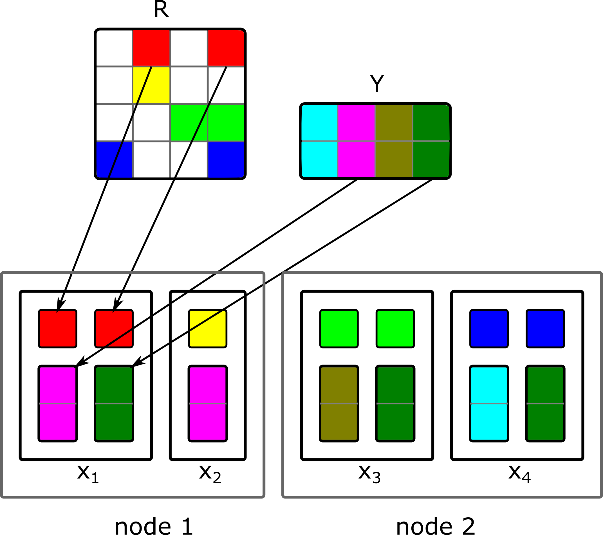
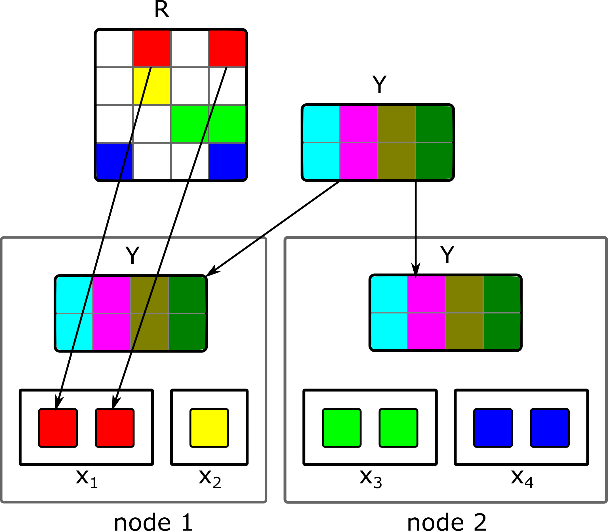
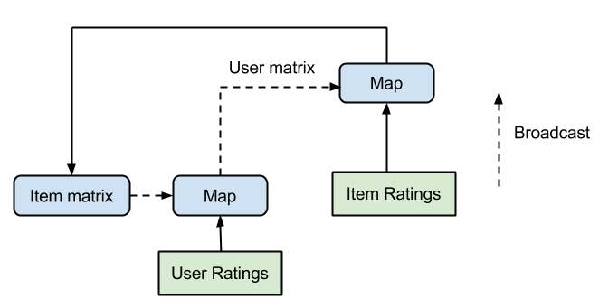
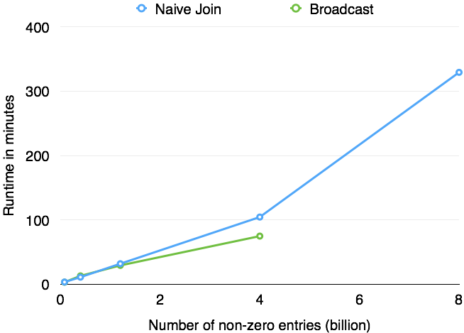
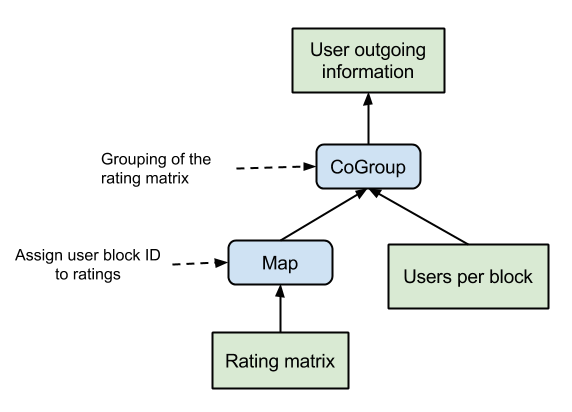
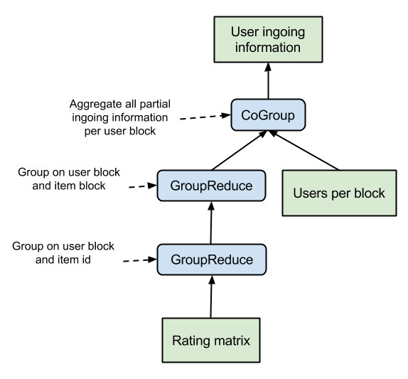

#How to factorize a 700 GB matrix with Apache Flink™

A story full of valuable insights told in 3 acts

Posted on Mar 30th, 2015 by	[Till Rohrmann](http://data-artisans.com/author/till/)

This article is a follow-up post to the earlier published article about Computing recommendations at extreme scale with Apache Flink. We discuss how we implemented the alternating least squares (ALS) algorithm in Apache Flink, starting from a straightforward implementation of the algorithm, and moving to a blocked ALS implementation optimizing performance on the way. Similar observations have been made by others, and the final algorithm we arrive to is also the one implemented in Apache Spark’s MLlib. Furthermore, we describe the improvements contributed to Flink in the wake of implementing ALS.

这篇文章是对前一篇文章《Computing recommendations at extreme scale with Apache Flink》的增补。我们讨论了如何在Apache Flink中实现ALS算法，从算法的简单实现开始，再利用Block ALS思路对齐优化性能。[其他人](http://de.slideshare.net/MrChrisJohnson/music-recommendations-at-scale-with-spark)已经做过类似的结论，最终我们实现的算法是在[Apache Spark MLLib](http://spark.apache.org/)中实现的类似思路。此外，作为实现ALS的结果，我们也将此过程中的改进贡献到Flink中。

##Prologue

Recommending the right products to users is the cornerstone for e-commerce and several internet companies. Examples of recommendations include recommending items at amazon.com, movies on netflix, songs at music services like Spotify, etc. Providing good recommendations improves the user experience and plays an important role in sales growth.

There are two main approaches to recommendation: The first one is called content-based recommendation. Content-based methods try to create a feature vector for each item describing its properties. By knowing which items the user consumed before, we can look for other items which are similar with respect to some metric and recommend these items to the user. The drawback of this approach is that it is not always possible to find the right features to describe an item.

##序

给用户推荐恰当的产品是电子商务和部分互联网公司基石。推荐系统包括在amazon上推荐商品，在netflix上推荐电影，在Spotify类似的音乐服务上推荐歌曲等等。提供好的推荐改善了用户体验，并在提高销售的过程中扮演了重要角色。

推荐系统有两种主要实现：第一种成为基于内容的推荐。基于内容的方法试图为每个商品（item）创建一个用来描述其属性（property）的特征向量（feature vector）。通过获知用户此前消费过什么商品，我们可以在某些度量标准下查找其他类似商品，并将其推荐给用户。这种方法的缺点是并不总是能够为一个商品找到其恰当的描述特征。

The alternative approach is recommending items based on the past behaviour of a group of users. Depending on the preferences of users who behave similarly, one can make predictions about what other items a user might like. This approach is called collaborative filtering (CF). The advantage of CF is that it automatically detects relationships between users and interdependencies among items which are hard to capture by a content-based method. However, CF suffers from the cold start problem which arises if one introduces a new item for which no past behaviour exists. For these items it is hard to make predictions until some users have given initial feedback.

Latent factor models

One way to solve the problem of collaborative filtering are latent factor models. Latent factor models try to find a user-factor and item-factor vector  for each user uu and item ii with ff being the number of latent factors such that the inner product calculates the prediction value . The latent factors are the representation of user preferences and item characteristics in an abstract feature space. One could think of these variables as denoting the color, shape, price or the genre of an item. In general, the latent factors represent more abstract concepts which cannot be directly grasped.

另一个方法是基于过去一段时间人群的行为进行商品推荐。基于相似行为用户的表现，我们可以预测这个用户可能喜欢其他什么商品。这个方法称之为协同过滤（CF），它的优势在于其自动检测用户间的关系，产品间的相关性，而这些很难在基于内容的方法中发现。但是CF在冷启动时效果受损，其发生在如下情况：一个没有历史行为记录的人买了一个新商品时（推荐受到挑战，冷启动）。在一些用户给出初始反馈前，这些商品很难对其进行预测。

###潜在因素模型
使用协同过滤的方式解决这个问题称之为[潜在因素模型](http://www2.research.att.com/~volinsky/papers/ieeecomputer.pdf)。它试图找到一个用户因子和商品因子，即向量，为每个用户u和商品i具有f个潜在因素，使得进行内积计算后即可以得到预测值。潜在因子是用户偏好和商品特征在抽象特征空间的一种描述。我们可以把那些变量想象成描述的是颜色、形状价格或者商品的流派。通常来说，潜在因子描述的抽象概念都是很难控制的（grasped）。

##Problem formulation

The following problem formulation is the summary of the work of [Zhou et al.](http://dx.doi.org/10.1007/978-3-540-68880-8_32) and [Hu et al.](http://citeseerx.ist.psu.edu/viewdoc/summary?doi=10.1.1.167.5120) Given the matrix of user-item ratings  with  and  where  and  represents the preference of user u for item i we can try to find the set of user- and item-factor vectors. It is noteworthy that R is intrinsically sparse because usually a user has only given feedback to a subset of all items. Therefore, we will only consider the rated items of every user to measure the performance of our latent factors model. By finding a model whose predictions are close to the actual ratings, we hope to be able to make predictions for unrated items.

Retrieving a suitable model boils down to a minimization problem of the root-mean-square error (RMSE) between existing ratings and their predicted values plus some regularization term to avoid overfitting:

.is the matrix of user-factor vectors and  is the matrix of item-factor vectors.  and  denotes the number of existing ratings of user u and item i, respectively. According to [Zhou et al.](http://dx.doi.org/10.1007/978-3-540-68880-8_32), this weighted-λ-regularization gives best empirical results. If we write this in matrix notation, then we easily see that we are actually looking for a low-rank matrix factorization of RR such that .

##问题的形式化描述

下面有关问题形式化描述的内容摘要自 [Zhou et al.](http://dx.doi.org/10.1007/978-3-540-68880-8_32) and [Hu et al.](http://citeseerx.ist.psu.edu/viewdoc/summary?doi=10.1.1.167.5120)的相关工作。给定用户-商品的评价矩阵其中  、，而代表了用户u对商品i的偏爱，我们可以尝试从中发现用户和商品的特征向量。值得注意的是R本质上是稀疏的，因为通常境况下用户只能给出所有商品一个子集的反馈意见。因此，我们只使用每个用户评价过的商品对我们的潜在因素模型进行效果度量。我们要找的模型，其预测值应当与实际评价尽量接近，我们希望使用这个预测模型给没有评价的商品进行预测。
获取一个合适的模型归纳起来是一个最小化均方根误差（RMSE）的问题，该误差描述了当前评价与模型预测值之间的差异，并公国一些正则化项以避免过拟合：

其中是用户特征向量矩阵，是商品特征向量矩阵。  and 代表了用户u和商品i已存在的评价数量。根据[Zhou et al.](http://dx.doi.org/10.1007/978-3-540-68880-8_32)的描述，加权的正则化系数λ应该通过最佳实践获得。如果我们使用矩阵的记号对其书写，可以很容易看到我们实际上寻找的是R的低秩矩阵分解，并使得 。

By fixing one of the sought-after matrices we obtain a quadratic form which can be easily minimized with respect to the remaining matrix. If this step is applied alternately to both matrices we can guarantee that for each step we converge closer to the solution. This method is called alternating least squares (ALS). If we fix the item-factor matrix and solve for the user-factor matrix we obtain the following equation which we have to solve for each user-factor vector:

通过固定其中一个矩阵（较好的），我们可以获得有关剩下矩阵的一个二次方程形式，而这是容易最小化的。如果在两个矩阵上交替执行这个步骤，我们可以保证每一步都是收敛地接近答案。这个方法被称之为交替最小二乘法（ALS）。如果我们固定商品特征矩阵，并对用户特征矩阵求解，我们可以为得到下面的公式，而这个就是我们要为每个用户特征向量求解的：

with  being the rating vector of user u (the uth row vector of R) and  is the diagonal matrix where

. For the sake of simplicity we set  and . The item-factor vectors can be calculated in a similar fashion:

with  being the rating vector of item i (iith column vector of R) and  is the diagonal matrix where

. Again we can simplify the equation by  and .

其中，是用户u的评价向量（也就是R的第u行向量），是对角线矩阵，其中

为了简单起见，我们假设 、。商品特征向量可以通过类似的方式计算：

其中是商品i的评价向量（也就是R的第i列向量），是对角线矩阵，其中

并且我们使用简化的 、 。

Since we want to factorize rating matrices which are so big that they no longer fit into the main memory of a single machine, we have to solve the problem in parallel. Furthermore, the ALS computation is inherently iterative, consisting of a series of optimization steps. Apache Flink constitutes an excellent fit for this task, since it offers an expressive API combined with support for iterations. An in-depth description of Apache Flink’s programming API can be found here.

The rating matrix RR is sparse and consequently we should represent it as a set of tuples (rowIndex, columnIndex, entryValue). The resulting user-factor and item-factor matrices will be dense and we represent them as a set of column vectors (columnIndex, columnVector). If we want to distribute the rating and user/item matrices, we can simply use Flink’s DataSet, which is the basic abstraction to represent distributed data. Having defined the input and output types, we can look into the different implementations of ALS.

因为我们希望因式分解的评价矩阵太大，以至于在一台机器的内存中都不能够放下，我们不得不并行化解决这个问题。更进一步，ALS的计算从本质上说是迭代的，包含一些列的求取最优化的步骤。Apache Flink对于这类任务是十分合适的，因为它提供很强表达能力的API，它可以很好地支持迭代过程。Apache Flink的编程API的深入描述参照[这里](http://flink.apache.org/docs/0.8/programming_guide.html)。
评价矩阵R是稀疏的，因此我们应该使用如下的tuple集合来表达这个矩阵（rowIndex，columnIndex，entryValue）。作为结果的用户特征和商品特征矩阵将是稠密的，我们将它们表述成列向量的集合（columnIndex，columnVector）。如果我们希望将评价矩阵和用户/商品矩阵分布式处理，可以使用Flink的DataSet，它是分布式数据的一个基本抽象表达。在定义好输入输出类型后，我们可以深入ALS的具体实现。

## Act I: Naive ALS
As a first implementation, we simply implemented the formulas of how to compute the user vectors from the item matrix and vice versa. For the first step, the item matrix is initialized randomly. In order to calculate a new user vector, we have to collect all item vectors for which the user has provided a rating. Having these vectors and the corresponding ratings, we can solve the equation which gives us the new user vector. Afterwards, the new DataSet of user vectors is used to compute the new item matrix. These two steps are executed iteratively to obtain the final solution.
But how can we realize these operations with Flink? At first, we can observe that all item vectors are uniquely identified by their column indices. The same holds for the ratings which are identified by a pair of row and column indices (userID, itemID). We can combine the item vectors with their corresponding ratings by joining the item vectors with the ratings where the vector’s column index is equal to the column index of the rating.
This join operation produces a tuple of user id u, the rating rui and the corresponding item vector yi. By grouping on the user id, we obtain all item vectors and the ratings for one user. Within the group reduce operation we can construct the matrix Au and the right-hand side Vu from the item vectors. The solution to this equation system gives us the new xu. The data partitioning of the group reduce operation is depicted in the figure below. Each user vector xu is calculated within its own parallel task.

## Act I：基础版ALS
作为第一种实现，我们使用公式简单实现了如何从商品矩阵求出用户矩阵，反之同理（从商品矩阵求出用户矩阵）。第一步我们对商品矩阵进行随机初始化。为了计算出一个新的用户向量，我们必须把用户评价的所有商品向量收集起来。有了这些向量和相应的评价，就可以求解方程并给出新的用户向量。之后，这个新用户向量构成的数据集被用来计算新的商品矩阵。迭代执行这两个步骤就可以获得最终的结果。

但在Flink中我们应如何实现这些运算？首先，所有的商品向量由它们的列索引（column index）唯一标识。类似地，一对行列索引值（userID，itemID）唯一标识了一个评价。我们可以把商品向量与评价矩阵进行join，使得商品向量的column index与评价矩阵的column index相同。

join操作将产生一个元组：由用户id ，评价值和相应的商品向量组成。通过在用户id上进行分组，可以将同一用户在所有商品向量和评价聚集到一起。在这个分组（group）上进行reduce操作，可以从商品向量（集合）中构造出矩阵，和右边的项。而方程式的解就是我们需要的新的。对数据进行分区的group和reduce操作在下面展示，每个用户向量在并行的task上独自计算得出。

The Flink code for one iteration step looks the following:

在一个迭代过程中的Flink代码如下：

	// Generate tuples of items with their ratings
	val uVA = items.join(ratings).where(0).equalTo(1) {
		(item, ratingEntry) => {
			val Rating(uID, _, rating) = ratingEntry
			(uID, rating, item.factors)
		}
	}

	// Group item ratings per user and calculate new user-factor vector
	uVA.groupBy(0).reduceGroup {
		vectors => {
			var uID = -1
			val matrix = FloatMatrix.zeros(factors, factors)
			val vector = FloatMatrix.zeros(factors)
			var n = 0
		
			for((id, rating, v) <- vectors) {
				uID = id
				vector += rating * v
				matrix += outerProduct(v , v)
				n += 1
			}

			for(idx <- 0 until factors) {
				matrix(idx, idx) += lambda * n
			}
		
			new Factors(uID, Solve(matrix, vector))
		}
	}

This ALS implementation successfully computes the matrix factorization for all tested input sizes. However, it is far from optimal, since the algorithm creates for each user who rates an item i a copy of the item vector yi. If for example, several users which reside on one node have rated the same item, then each of them will receive their own copy of the item vector. Depending on the structure of the rating matrix, this can cause some serious network traffic which degrades the overall performance. A better solution which mitigates this problem will be presented in act III.

ALS为所有输入成功计算出矩阵的分解结果。但是，它远没有进行优化，因为算法中为对商品进行评价的每个用户都创建了一个商品向量的拷贝。如果在同一台机器上处理的几个用户都评价了相同的商品，那么每个都会收到这个商品向量的一份拷贝。依赖于评价矩阵的结构，这可以引起非常严重的网络问题，而这对将严重影响整体性能表现。一个相对好点解决这个问题的方法将会在下面的Act II中展示。

##Act II: ALS with broadcasting

The naive ALS implementation had to calculate for each step which item vectors are needed to compute the next user vector. Depending on the density of the rating matrix RR it might be the case that almost all item vectors have to be transferred. In such a case, we could omit the expensive join and group reduce operations and simply broadcast the whole item matrix YY to all cluster nodes. By grouping the ratings according to their user ids, we simply have to apply a map operation to the grouped user ratings. Within the map operation we have access to all of the broadcasted item vectors and the ratings of the respective user. Thus, we can easily calculate the new user vector. The corresponding data partitioning for the map operation which calculates the next user vectors is shown below. Each of the parallel tasks, responsible to calculate a single user vector xuxu only requires the respective user ratings. The necessary item vectors are accessed through the broadcasted item matrix.

##Act II：使用广播变量的ALS

原始ALS的实现在每个迭代中都需要进行下面的计算：为计算下一迭代的用户向量，需要使用哪些商品向量。受制于矩阵的密度（density），这个过程可能导致不得不传递所有的商品向量。在这种情况下，我们可以将整个商品矩阵广播到所有集群中的节点上，就可以避免昂贵的join和group reduce操作。利用用户id对评价矩阵进行分组，我们只需要在分组好的用户评价上应用map操作。利用map操作我们可以访问已经广播的整个商品向量以及与这个用户相关的评价内容。这样，我们可以简单的计算新的用户向量。与map操作有关的数据分区（partition），用来计算下一阶段的用户向量的过程如下。每个并行的task，负责计算一个用户向量，这只需要与之对应的用户评价信息。必要的商品向量可以从广播过的商品矩阵中获得。

For the new item matrix we would do the same, only that we broadcast the new user matrix and group the ratings according to the item ids. The grouping of the ratings can be done outside of the iteration and thus will be calculated only once. Consequently, the final iteration step only consists of two map and two broadcast operations. The iteration is shown in the picture below.

为计算新的商品矩阵我们也进行类似地操作，只需要广播新的用户矩阵，并将评价矩阵在商品id上进行分组。对评价矩阵的分组可以在迭代外进行，这可以保证其只被计算一次。作为结果，最终的迭代步骤只包括两次map和两次广播操作。这个迭代过程如下图所示：

To support the above presented algorithm efficiently we had to improve Flink’s broadcasting mechanism since it easily becomes the bottleneck of the implementation. The enhanced Flink version can share broadcast variables among multiple tasks running on the same machine. Sharing avoids having to keep for each task an individual copy of the broadcasted variable on the heap. This increases the memory efficiency significantly, especially if the broadcasted variables can grow up to several GBs of size.

##Runtime comparison: Naive vs. Broadcast
In order to compare the performance of the broadcast variant to the naive ALS implementation, we measured the execution time for different input matrices. All experiments were run on Goolge Compute Engine where we used a cluster consisting of 40 medium instances (“n1-highmem-8”, 8 cores, 52 GB of memory).
As input data, we generated random rating matrices of varying sizes and calculated 10 iterations of ALS with 50 latent factors. For each row of the random rating matrix a normal distributed number of non-zero entries was generated. We started with 400000 users and 50000 items where each user rated 200 items on average. We increased the size of the rating matrices up to 16 million users and 2 million items where each user rated 500 items on average. Thus, the largest rating matrix contained 8 billion ratings.

为保证上述算法高效运行，我们改进了Flink的广播变量机制，因为这很容易就会成为这个实现的瓶颈。Flink的增强版本可以在运行于同一台机器的多个任务间共享一个广播变量。共享机制避免在内存中为每一个独立运行的task保存广播变量的一份拷贝。这显著提高了内存效率，尤其是当广播变量增长到GB级别后。

##运行时对比：原始版本vs广播变量版本

为了比较广播变量版本与原始版本之间的性能，我们对不同级别的输入度量了执行时间。所有的实验都运行在GCE上，其上使用的集群由40个中等实例组成（“n1-highmem-8”，8核，52GB内存）
作为输入数据，我们随机生成了多个级别的评价矩阵，并利用50个潜在因素进行10轮迭代计算。对于评价矩阵的每一行在产生非零元组时使用了正态分布（normal distribute）。一开始，我们使用40万用户和5万商品，其中每个用户平均评价200个商品，持续增长到1600万用户和200万商品，平均每个用户评价500个商品。这样，最大的评价矩阵包含80亿评价。

The simplification of the broadcast variant’s data flow leads to a significantly better runtime performance compared to the naive implementation. However, it comes at the price of degraded scalability. The broadcast variant only works if the complete item matrix can be kept in memory. Due to this limitation, the solution does not scale to data sizes which exceed the complete memory capacity. This disadvantage can be seen in the figure above. The factorization of our input matrices with more than 4 billion non-zero entries failed using the broadcast ALS version whereas the naive implementation successfully finished.
The broadcast ALS implementation can be found here. The code for the naive join ALS implementation can be found here.

与原始实现相比，广播变量对数据流的简化使得运行时表现有了显著的提高。但是，它带来的问题时扩展能力的下降。广播变量方法只有在商品矩阵能够完整放入内存时能够工作。由于这个限制，当数据容量超出了整个内存容量，这个解决方案就不能工作了。这个缺陷可以在上图中看到。当输入矩阵超过40亿非零记录时，使用广播变量ALS版本就失败了，而原始版本还能够成功结束。
广播变量ALS的实现参见[这里](https://github.com/tillrohrmann/flink-perf/blob/master/flink-jobs/src/main/scala/com/github/projectflink/als/ALSBroadcast.scala)，原始join ALS实现版本的代码可以参见[这里](https://github.com/tillrohrmann/flink-perf/blob/master/flink-jobs/src/main/scala/com/github/projectflink/als/ALSJoin.scala)。

##Act III: Blocked ALS
The main drawback of the naive implementation is that item vectors are sent to each user individually. For users residing on the same machine and having rated the same item this means that the item vector will be sent several times to this machine. That causes unnecessary network traffic and is especially grave since ALS is so communication intensive.
The main idea to overcome this problem is to group the item vectors with respect to the users who are kept on the same machine. That way each item vector will be only sent at most once to each participating working machine. We achieve the user and item grouping by using blocks of users and items for our calculations instead of single users and items. These blocks will be henceforth called user and item blocks.
Since we do not want to send each item block to all user blocks we first have to compute which item vectors of a given block has to be sent to which user block. With this outgoing information we can generate for each user block the partial item block update messages. In order to calculate the outgoing information we have to look for each user block ub if there exists a user u in block ub who has rated a given item i contained in block ib. If this is the case, then the block ib has to send the item vector yi to the user block ub. This information can be calculated by grouping the rating matrix R with respect to the item blocks and computing for each item to which user block it has to be sent. The corresponding data flow plan is given below.

##Act III：ALS的块方案（Block）
原始版本的最大缺陷是商品向量被单独发送给每一个用户。对同一台机器上处理的用户评价了同一个商品，这就意味着商品向量将被多次发送到这台机器。这将引起非必要的网络开销，由于ALS是通讯敏感的，这个问题就更加致命。
解决这个问题最主要的想法是将商品向量按照（由同一台机器处理的）用户进行group。这样，每个商品向量给每个参与计算的机器最多发送一次。在我们的计算中，使用用户和商品的块（block）替代单条（single），可以对用户和商品进行group。在后文中，将块称之为用户块和商品块。
由于我们不希望把每一个商品块发送给所有用户块，我们需要对给定的块内的商品向量发送到哪个用户块进行提前计算。使用出边（outgoing information）信息，我们可以为每个用户块产生商品块的更新信息。为了计算出边信息，需要查看每一个用户块，只要在块中包含的商品条目被这个用户块中任意一个用户评价。如果在这种情况下，商品块会将商品条目发送给用户块。这个信息可以通过对评价矩阵依据商品块进行分组计算得出，计算商品块中每个商品条目应该被发送到哪个用户块中。相应的数据流执行计划如下图所示。

Additionally to the outgoing information, we also need the ingoing information to compute the user block updates out of the partial update messages. Since every item vector i is only sent at most once to each user block and there might be several users in a block who have rated this item, we have to know who these users are and what their rating is. With this information, we can incrementally construct the matrices Au for all u in a given block b by adding the item vector i only to those Au for which a rating rui exists. That way, we do not have to keep all item vectors in memory and can instead work only on one partial update message at a time in a streaming-like fashion. The streaming aspect comes in handy for Flink’s runtime which natively supports pipelined operations and thus avoids to materialize intermediate results which can easily exceed the total memory size.
The ingoing information are computed from the rating matrix R by grouping it with respect to the user block and item. That way, we can compute for each user block ub and item i the set of users belonging to block ub and having rated item i. By grouping these results according to the item block ib, we can compute the partial ingoing information for each pair of user and item blocks (ub,ib). To finalize the ingoing information we simply have to aggregate all user-item block pairs with respect to the user block. The corresponding data flow is given below.

与出边信息相对，我们同样需要计算入边信息（ingoing information），利用外部部分更新信息对用户块进行更新。由于每个商品向量对每个用户块最多只发送一次，在一个块内可能会存在多个用户都评价了该商品，我们必须知道这些用户到底是哪些，他们的评价又是什么。利用这个信息，我们可以增量构建矩阵，对于给定块中的用户，对于存在评价的商品向量，都累加到中。这样我们不需要在内存中保留所有的商品向量，同一时间只需要保存一部分更新信息就可以工作，而这就是一种流处理风格。在Flink的运行过程中很容易使用这种流处理风格，它原生支持流水线（pipeline）操作，这可以避免对中间结果的物化，而这个中间结果可以很容易超过内存限制。
入边信息可以通过对评价矩阵进行分组得到，分组依据用户块和商品。这种方式中，对每个用户块和商品，只要中的用户评价过商品。对结果依据商品块进行分组，可以为每个用户和商品块对（pair），计算部分入边信息。只需要在所有用户-商品块对上依据用户块进行聚集，就可以计算出最终的入边信息。相应的数据流程如下图所示：

Having calculated these meta information and having blocked the user and item matrix, we can think about the actual ALS iteration step. The iteration step is in fact similar to the naive implementation only with the difference that we are operating on user and item blocks. At first, we have to generate the partial update messages for each user block. This can be done by joining the block item matrix with the outgoing item information. The outgoing information for the item block ibib contains the information to generate for each user block ubub a partial update message containing only the required item vectors from ibib.

The partial update messages are grouped according to their user block ubub and joined with the ingoing user information. The grouping and joining can be realized as a coGroup operation which avoids to explicitly construct an object containing all partial update messages. Instead we can exploit Flink’s streaming capabilities and process one partial update message after the other within the coGroup function. The coGroup function is responsible to construct the different AuAu matrices for each user uu in a user block. This can be done incrementally by adding the currently processed item vector yiyi from a partial update message to all AuAu and VuVu where the user uu has rated item ii. The ingoing information contains this information and also the rating value. After having processed all partial update messages, the finished AuAu and VuVu can be used to calculate the new user vector xuxu. The resulting data partitioning for the coGroup operation is depicted below. Ideally, we have only one user block per node so that the amount of redundantly sent data is minimized.

在计算了这些元信息并将用户和商品矩阵分块后，可以讨论ALS迭代步骤的实际工作过程了。这个迭代过程事实上与原始的实现是很像的，唯一的区别是我们在用户和商品块上进行操作。第一步，需要为每个用户块产生部分更新信息。这可以通过商品块矩阵和出边信息进行join就可以计算出这些信息。每个商品块出边信息包含的内容有如下作用：为每个用户块和中的商品向量产生部分更新信息。

这些部分更新信息可以利用用户块进行分组，并和入边用户信息进行join。这个分组（group）和join可以通过coGroup操作符实现，这可以避免构建包含全部部分更新信息的大对象。相应地，我们充分利用Flink的流处理能力，在coGroup函数中处理完一个部分更新信息就可以处理下一个。这个coGroup函数负责为用户块中的每个用户构建一个矩阵。这可以通过将当前处理的商品向量增量累加获得，

