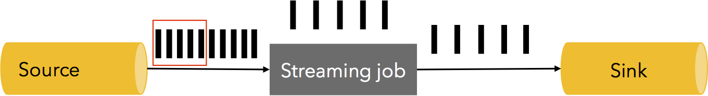
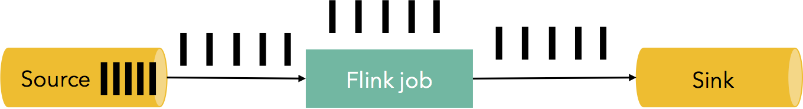

# How Apache Flink™ handles backpressure

> August 31, 2015 - [Flink Features](https://data-artisans.com/blog/category/flink-features) by [Ufuk Celebi](https://data-artisans.com/blog/author/ufuk)

People often ask us how Flink deals with backpressure effects. The answer is simple: Flink does not use any sophisticated mechanism, because it does not need one. It gracefully responds to backpressure by virtue of being a pure data streaming engine. In this blog post, we introduce the problem of backpressure. We then dig deeper on how Flink’s runtime ships data buffers between tasks and show how streaming data shipping naturally doubles down as a backpressure mechanism. We finally show this in action with a small experiment.

人们经常问我们Flink如何处理背压效应。我们的答案很简单：Flink并没有专门应对背压的复杂机制，原因在于Flink不需要。它可以优雅地应对背压，这得益于Flink是纯粹的数据流处理引擎。在接下来，我们将介绍背压问题，并深入Flink的运行时（runtime），看看它如何在任务（task）间转移数据，并展示流数据如何在流转过程中自然降速，而这构成了它应对背压的机制。最后，我们通过一个小小的实验展示了这一点。

## What is backpressure

## 什么是背压

Streaming systems like Flink need to be able to gracefully deal with backpressure. Backpressure refers to the situation where a system is receiving data at a higher rate than it can process during a temporary load spike. Many everyday situations can cause backpressure. For example, garbage collection stalls can cause incoming data to build up or a data source may exhibit a spike on how fast it is sending data. Backpressure, if not dealt with correctly, can lead to exhaustion of resources, or even, in the worst case, data loss.

像Flink一样的流处理系统需要具备优雅应对背压的能力。背压通常指的是如下场景：在一段时间内（通常是较短时间），系统在以超过其处理能力的速率接收数据，这造成了临时的负载尖峰。很多日常场景都会造成背压，比如：垃圾回收的停顿可以造成流入数据的堆积（build up），或者数据源在以更快的速度发送数据，表现成尖峰形式。背压，如果不能够正确地处理，可能导致资源耗尽，更甚者，在最坏的情况下将造成数据丢失。

Let us look at a simple example. Assume a data streaming pipeline with a source, a streaming job, and a sink that is processing data at a speed of 5 million elements per second in its steady state as shown below (one black bar represents 1 million elements, the image is an 1 second “snapshot” of the system):

让我们以一个简单的例子看一下。假设一个数据流管道（pipeline）有一个源（source）、一个流作业（streaming job）、一个sink，在稳定状态下，它处理数据的速率是每秒钟500万记录，如下图所示（每个黑块代表100万记录，这张图展示了系统中1秒钟的“快照”）：

At some point, either the streaming job or the sink have an 1 second stall, causing 5 million more elements to build up. Alternatively, the source might have a spike, producing data at a double rate for the duration of one second.

在某些时刻，无论是流作业（streaming job）或者sink产生1秒钟的停顿，将导致500万多余元组的堆积。与之对应的，源（source）可能产生一个尖峰，在这一秒内其会以两倍速度生产（发射）数据。

How do we deal with situations like that? Of course, one could drop these elements. However, data loss is not acceptable for many streaming applications, which require exactly once processing of records. The additional data needs to be buffered somewhere. Buffering should also be durable, as, in the case of failure, this data needs to be replayed to prevent data loss. Ideally, this data should be buffered in a persistent channel (e.g., the source itself if the source guarantees durability – Apache Kafka is a prime example of such a channel). The ideal reaction is to “backpressure” the whole pipeline from sink to the source, and throttle the source in order to adjust the speed to that of the slowest part of the pipeline, arriving at a steady state:

我们如何应对类似的情况呢？当然，一种方法是丢弃这些多余的数据。但是，数据丢失在大多数流应用中是不被接受的，它们都需要对记录的 **一次且仅一次（exactly once）** 的处理逻辑。多余的数据需要缓存（buffer）在某些地方。缓存应当是持久的，因为在某些failure的情况下，需要进行数据重演（replay）才能防止数据丢失。理想状况下，数据应当缓存在持久化管道（persistent channel）中（例如，源本身就具有保证持久性的特点，Apache Kafka是一个典型的具有类似特征的样例）。理想的情况下，应对背压，整个管道应从sink反压到source，同时通过调节source使其适应（adjust）管道（pipeline）中最慢一部分的速度，并达到稳定状态：

## Backpressure in Flink

## Flink中的背压

The building blocks of Flink’s runtime are operators and streams. Each operator is consuming intermediate streams, applying transformations to them, and producing new streams. The best analogy to describe the network mechanism is that Flink uses effectively distributed blocking queues with bounded capacity. As with Java’s regular blocking queues that connect threads, a slower receiver will slow down the sender as soon as the buffering effect of the queue is exhausted (bounded capacity).

Flink在运行时通过算子（operator）和流（stream）构建块（block）。每个算子通过应用转换操作（transformation），消费（consume）中间的流（intermediate stream），并产生（produce）新的流。描述这个网络机制的最佳类比是，Flink通过有限容量达成了高效的分布式阻塞队列。与java中常规的连接线程阻塞队列类似，较慢的接收者（receiver）将使发送者（sender）降速，其通过队列缓冲效果耗尽（有限容量）来实现。*换句话说，接收者的接收队列已经满了，不再接收新的数据了，发送者自然不能够再发送新的数据了，则发送者作为[上游发送者的接收者]也随之缓存数据并发生阻塞，依次完成反压。*

Take the following simple flow between two tasks as an example of how Flink realizes back pressure:

下面的例子，两个任务（task）的简单流，展示了Flink如何实现背压：

1. Record “A” enters Flink and is processed by Task 1.  
2. The record is serialized into a buffer,
3. This buffer is shipped to Task 2, which then reads the record back from the buffer.

1. 记录“A”进入到Flink中，并被Task 1处理。
2. 纪录被序列化到缓存中。
3. 缓存数据被发送（ship）到Task 2中，它将从缓存中读取记录。

The central observation is the following: In order for records to progress through Flink, buffers need to be available. In Flink these distributed queues are the logical streams, the bounded capacity is realized via the managed buffer pools per produced and consumed stream. A buffer pool is a set of buffers, which are recycled after they are consumed. The general idea is simple: You take a buffer from the pool, fill it up with data, and after the data has been consumed, you put the buffer back into the pool, where you can reuse it again.

核心观察如下：为了使记录在Flink中运行（progress），需要提供缓冲区（buffer）。在Flink中，分布式队列是逻辑上的流（logical stream），通过对每个生产和消费流（produced and consumed stream）管理缓冲池（buffer pool）实现了有界容量。缓冲池（buffer pool）是一组缓冲区（buffer），它在消费之后会被循环使用。一般的想法很简单：从池（pool）中获取一个缓冲区（buffer），将其填满数据（fill up），在数据被消费之后，将缓冲区返回池中，之后就可以重复使用了。

The size of these pools varies dynamically during runtime. The amount of memory buffers in the network stack (= capacity of the queues) defines the amount of buffering the system can do in the presence of different sender/receiver speeds. Flink guarantees that there are always enough buffers to make *some progress*, but the speed of this progress is determined by the user program and the amount of available memory. More memory means the system can simply buffer away certain transient backpressure (short periods, short GC). Less memory means more immediate responses to back pressure.

缓冲池的大小在运行时会动态变化。在网络堆栈中的内存缓冲区（memory buffer）数量（=队列容量）定义了系统的缓冲量，它将决定在不同速率的发送者/接收者存在的情况下的系统表现。Flink保证总有足够的缓冲区用来实现一些操作（some progress），但这些操作（progress）的速度将由用户程序和可用内存数量决定。更大的内存意味着系统可以对特定瞬时背压（short periods、short GC）进行简单的缓冲。更小的内存意味着系统对背压做出更快响应。*换句话说，更大的内存，应对瞬时背压时，只用当前节点的缓存就可以杠住，不会影响上游节点的发送速率；更小的内存，使得背压带来的降速会更快地传导到源头。*

Take the simple example from above: Task 1 has a buffer pool associated with it on the output side and task 2 on its input side. If there is a buffer available to serialize “A”, we serialize it and dispatch the buffer.

用上面的简单示例：Task 1在输出端（output side）有与之关联的一个缓冲池（buffer pool），Task 2在输入端（input side）也有。如果有一个缓冲区可以序列化“A”，我们将对其序列化并派（dispatch）到缓冲区。

We have to look at two cases here:

- Local exchange: If both task 1 and task 2 run on the same worker node (TaskManager), the buffer can be directly handed over to the next task. It is recycled as soon as task 2 has consumed it. If task 2 is slower than 1, buffers will be recycled at a lower rate than task 1 is able to fill, resulting in a slow down of task 1.
- Remote exchange: If task 1 and task 2 run on different worker nodes, the buffer can be recycled as soon as it is on the wire (TCP channel). On the receiving side, the data is copied from the wire to a buffer from the input buffer pool. If no buffer is available, reading from the TCP connection is interrupted. The output side never puts too much data on the wire by a simple watermark mechanism. If enough data is in-flight, we wait before we copy more data to the wire until it is below a threshold. This guarantees that there is never too much data in-flight. If new data is not consumed on the receiving side (because there is no buffer available), this slows down the sender.

我们可以看到如下两种情况：

- 本地交换：如果Task 1和Task 2在同一个worker节点（TaskManager）运行，这个缓冲区可以被下一个task直接操作。它回收（recycle）的速度与task 2的消费速度相一致。如果Task 2比Task 1慢，缓冲区将以慢于task 1的速度进行回收，以至于缓冲区将被填满，造成的结果是对task 1进行降速。*（因为task 1在对“A”进行序列化的时候没有多余空间，导致task 1无法完成序列化，并等待资源）*

- 远程交换：如果Task 1和Task 2运行在不同的worker节点，则缓冲区的回收速度与其线路速度相一致（TCP 通道）。在接收端，数据从线路中复制到输入缓冲池（input buffer pool）的缓冲区中。如果没有足够的缓冲区可用，从TCP连接中的读取操作将被中断。在简单的watermark机制下，输出端从不会将太多数据放到线路中。如果有大量数据“在空中”（in-flight），在复制更多数据到线路前，我们将等待直到“在空中”的数据量降到阈值以下。这一点保证了“在空中”的数据量永远不会多。如果新的数据在接收端还没有被消费（因为这里没有更多的缓冲区可用），这将传导到发送端。

This simple flow of buffers between fixed-sized pools enables Flink to have a robust backpressure mechanism, where tasks never produce data faster than can be consumed.

具有固定大小容量的缓冲池，为简单的流赋予了缓冲能力，这使得Flink具有很强的背压机制，其使得任务生产数据的速度永远不会超过其消费的速度。

The mechanism that we described for data shipping between two tasks naturally generalizes to complex pipelines, guaranteeing that backpressure is propagated through the whole pipeline.

上面介绍的两个task之间的数据传送机制可以很自然地应用到复杂的管道（pipeline）中，保证了背压在整个管道网络中进行传播。

Let us look at a simple experiment that shows Flink’s behavior under backpressure at work. We run a simple producer-consumer streaming topology with tasks exchanging data locally, where we vary the speed at which the the tasks produce records. For this test, we use less memory than default to make the back pressure effects more visible for presentation reasons. We use 2 buffers of size 4096 bytes per task. In usual Flink deployments, tasks will have more buffers of larger size, which only improves the performance. The test is run in a single JVM, but uses the complete Flink code stack.

让我们看一个简单的实验，它展示了在工作背压的情况下Flink的表现。运行一个简单的生产者-消费者流拓扑，其中task在本地交换数据，在task生产记录这一端，我们可以改变其速率。对于测试，我们使用少于默认值的内存，以便能够明显地看到背压效果，并很好地展示。我们为每个task分配两个4096字节的缓冲区。在通常Flink的部署中，任务将有更多大的缓冲区，这只是增强了其性能。这个测试运行在单一的JVM上，但使用了Flink完整的代码栈。

The figure shows the average throughput as a percentage of the maximum attained throughput (we achieved up to 8 million elements per second in the single JVM) of the producing (yellow) and consuming (green) tasks as it varies by time. To measure average throughput, we measure the number of records processed by the tasks every 5 seconds.

该图展示平均吞吐量于最大吞吐量的比值（我们在单个JVM中达到了800万每秒最大吞吐值），其中生产（黄色）和消费（绿色）的任务随时间变换图。为了测量平均吞吐，我们每5秒测量一次通过任务的记录数。

First, we run the producing task at 60% of its full speed (we simulate slow-downs via Thread.sleep() calls). The consumer processes data at the same speed without being slowed down artificially. We then slow down the consuming task to 30% its full speed. Here, the backpressure effect comes into play, as we see the producer also naturally slowing down to 30% of its full speed. We then stop the artificial slow down of the consumer, and both tasks reach their maximum throughput. We slow down the consumer again to 30% of its full speed, and the pipeline immediately reacts with the producer slowing down to 30% its full speed as well. Finally, we stop the slow-down again, and both tasks continue at 100% their full speed. All in all, we see that producer and consumer follow each other’s throughput in the pipeline, which is the desired behavior in a streaming pipeline.

首先，我们以全速的60%运行生产者任务（我们模拟降速通过Thread.sleep()调用来实现）。消费者以相同的速度消费数据而不会人为减慢速度。接下来jiang'du

## Summary

Flink, together with a durable source like Kafka, gets you immediate backpressure handling for free without data loss. Flink does not need a special mechanism for handling backpressure, as data shipping in Flink doubles as a backpressure mechanism. Thus, Flink achieves the maximum throughput allowed by the slowest part of the pipeline.
