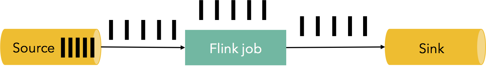
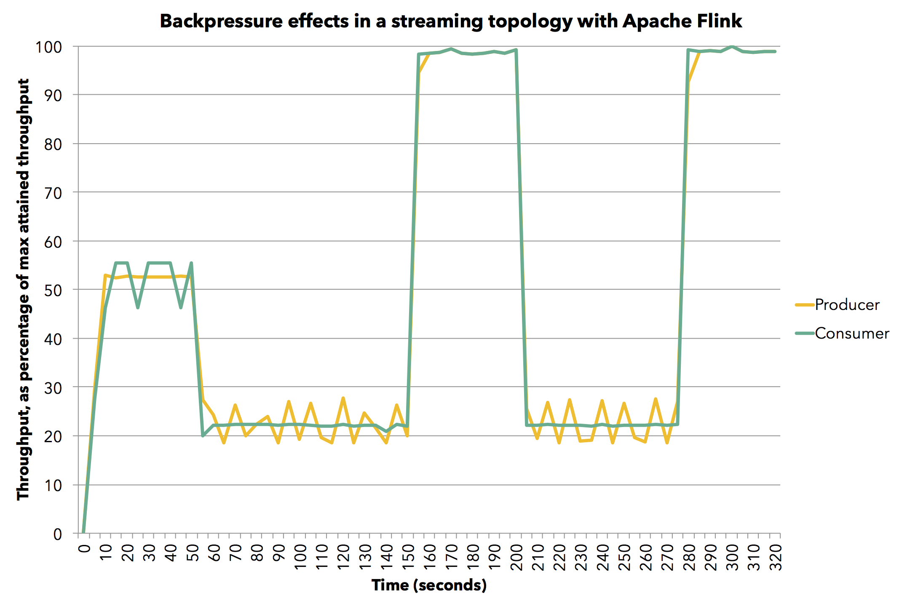

# How Apache Flink™ handles backpressure

> August 31, 2015 - [Flink Features](https://data-artisans.com/blog/category/flink-features) by [Ufuk Celebi](https://data-artisans.com/blog/author/ufuk)

人们经常问我们Flink如何处理背压效应。我们的答案很简单：Flink并没有专门应对背压的复杂机制，原因在于Flink不需要。它可以优雅地应对背压，这得益于Flink是纯粹的数据流处理引擎。在接下来，我们将介绍背压问题，并深入Flink的运行时（runtime），看看它如何在任务（task）间转移数据，并展示流数据如何在流转过程中自然降速，而这构成了它应对背压的机制。最后，我们通过一个小小的实验展示了这一点。

## 什么是背压

像Flink一样的流处理系统需要具备优雅应对背压的能力。背压通常指的是如下场景：在一段时间内（通常是较短时间），系统在以超过其处理能力的速率接收数据，这造成了临时的负载尖峰。很多日常场景都会造成背压，比如：垃圾回收的停顿可以造成流入数据的堆积（build up），或者数据源在以更快的速度发送数据，表现成尖峰形式。背压，如果不能够正确地处理，可能导致资源耗尽，更甚者，在最坏的情况下将造成数据丢失。

让我们以一个简单的例子看一下。假设一个数据流管道（pipeline）有一个源（source）、一个流作业（streaming job）、一个sink，在稳定状态下，它处理数据的速率是每秒钟500万记录，如下图所示（每个黑块代表100万记录，这张图展示了系统中1秒钟的“快照”）：

在某些时刻，无论是流作业（streaming job）或者sink产生1秒钟的停顿，将导致500万多余元组的堆积。与之对应的，源（source）可能产生一个尖峰，在这一秒内其会以两倍速度生产（发射）数据。

我们如何应对类似的情况呢？当然，一种方法是丢弃这些多余的数据。但是，数据丢失在大多数流应用中是不被接受的，它们都需要对记录的 **一次且仅一次（exactly once）** 的处理逻辑。多余的数据需要缓存（buffer）在某些地方。缓存应当是持久的，因为在某些failure的情况下，需要进行数据重演（replay）才能防止数据丢失。理想状况下，数据应当缓存在持久化管道（persistent channel）中（例如，源本身就具有保证持久性的特点，Apache Kafka是一个典型的具有类似特征的样例）。理想的情况下，应对背压，整个管道应从sink反压到source，同时通过调节source使其适应（adjust）管道（pipeline）中最慢一部分的速度，并达到稳定状态：

## Flink中的背压

Flink在运行时通过算子（operator）和流（stream）构建块（block）。每个算子通过应用转换操作（transformation），消费（consume）中间的流（intermediate stream），并产生（produce）新的流。描述这个网络机制的最佳类比是，Flink通过有限容量达成了高效的分布式阻塞队列。与java中常规的连接线程阻塞队列类似，较慢的接收者（receiver）将使发送者（sender）降速，其通过队列缓冲效果耗尽（有限容量）来实现。*换句话说，接收者的接收队列已经满了，不再接收新的数据了，发送者自然不能够再发送新的数据了，则发送者作为[上游发送者的接收者]也随之缓存数据并发生阻塞，依次完成反压。*

下面的例子，两个任务（task）的简单流，展示了Flink如何实现背压：

1. 记录“A”进入到Flink中，并被Task 1处理。
2. 纪录被序列化到缓存中。
3. 缓存数据被发送（ship）到Task 2中，它将从缓存中读取记录。

核心观察如下：为了使记录在Flink中运行（progress），需要提供缓冲区（buffer）。在Flink中，分布式队列是逻辑上的流（logical stream），通过对每个生产和消费流（produced and consumed stream）管理缓冲池（buffer pool）实现了有界容量。缓冲池（buffer pool）是一组缓冲区（buffer），它在消费之后会被循环使用。一般的想法很简单：从池（pool）中获取一个缓冲区（buffer），将其填满数据（fill up），在数据被消费之后，将缓冲区返回池中，之后就可以重复使用了。

缓冲池的大小在运行时会动态变化。在网络堆栈中的内存缓冲区（memory buffer）数量（=队列容量）定义了系统的缓冲量，它将决定在不同速率的发送者/接收者存在的情况下的系统表现。Flink保证总有足够的缓冲区用来实现一些操作（some progress），但这些操作（progress）的速度将由用户程序和可用内存数量决定。更大的内存意味着系统可以对特定瞬时背压（short periods、short GC）进行简单的缓冲。更小的内存意味着系统对背压做出更快响应。*换句话说，更大的内存，应对瞬时背压时，只用当前节点的缓存就可以杠住，不会影响上游节点的发送速率；更小的内存，使得背压带来的降速会更快地传导到源头。*

用上面的简单示例：Task 1在输出端（output side）有与之关联的一个缓冲池（buffer pool），Task 2在输入端（input side）也有。如果有一个缓冲区可以序列化“A”，我们将对其序列化并派（dispatch）到缓冲区。

我们可以看到如下两种情况：

- 本地交换：如果Task 1和Task 2在同一个worker节点（TaskManager）运行，这个缓冲区可以被下一个task直接操作。它回收（recycle）的速度与task 2的消费速度相一致。如果Task 2比Task 1慢，缓冲区将以慢于task 1的速度进行回收，以至于缓冲区将被填满，造成的结果是对task 1进行降速。*（因为task 1在对“A”进行序列化的时候没有多余空间，导致task 1无法完成序列化，并等待资源）*

- 远程交换：如果Task 1和Task 2运行在不同的worker节点，则缓冲区的回收速度与其线路速度相一致（TCP 通道）。在接收端，数据从线路中复制到输入缓冲池（input buffer pool）的缓冲区中。如果没有足够的缓冲区可用，从TCP连接中的读取操作将被中断。在简单的watermark机制下，输出端从不会将太多数据放到线路中。如果有大量数据“在空中”（in-flight），在复制更多数据到线路前，我们将等待直到“在空中”的数据量降到阈值以下。这一点保证了“在空中”的数据量永远不会多。如果新的数据在接收端还没有被消费（因为这里没有更多的缓冲区可用），这将传导到发送端。

具有固定大小容量的缓冲池，为简单的流赋予了缓冲能力，这使得Flink具有很强的背压机制，其使得任务生产数据的速度永远不会超过其消费的速度。

上面介绍的两个task之间的数据传送机制可以很自然地应用到复杂的管道（pipeline）中，保证了背压在整个管道网络中进行传播。

让我们看一个简单的实验，它展示了在工作背压的情况下Flink的表现。运行一个简单的生产者-消费者流拓扑，其中task在本地交换数据，在task生产记录这一端，我们可以改变其速率。对于测试，我们使用少于默认值的内存，以便能够明显地看到背压效果，并很好地展示。我们为每个task分配两个4096字节的缓冲区。在通常Flink的部署中，任务将有更多大的缓冲区，这只是增强了其性能。这个测试运行在单一的JVM上，但使用了Flink完整的代码栈。

该图展示平均吞吐量于最大吞吐量的比值（我们在单个JVM中达到了800万每秒最大吞吐值），其中生产（黄色）和消费（绿色）的任务随时间变换图。为了测量平均吞吐，我们每5秒测量一次通过任务的记录数。

首先，我们以全速的60%运行生产者任务（我们模拟降速通过Thread.sleep()调用来实现）。消费者以相同的速度消费数据而不会人为减慢速度。接下来，将消费task的速度降到全速的30%。这里，背压效果显现出来，可以看到生产者也自然地降到了全速的30%。接下来，停止在消费者的人为降速，两个task都达到了它们的最大吞吐。再次将消费者的速度降到全速的30%，管道（pipeline）立即作出反应，生产者的速度也降到全速的30%。最终，再次停止人为降速，两个task继续以100%的全速运行。综上所述，观察到的生产者和消费者在管道中对对方的吞吐都有依赖，这在流管道场景下是最佳表现。

## 总结

Flink，与可持久化源（如Kafka）的组合，使得系统可以对背压立即做出响应，并免于丢失数据。Flink在处理背压时并不需要特殊的机制，因为在Flink进行数据发送的过程中兼具了背压机制。这使得，Flink在管道化的运行中可以达到最慢部分（slowest part）的最大吞吐（maximum throughput）。
