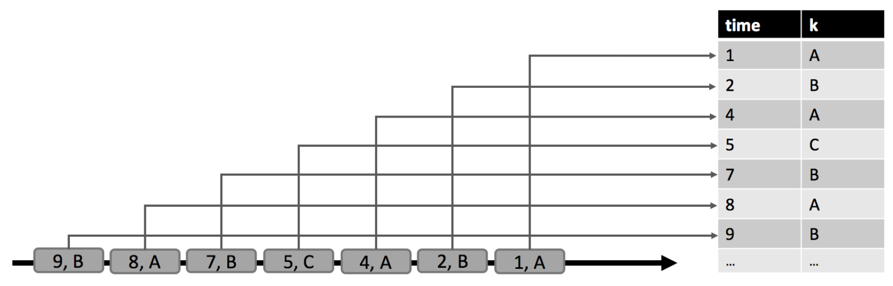

# Continuous Queries on Dynamic Tables: Analyzing Data Streams with Streaming SQL
April 11, 2017 - [Flink Features](https://data-artisans.com/blog/category/flink-features), [Table API and SQL](https://data-artisans.com/blog/category/table-api-and-sql) by [Fabian Hueske](https://data-artisans.com/blog/author/fabian), [Xiaowei Jiang](https://data-artisans.com/blog/author/xiaowei) and [Shaoxuan Wang](https://data-artisans.com/blog/author/shaoxuan)

> Xiaowei Jiang is a Senior Director in Alibaba’s Search Infrastructure division, and Shaoxuan Wang is a Senior Manager in Alibaba’s Search Infrastructure division. Fabian Hueske ([@fhueske](https://twitter.com/fhueske?lang=en)) is a co-founder and software engineer at data Artisans and an Apache Flink® committer and PMC member.
>
> This post originally appeared on the [Apache Flink blog](http://flink.apache.org/news/2017/04/04/dynamic-tables.html). It was reproduced here under the [Apache License, Version 2.0](https://www.apache.org/licenses/LICENSE-2.0.html).

> Xiaowei Jiang 是阿里巴巴搜索基础架构团队的高级总监，Shaoxuan Wang是阿里巴巴搜索基础架构团队的高级经理。Fabian Hueske ([@fhueske](https://twitter.com/fhueske?lang=en))是data Artisans的联合创始人和软件开发工程师，是Apache Flink® 的commiter和项目管理委员会（PMC）成员。
>
>这篇博文最早发于[Apache Flink blog](http://flink.apache.org/news/2017/04/04/dynamic-tables.html)。是在[Apache License, Version 2.0](https://www.apache.org/licenses/LICENSE-2.0.html)版权许可下被复制的。

More and more companies are adopting stream processing and are migrating existing batch applications to streaming or implementing streaming solutions for new use cases. Many of those applications focus on analyzing streaming data. The data streams that are analyzed come from a wide variety of sources such as database transactions, clicks, sensor measurements, or IoT devices.

越来越多的公司在采用流处理引擎，正在将现存的批处理应用迁移到流处理上，或为新用例实现一套流处理解决方案。这些应用大多聚焦在流数据的分析场景上。被用于分析的数据流来源非常广泛，如：数据库事务、点击、传感器测量数据、物联网（IoT）设备等。


Apache Flink is very well suited to power streaming analytics applications because it provides support for event-time semantics, stateful exactly-once processing, and achieves high throughput and low latency at the same time. Due to these features, Flink is able to compute exact and deterministic results from high-volume input streams in near real-time while providing exactly-once semantics in case of failures.

Apache Flink非常适合流处理分析应用，这是由于它提供了基于事件时间语义的支持、有状态的一次且仅一次（exactly-once）处理机制、并同时支持了高吞吐和低延时。由于上述特征，Flink完全在高容量输入流上，近乎实时地计算出精确（exact）和确定（deterministic）结果，同时在出现故障时还能提供exactly-once语义支持。

Flink’s core API for stream processing, the [DataStream API](https://ci.apache.org/projects/flink/flink-docs-release-1.2/dev/datastream_api.html), is very expressive and provides primitives for many common operations. Among other features, it offers highly customizable windowing logic, different state primitives with varying performance characteristics, hooks to register and react on timers, and tooling for efficient asynchronous requests to external systems. On the other hand, many stream analytics applications follow similar patterns and do not require the level of expressiveness as provided by the DataStream API. They could be expressed in a more natural and concise way using a domain specific language. As we all know, SQL is the de-facto standard for data analytics. For streaming analytics, SQL would enable a larger pool of people to specify applications on data streams in less time. However, no open source stream processor offers decent SQL support yet.

Flink用于进行流处理核心API，[DataStream API](https://ci.apache.org/projects/flink/flink-docs-release-1.2/dev/datastream_api.html)，具有强大的表现力，并为很多通用操作提供了原语（primitive）支持。除了其他的特性，它还提供了1.高度定制化的窗口逻辑，2.具有不同性能特点的不同的状态原语，3.可以在定时器上注册和响应的钩子（hook），4.用于对外部系统提供的高效异步请求工具。另一方面，很多流分析应用遵循类似的模式，并不需要DataStream API提供的高级别的表现力。使用特定域的语言（意指功能受限），他们希望通过更自然和简洁的方式进行表达。众所周知，SQL是数据分析领域的事实标准。对流处理分析，SQL将使更多的人能够在更短时间内完成数据流上的特定应用。但到目前为止，并没有开源流处理引擎提供像样的SQL支持。

## Why is SQL on Streams a Big Deal?

## 为什么流上的SQL分析很重要？

SQL is the most widely used language for data analytics for many good reasons:
- SQL is declarative: You specify what you want but not how to compute it.
- SQL can be effectively optimized: An optimizer figures out an efficient plan to compute your result.
- SQL can be efficiently evaluated: The processing engine knows exactly what to compute and how to do so efficiently.
- And finally, everybody knows and many tools speak SQL.

SQL在数据分析领域是最广泛使用的语言，这是有很多原因的：
- SQL 是声明式的：只需指定你要什么而不用告诉怎样计算。
- SQL可以被高效地优化：优化器将为计算提供一个高效的执行计划。
- SQL可以被有效评估：处理引擎确切地知道要计算什么，以及如何有效计算出结果。
- 最后，每个人都懂得、很多工具都支持SQL

So being able to process and analyze data streams with SQL makes stream processing technology available to many more users. Moreover, it significantly reduces the time and effort to define efficient stream analytics applications due to the SQL’s declarative nature and potential to be automatically optimized.

However, SQL (and the relational data model and algebra) were not designed with streaming data in mind. Relations are (multi-)sets and not infinite sequences of tuples. When executing a SQL query, conventional database systems and query engines read and process a data set, which is completely available, and produce a fixed sized result. In contrast, data streams continuously provide new records such that data arrives over time. Hence, streaming queries have to continuously process the arriving data and never “complete”.

That being said, processing streams with SQL is not impossible. Some relational database systems feature eager maintenance of materialized views, which is similar to evaluating SQL queries on streams of data. A materialized view is defined as a SQL query just like a regular (virtual) view. However, the result of the query is actually stored (or materialized) in memory or on disk such that the view does not need to be computed on-the-fly when it is queried. In order to prevent that a materialized view becomes stale, the database system needs to update the view whenever its base relations (the tables referenced in its definition query) are modified. If we consider the changes on the view’s base relations as a stream of modifications (or as a changelog stream) it becomes obvious that materialized view maintenance and SQL on streams are somehow related.

因此，能够使用SQL处理和分析数据，将使得流处理技术可为更多用户使用。此外，支持SQL将有效减少用户用于定义高效流分析应用所花费的时间和精力，这主要得益于SQL更自然的声明式特征和自动优化的潜能。

但是，SQL（以及关系数据模型和代数）在设计之初并未考虑到流数据的特性。关系是定义在（多重）集之上的，而非定义在无限元组序列上的。当执行一个SQL查询，传统数据库系统和查询引擎将读取并处理一个数据集（data set），这个数据集是完全可用的，并会产生固定大小的结果。相反，数据流随着数据随时间到来，将源源不断地提供新纪录。因此，流查询必须持续不断地处理到达的数据并永不会“完成”。

话虽如此，使用SQL在流上进行处理也不是不可能。一些关系数据库提供了对物化视图（materialized view）频繁维护的特性，这与在数据流上应用SQL查询十分相似。物化视图由SQL查询定义，就像常规（虚拟）视图一样。但是，查询结果实际上是存储（物化）在内存或磁盘中的，以便在查询时不需要动态计算。为了防止物化视图变得陈旧（stale），无论何时其基本关系（物化视图定义时引用的表）发生了修改，数据库系统就需对视图进行更新。如果我们将视图基本关系上的修改看作是修改（数据）流（或者称之为 changelog 流），则显然物化视图的维护就和流上SQL的执行在某种程度上是相似的。

## Flink’s Relational APIs: Table API and SQL

## Flink 关系API：Table API和SQL

Since version 1.1.0 (released in August 2016), Flink features two semantically equivalent relational APIs, the language-embedded Table API (for Java and Scala) and standard SQL. Both APIs are designed as unified APIs for online streaming and historic batch data. This means that

**a query produces exactly the same result regardless whether its input is static batch data or streaming data.**

Unified APIs for stream and batch processing are important for several reasons. First of all, users only need to learn a single API to process static and streaming data. Moreover, the same query can be used to analyze batch and streaming data, which allows to jointly analyze historic and live data in the same query. At the current state we haven’t achieved complete unification of batch and streaming semantics yet, but the community is making very good progress towards this goal.

The following code snippet shows two equivalent Table API and SQL queries that compute a simple windowed aggregate on a stream of temperature sensor measurements. The syntax of the SQL query is based on [Apache Calcite’s](https://calcite.apache.org/) syntax for [grouped window functions](https://calcite.apache.org/docs/reference.html#grouped-window-functions) and will be supported in version 1.3.0 of Flink.

自从1.1.0版本（发布于2016年8月），Flink具有了两个语义上等价的关系API，嵌入式语言的Table API（对java和scala编程来说）和标准SQL。两个API在处理在线流数据和历史批量数据上都被设计成统一的API（*意即两个API都可以同时处理流和批*）。这意味着：

**无论输入是静态批量数据还是流数据，查询总是能产生完全相同的结果。**

出于多种原因考虑，将流和批处理的API进行统一都是十分重要的。首先，对用户来说，处理静态数据和流数据，只需要学习一套API。进一步，相同的查询可以同时用在分析批量数据和流数据上，这允许在用同一个查询联合分析历史数据和在线数据。在当前状态下，我们尚未完成批和流在语义上的完全统一，但社区一直在朝着这个目标前进并取得了很好的进展。

下面的代码片段展示了Table API和SQL两个等效API查询，这些查询在温度传感器测量的数据流上完成简单的窗口聚合操作。SQL查询的语法是基于[Apache Calcite](https://calcite.apache.org/)的分组窗口函数（[grouped window functions](https://calcite.apache.org/docs/reference.html#grouped-window-functions)）语法，这将在Flink 1.3.0版本中得到支持。

```scala
val env = StreamExecutionEnvironment.getExecutionEnvironment
 env.setStreamTimeCharacteristic(TimeCharacteristic.EventTime)

val tEnv = TableEnvironment.getTableEnvironment(env)

// define a table source to read sensor data (sensorId, time, room, temp)
 val sensorTable = ??? // can be a CSV file, Kafka topic, database, or ...
 // register the table source
 tEnv.registerTableSource("sensors", sensorTable)

// Table API
 val tapiResult: Table = tEnv.scan("sensors") // scan sensors table
 .window(Tumble over 1.hour on 'rowtime as 'w) // define 1-hour window
 .groupBy('w, 'room) // group by window and room
 .select('room, 'w.end, 'temp.avg as 'avgTemp) // compute average temperature

// SQL
 val sqlResult: Table = tEnv.sql("""
 |SELECT room, TUMBLE_END(rowtime, INTERVAL '1' HOUR), AVG(temp) AS avgTemp
 |FROM sensors
 |GROUP BY TUMBLE(rowtime, INTERVAL '1' HOUR), room
 |""".stripMargin)
```

As you can see, both APIs are tightly integrated with each other and Flink’s primary [DataStream](https://ci.apache.org/projects/flink/flink-docs-release-1.2/dev/datastream_api.html) and [DataSet](https://ci.apache.org/projects/flink/flink-docs-release-1.2/dev/batch/index.html) APIs. A `Table` can be generated from and converted to a `DataSet` or `DataStream`. Hence, it is easily possible to scan an external table source such as a database or [Parquet](https://parquet.apache.org/) file, do some preprocessing with a `Table` API query, convert the result into a `DataSet` and run a [Gelly](https://ci.apache.org/projects/flink/flink-docs-release-1.2/dev/libs/gelly/index.html) graph algorithm on it. The queries defined in the example above can also be used to process batch data by changing the execution environment.

如您所见，这两个API相互间深度集成，并与Flink基础的DataStream和DataSet API也有深度集成。一个`Table`可以生成自/转化成一个`DataSet`或`DataStream`。因此，可以很容易扫描外部数据源如数据库或[Parquet](https://parquet.apache.org/)文件，并用`Table`API语句进行一些预处理操作，并将结果写到`DataSet`，在之后可以使用[Gelly](https://ci.apache.org/projects/flink/flink-docs-release-1.2/dev/libs/gelly/index.html)图算法在其上进行分析。示例中，同样的查询语句只需要修改下运行时环境，就可以用来处理批数据。

Internally, both APIs are translated into the same logical representation, optimized by Apache Calcite, and compiled into DataStream or DataSet programs. In fact, the optimization and translation process does not know whether a query was defined using the Table API or SQL. If you are curious about the details of the optimization process, have a look at [a blog post](http://flink.apache.org/news/2016/05/24/stream-sql.html) that we published last year. Since the Table API and SQL are equivalent in terms of semantics and only differ in syntax, we always refer to both APIs when we talk about SQL in this post.

在内部，两个API会被转换成同一个逻辑表达，并被Apache Calcite进行优化，最后编译成DataStream或DataSet API的执行程序。事实上，优化和翻译程序并不知道查询被定义成Table API还是SQL形式。如果很好奇优化过程的细节，可以参看去年发布的[一篇博文](http://flink.apache.org/news/2016/05/24/stream-sql.html)。由于Table API和SQL在语义层面是等价的，其差异仅仅表现在语法层面，接下来当我们提到SQL时事实上指的是这两类API。

In its current state (version 1.2.0), Flink’s relational APIs support a limited set of relational operators on data streams, including projections, filters, and windowed aggregates. All supported operators have in common that they never update result records which have been emitted. This is clearly not an issue for record-at-a-time operators such as projection and filter. However, it affects operators that collect and process multiple records as for instance windowed aggregates. Since emitted results cannot be updated, input records, which arrive after a result has been emitted, have to be discarded in Flink 1.2.0.

The limitations of the current version are acceptable for applications that emit data to storage systems such as Kafka topics, message queues, or files which only support append operations and no updates or deletes. Common use cases that follow this pattern are for example continuous ETL and stream archiving applications that persist streams to an archive or prepare data for further online (streaming) analysis or later offline analysis. Since it is not possible to update previously emitted results, these kinds of applications have to make sure that the emitted results are correct and will not need to be corrected in the future. The following figure illustrates such applications.

在当前情况（1.2.0版本），Flink关系API在数据流上，支持有限的关系操作符，包括：投影（projection）、过滤（filter）、窗口聚合（windowed aggregate）。所有支持的算子（操作符）都有一个共同点：永远不会修改已发射（emit）出去的记录。这对如投影、过滤这些一次只处理一条记录的算子来说不是问题。但对收集（collect）并处理（process）多条记录的算子会有影响，比如窗口聚合。由于无法更新发出的结果，在Flink 1.2.0中，那些迟到（在结果发出后才到达）的输入数据只能被丢弃。

当前版本的限制对一些应用程序来说是可接受的，这类应用程序的下游存储往往是是Kafka topic、消息管道（message queue）、仅支持追加（append）不支持更新删除操作的文件系统。这些常见用例遵循如下模式：连续的ETL和流存档应用将1.持久化流数据到存档位置；2.为将来的在线（流）分析或离线分析准备数据。由于不支持对已发出数据进行修改，这类应用必须确保发出的结果是正确的，并且将来不需要被修改。下图展示了这类应用：


While queries that only support appends are useful for some kinds of applications and certain types of storage systems, there are many streaming analytics use cases that need to update results. This includes streaming applications that cannot discard late arriving records, need early results for (long-running) windowed aggregates, or require non-windowed aggregates. In each of these cases, previously emitted result records need to be updated. Result-updating queries often materialize their result to an external database or key-value store in order to make it accessible and queryable for external applications. Applications that implement this pattern are dashboards, reporting applications, or [other applications](http://2016.flink-forward.org/kb_sessions/joining-infinity-windowless-stream-processing-with-flink/), which require timely access to continuously updated results. The following figure illustrates these kind of applications.

虽然查询仅支持追加操作（append）对某类应用和特定类型的存储系统十分有用，但仍有大量的流分析用例需要更新结果。这包括1.流应用程序不能废弃迟到的记录，2.需要用到（长期运行）窗口聚集操作的早期结果，3.需要用到非窗口聚集。在每种情况下，已经发出的结果记录都需要被更新。更新结果查询通常将结果物化到外部数据库或键值存储中，使外部应用可以对它进行访问、查询。这类模式下的应用程序有仪表盘、报表系统、或[其他应用](http://2016.flink-forward.org/kb_sessions/joining-infinity-windowless-stream-processing-with-flink/)，这些系统需要即时访问连续更新的结果。下图展示了这类应用。


## Continuous Queries on Dynamic Tables

## 在动态表上的连续查询

Support for queries that update previously emitted results is the next big step for Flink’s relational APIs. This feature is so important because it vastly increases the scope of the APIs and the range of supported use cases. Moreover, many of the newly supported use cases can be challenging to implement using the DataStream API.

So when adding support for result-updating queries, we must of course preserve the unified semantics for stream and batch inputs. We achieve this by the concept of Dynamic Tables. A dynamic table is a table that is continuously updated and can be queried like a regular, static table. However, in contrast to a query on a batch table which terminates and returns a static table as result, a query on a dynamic table runs continuously and produces a table that is continuously updated depending on the modification on the input table. Hence, the resulting table is a dynamic table as well. This concept is very similar to materialized view maintenance as we discussed before.

Assuming we can run queries on dynamic tables which produce new dynamic tables, the next question is, “How do streams and dynamic tables relate to each other?” The answer is that streams can be converted into dynamic tables and dynamic tables can be converted into streams. The following figure shows the conceptual model of processing a relational query on a stream.

对已发出数据进行修改的支持将是Flink关系API下一个重大的更新。这个特性是非常重要的，因为它可以极大增加API的适用范围，扩展用户使用场景。此外，许多新支持的用例对DataStream API的实现是很有挑战（challenge）的。

因此，在添加 *结果更新查询* 这一特性时，我们当然也必须保留对流和批输入的统一语义支持。为达到这个效果，需要引入动态表（Dynamic Table）概念。动态表是一个连续更新的表，可以向常规的静态表一样被查询。批处理表上的查询会终止并返回一个静态表作为结果，与之不同，动态表上的查询会连续不断的运行，其产生的表会根据输入表上的修改而连续不断地更新。因此，结果表也同样是一个动态表。这个概念与之前讨论的物化视图维护过程是类似的。

设想下，在动态表上执行查询并产生新的动态表，接下来的问题是“流和动态表之间是如何关联的？”答案很简单，流可以被转换成动态表，动态表也可以被转换成流。下面这张图就展示了流上关系查询处理的概念模型。


First, the stream is converted into a dynamic table. The dynamic table is queried with a continuous query, which produces a new dynamic table. Finally, the resulting table is converted back into a stream. It is important to note that this is only the logical model and does not imply how the query is actually executed. In fact, a continuous query is internally translated into a conventional DataStream program.

In the following, we describe the different steps of this model:
- Defining a dynamic table on a stream,
- Querying a dynamic table, and
- Emitting a dynamic table.

首先，将流转换成动态表。将连续查询在动态表上执行，它将产生新的动态表。最终，结果表被转换回流。特别需要指出的是这仅仅是逻辑模型，并不意味着查询时的实际执行过程。事实上，连续查询在内部将被翻译成传统的DataStream程序。

接下来，我们描述下这个模型中的不同步骤：
- 在流上定义动态表
- 在动态表上查询
- 发出动态表

## Defining a Dynamic Table on a Stream

## 在流上定义动态表

The first step of evaluating a SQL query on a dynamic table is to define a dynamic table on a stream. This means we have to specify how the records of a stream modify the dynamic table. The stream must carry records with a schema that is mapped to the relational schema of the table. There are two modes to define a dynamic table on a stream: Append Mode and Update Mode.

In append mode each stream record is an insert modification to the dynamic table. Hence, all records of a stream are appended to the dynamic table such that it is ever-growing and infinite in size. The following figure illustrates the append mode.

在动态表上执行SQL查询的第一步是在在流上定义动态表。这意味着需要指定流上的记录如何修改动态表。流上的记录都应该携带模式（schema），此模式需映射到表上的关系模式。基于此，流上的动态表定义就有两种模式：追加模式（Append Mode）和更新模式（Update Mode）。

在追加模式中，每个流上的记录相对于动态表来说都是一次插入修改。因此，流上所有记录都会追加到动态表中，因此动态表是不断增长并且是无限大的。下图展示追加模式。



In update mode a stream record can represent an insert, update, or delete modification on the dynamic table (append mode is in fact a special case of update mode). When defining a dynamic table on a stream via update mode, we can specify a unique key attribute on the table. In that case, update and delete operations are performed with respect to the key attribute. The update mode is visualized in the following figure.

在更新模式中，流上的记录可以代表动态表上的插入（insert）、更新（update）、删除（delete）这些修改操作（追加模式实际上是一种特殊的更新模式）。通过更新模式定义流上动态表时，需要指定表中的唯一主键（unique key）。在这种情况下，更新、删除操作都会在主键上执行。更新模式在下图中进行了形式化展示。


## Querying a Dynamic Table

## 动态表查询

Once we have defined a dynamic table, we can run a query on it. Since dynamic tables change over time, we have to define what it means to query a dynamic table. Let’s imagine we take a snapshot of a dynamic table at a specific point in time. This snapshot can be treated as a regular static batch table. We denote a snapshot of a dynamic table A at a point t as A[t]. The snapshot can be queried with any SQL query. The query produces a regular static table as result. We denote the result of a query q on a dynamic table A at time t as q(A[t]). If we repeatedly compute the result of a query on snapshots of a dynamic table for progressing points in time, we obtain many static result tables which are changing over time and effectively constitute a dynamic table. We define the semantics of a query on a dynamic table as follows.

A query `q` on a dynamic table `A` produces a dynamic table `R`, which is at each point in time `t` equivalent to the result of applying `q` on `A[t]`, i.e., `R[t] = q(A[t])` . This definition implies that running the same query on `q` on a batch table and on a streaming table produces the same result. In the following, we show two examples to illustrate the semantics of queries on dynamic tables.

In the figure below, we see a dynamic input table `A` on the left side, which is defined in append mode. At time `t = 8`, A consists of six rows (colored in blue). At time `t = 9` and `t = 12`, one row is appended to `A` (visualized in green and orange, respectively). We run a simple query on table `A` which is shown in the center of the figure. The query groups by attribute `k` and counts the records per group. On the right hand side we see the result of query `q` at time `t = 8` (blue), `t = 9` (green), and `t = 12` (orange). At each point in time `t`, the result table is equivalent to a batch query on the dynamic table `A` at time `t`.

一旦定义了动态表，可以在其上执行查询。由于动态表会随时间更改，我们需要明确定义查询动态表的含义。设想下，在特定时点上取动态表的快照。这个快照可以被当做常规的静态批量表。形式化定义：将动态表A在某一时点t的快照定义为A[t]。可以使用任意SQL在这个快照上执行查询。查询结果仍是常规静态表。形式化定义：将查询q在动态表A在某一时点t上的查询结果记为q(A[t])。随着时间演进，若重复在动态表快照上执行查询，将会获得随时间改变的多个静态结果表，这些构成了新的动态表。我们在动态表上定义如下查询语义。

动态表`A`上的查询`q`将产生动态表`R`，意味着：对于任意时刻`t`，在`A[t]`上应用`q`，都有`R[t] = q(A[t])`。这个定义意味着在批量表上和流量表上执行同样的查询`q`，将产生相同的结果。接下来，我们用两个例子展示了动态表上的查询语义。

在下图中，左侧是动态输入表`A`，它被定义为追加模式。在`t = 8`的时刻，`A`由六条记录组成（标识为蓝色）。在`t = 9`和`t = 12`的时刻，`A`中各追加了一条新的记录（分别被标识为绿色和橘色）。图中位置，展现了在表`A`上执行的简单查询语句。这个查询在属性`k`上进行分组并统计每个分组的记录数。右侧是`q`在`t = 8`时刻（蓝色）、`t = 9`时刻（绿色）、`t = 12`时刻（橘色）的查询结果。在`t`的每个时点，结果表都是动态表`A`在`t`时刻的批量表上的查询结果。


The query in this example is a simple grouped (but not windowed) aggregation query. Hence, the size of the result table depends on the number of distinct grouping keys of the input table. Moreover, it is worth noticing that the query continuously updates result rows that it had previously emitted instead of merely adding new rows.

The second example shows a similar query which differs in one important aspect. In addition to grouping on the key attribute k, the query also groups records into tumbling windows of five seconds, which means that it computes a count for each value of k every five seconds. Again, we use Calcite’s [group window functions](https://calcite.apache.org/docs/reference.html#grouped-window-functions) to specify this query. On the left side of the figure we see the input table A and how it changes over time in append mode. On the right we see the result table and how it evolves over time.

示例中是简单的分组（但没有窗口操作）聚合查询。因此，结果表大小取决于输入表中分组键上不同值的数量。此外，值得注意的是，查询会连续更新结果记录，而不仅仅是添加新的记录。

第二个示例展示了类似查询的另一个重要方面。除了在属性k上进行分组，查询将记录分成每5秒钟一个的滚动窗口，这意味着每5秒钟将在每个k的属性值上进行一次统计。同样的，使用了Calcite的分组窗口函数（[group window function](https://calcite.apache.org/docs/reference.html#grouped-window-functions)）来指定这个查询。在图的左侧是输入表A，它随时间按照追加模式更新。在图的右侧是结果表，以及它随时间的变化。


In contrast to the result of the first example, the resulting table grows relative to the time, i.e., every five seconds new result rows are computed (given that the input table received more records in the last five seconds). While the non-windowed query (mostly) updates rows of the result table, the windowed aggregation query only appends new rows to the result table.

Although this blog post focuses on the semantics of SQL queries on dynamic tables and not on how to efficiently process such a query, we’d like to point out that it is not possible to compute the complete result of a query from scratch whenever an input table is updated. Instead, the query is compiled into a streaming program which continuously updates its result based on the changes on its input. This implies that not all valid SQL queries are supported but only those that can be continuously, incrementally, and efficiently computed. We plan discuss details about the evaluation of SQL queries on dynamic tables in a follow up blog post.

与第一个示例的结果不同，这一次的结果表随着时间增长，即，每5秒钟计算新的结果集（假设输入表在最后5秒内接收到更多的记录）。非窗口查询（主要）更新结果表的行，窗口化聚集查询只是在结果表中增加新的记录。

虽然博文主要关注在动态表上SQL查询的语义，并没有聚焦如何高效执行一个查询，但我们想要指出：无论何时输入表发生了更新，从头完整计算查询的结果都是不可能的。相反，查询被编译为流处理程序，它可以随着输入上的更新源源不断地更新结果集。这意味着并非所有有效（valid）SQL查询都是被支持的，（动态表上）仅支持那些可以被连续、增量、高效计算的SQL。在后续博客文章中，我们计划讨论更多动态表上SQL查询执行的相关细节。

## Emitting a Dynamic Table

## 发出动态表

Querying a dynamic table yields another dynamic table, which represents the query’s results. Depending on the query and its input tables, the result table is continuously modified by insert, update, and delete changes just like a regular database table. It might be a table with a single row, which is constantly updated, an insert-only table without update modifications, or anything in between.

Traditional database systems use logs to rebuild tables in case of failures and for replication. There are different logging techniques, such as UNDO, REDO, and UNDO/REDO logging. In a nutshell, UNDO logs record the previous value of a modified element to revert incomplete transactions, REDO logs record the new value of a modified element to redo lost changes of completed transactions, and UNDO/REDO logs record the old and the new value of a changed element to undo incomplete transactions and redo lost changes of completed transactions. Based on the principles of these logging techniques, a dynamic table can be converted into two types of changelog streams, a REDO Stream and a REDO+UNDO Stream.

A dynamic table is converted into a redo+undo stream by converting the modifications on the table into stream messages. An insert modification is emitted as an insert message with the new row, a delete modification is emitted as a delete message with the old row, and an update modification is emitted as a delete message with the old row and an insert message with the new row. This behavior is illustrated in the following figure.

查询动态表会产生另一个动态表，这代表了查询的结果。根据查询和它的输入表，结果表就像常规数据库表一样，将通过插入、更新、删除被连续修改。他可能是1.包含单一记录的表，被连续不断更新，也可能是2.没有更新修改的纯插入的表，或者是3.介于两者之间。

传统数据库系统在发生故障和需要复制时，使用日志来重建表。市面上有不同的日志技术，如UNDO、REDO和UNDO/REDO日志。总的来说，UNDO日志记录了被修改元素之前的值，当发生不完全事务时进行回滚（revert）操作；REDO日志记录了修改元素的新值，以重做被丢失的完成事务；UNDO/REDO日志将被修改元素的旧值、新值都记录下来，可以回滚未完成事务，并重做丢失的完成事务。基于上述日志技术的原则，动态表可以被转换成两种类型的更新流，REDO流和REDO+UNDO流。

通过将表上的修改转换成流消息，动态表可以被转换成redo+undo流。插入修改就是发出携带新纪录的插入消息，删除修改就是发出携带旧记录的删除消息，更新修改就是发出 *携带旧记录的删除消息* 和 *携带新纪录的插入消息*。下图展示了这些行为。


The left shows a dynamic table which is maintained in append mode and serves as input to the query in the center. The result of the query converted into a redo+undo stream which is shown at the bottom. The first record `(1, A)` of the input table results in a new record in the result table and hence in an insert message `+(A, 1)` to the stream. The second input record with `k = ‘A’` `(4, A)` produces an update of the `(A, 1)` record in the result table and hence yields a delete message `-(A, 1)` and an insert message for `+(A, 2)`. All downstream operators or data sinks need to be able to correctly handle both types of messages.

A dynamic table can be converted into a redo stream in two cases: either it is an append-only table (i.e., it only has insert modifications) or it has a unique key attribute. Each insert modification on the dynamic table results in an insert message with the new row to the redo stream. Due to the restriction of redo streams, only tables with unique keys can have update and delete modifications. If a key is removed from the keyed dynamic table, either because a row is deleted or because the key attribute of a row was modified, a delete message with the removed key is emitted to the redo stream. An update modification yields an update message with the updating, i.e., new row. Since delete and update modifications are defined with respect to the unique key, the downstream operators need to be able to access previous values by key. The figure below shows how the result table of the same query as above is converted into a redo stream.

左侧展示了基于追加模式进行修改的动态表，它做为图中间查询部分的输入。查询的结果被转换成redo+undo的流，在图中的下部分展示。输入表中的第一条记录`(1, A)`在结果表中产生了新的记录，因此在流上产生了一条携带`+(A, 1)`的插入消息。`k = 'A'` 的第二条输入记录`(4, A)`在结果表中产生了对`(A, 1)`的更新操作，因此产生了携带`-(A, 1)`的删除消息和携带`+(A, 2)`的插入消息。所有下游算子或数据接收器（sink）都需要能够正确处理这两类消息。

动态表可以被转换成redo流，有两种情况：这是只追加的表（也就是说，它只有插入操作），或者它有唯一的主键。每个动态表上的插入操作都会产生redo流上携带新纪录的插入消息（insert message）。由于redo流的严格限制，只有具有唯一主键的表可以执行更新操作和删除操作。如果有主键的动态表上（纪录的）键被移除了，无论是由于记录被删除导致还是由于记录的主键值被修改导致，都将在redo流上发出携带被移除主键（removed key）的删除消息（delete message）。修改操作会产生携带修改内容的修改消息，即新的记录。由于删除、修改操作是与唯一主键相关的，下游算子需要支持通过主键访问之前的值。下图展示了相同的查询如何转换成redo流。


The row `(1, A)` which yields an insert into the dynamic table results in the `+(A, 1)` insert message. The row `(4, A)` which produces an update yields the `*(A, 2)` update message.

Common use cases for redo streams are to write the result of a query to an append-only storage system, like rolling files or a Kafka topic, or to a data store with keyed access, such as Cassandra, a relational DBMS, or a compacted Kafka topic. It is also possible to materialize a dynamic table as keyed state inside of the streaming application that evaluates the continuous query and make it queryable from external systems. With this design Flink itself maintains the result of a continuous SQL query on a stream and serves key lookups on the result table, for instance from a dashboard application.

记录`(1, A)`将产生动态表上的插入操作，并携带了`+(A, 1)`作为插入信息。记录`(4, A)`将产生更新操作，并携带了`*(A, 2)`作为更新信息。

redo流上通常的用例是将查询结果1.写入到一个追加模式的存储系统中，如回滚文件（rolling files）或kafka topic，2.写入到可通过主键访问的数据存储中，如Cassandra、关系数据库、或者compacted kafka topic。还可以将动态表物化到流应用程序的内部的具有主键的状态中，它可以连续执行查询并可以从外部系统中通过查询访问它。通过这种设计，Flink自身维护了流上连续SQL查询的结果集，并在结果表上提供了通过逐渐查询表的操作，例如仪表盘应用。

## What will Change When Switching to Dynamic Tables?

## 当切换使用动态表时会发生哪些改变？

In version 1.2, all streaming operators of Flink’s relational APIs, like filter, project, and group window aggregates, only emit new rows and are not capable of updating previously emitted results. In contrast, dynamic table are able to handle update and delete modifications. Now you might ask yourself, How does the processing model of the current version relate to the new dynamic table model? Will the semantics of the APIs completely change and do we need to reimplement the APIs from scratch to achieve the desired semantics?

The answer to all these questions is simple. The current processing model is a subset of the dynamic table model. Using the terminology we introduced in this post, the current model converts a stream into a dynamic table in append mode, i.e., an infinitely growing table. Since all operators only accept insert changes and produce insert changes on their result table (i.e., emit new rows), all supported queries result in dynamic append tables, which are converted back into DataStreams using the redo model for append-only tables. Consequently, the semantics of the current model are completely covered and preserved by the new dynamic table model.

在1.2版本中，所有的Flink关系API上的流算子，如filter、project、group window aggregate，仅发出新记录，并没有更新先前发出结果的能力。相反，动态表能够处理更新和删除操作。通过上述内容，你可以自问下：当前版本的处理模型如何与新的动态表模式相关联？API的语义是否彻底改变了？为了满足上述语义，我们是否需要重新从头实现所有API？

上述问题的答案都很简单的。当前的处理模型是动态表模型的子集。使用本文中引入的术语，当前模型可以将流转换成追加模式下的动态表，也就是说，一个无限增长的表。由于所有算子只接收插入操作，并在结果表中产生插入操作（即，发出新的记录），所有在动态追加表中支持的查询结果，都可以通过追加表的redo模式转换回DataStream。因此，新的动态表模型完全覆盖并保留了当前模型的语义。

## Conclusion and Outlook

## 结论与展望

Flink’s relational APIs are great to implement stream analytics applications in no time and used in several production settings. In this blog post we discussed the future of the Table API and SQL. This effort will make Flink and stream processing accessible to more people. Moreover, the unified semantics for querying historic and real-time data as well as the concept of querying and maintaining dynamic tables will enable and significantly ease the implementation of many exciting use cases and applications. As this post was focusing on the semantics of relational queries on streams and dynamic tables, we did not discuss the details of how a query will be executed, which includes the internal implementation of retractions, handling of late events, support for early results, and bounding space requirements. We plan to publish a follow up blog post on this topic at a later point in time.

In recent months, many members of the Flink community have been discussing and contributing to the relational APIs. We made great progress so far. While most work has focused on processing streams in append mode, the next steps on the agenda are to work on dynamic tables to support queries that update their results. If you are excited about the idea of processing streams with SQL and would like to contribute to this effort, please give feedback, join the discussions on the mailing list, or grab a JIRA issue to work on.

Flink关系API非常适合在短时间内实现流分析应用，并可以在多种生产环境设置中使用。在本文中，我们讨论了Table API和SQL的特性。这项工作有助于Flink和流处理触达更多用户。更进一步，在历史和实时数据上，使用统一语义的查询方式，通过这种方式还可以用来查询和维护动态表，这将显著简化用例和应用程序的实现过程。由于本文聚焦在流上和动态表上的关系查询语义，并没有讨论查询被如何执行的细节内容。这些细节内容，包括撤销机制的内部实现，如何处理迟到事件，对早期结果集的支持，如何限制空间需求。我们计划在稍后发布与此主题相关的后续博客文章。

最近几个月，Flink社区中的许多成员一直在讨论并为关系API做出贡献。到目前为止，我们已经取得了很大的进步。虽然大部分工作都是聚焦在追加模式下的流处理问题，但议程的下一步将在动态表上工作，以支持动态表上的查询以及修改结果。如果你对流处理上的SQL工作改到兴奋，并有意为此做出贡献，请提供反馈，加入邮件列表的讨论，或者在JIRA上进行问题的处理。
