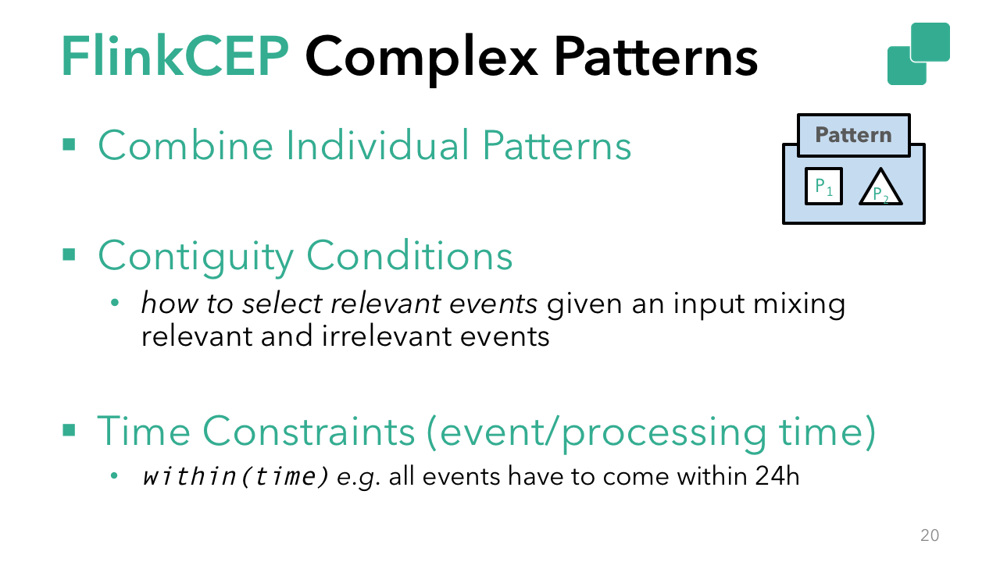
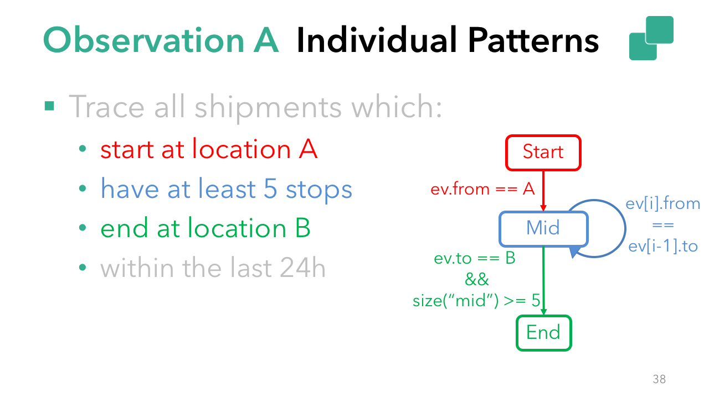

# Complex Event Processing with Flink: An Update on the State of Flink CEP
November 8, 2017 - [Flink Features](https://data-artisans.com/blog/category/flink-features), [Use Cases](https://data-artisans.com/blog/category/use-cases) by [Kostas Kloudas](https://data-artisans.com/blog/author/kkloudas) and [Chris Ward](https://data-artisans.com/blog/author/chris)

Modern organizations rely on the timely and efficient processing of their data to make decisions that have a direct impact on the quality of their services and products. Based on user expectations, timely implies real-time, meaning that data must be processed and made available for insight the moment it arrives.

A common use case in real-time stream processing is the detection of predefined sequences of events over continuously-arriving data–data that is often out of order.

Examples of this are:
- Infrastructure monitoring that detects when a server in your cluster is overheating.
- Network intrusion detection that creates alerts based on unusual behavior.
- Supply chain management that detects potential thefts.
- Trend detection based on physical or digital activity.

This detection and matching of predefined sequences of events in incoming, unbounded data streams is called ‘Complex Event Processing’ (CEP). FlinkCEP (first introduced in Flink 1.0) is the CEP library implemented on top of Flink, and it makes it easy to identify important patterns in your data.

In contrast to executing a query on stored data, FlinkCEP allows you to search for patterns in streams of events as they arrive. You can think of CEP as running live data through a stored query. FlinkCEP takes your input, looks for the desired pattern, and outputs the processed result–all as part of the standard Flink workflow.

In this post, I’ll highlight improvements we made to FlinkCEP in Flink 1.3.0, show code samples for different pattern types supported in FlinkCEP, and share what the community will be working on next.

## Recent Improvements to FlinkCEP

As an Apache Flink library, FlinkCEP is fully integrated with Flink’s rich ecosystem of data sources, data sinks, and deployment options. FlinkCEP benefits from Flink’s production-tested features, ensuring that a CEP application is able to provide accurate results in the event of failure.

In Flink 1.3.0, the community completed work to make CEP operators rescalable, meaning that a user can take a savepoint and restart a CEP job with a different parallelism with application state intact. This support for rescalable state to the CEP library is an extension of a key feature that was first supported in DataStream programs in Flink 1.2.0.

Flink 1.3.0 also includes better late event handling, where late events are no longer silently dropped, and a user can choose to send them to a side output.

There were also API improvements, and the pattern API now supports quantifiers, extending the patterns supported by FlinkCEP.

In short, the release brought FlinkCEP up to date with operability improvements that were already supported in the Flink DataStream API while also expanding the library’s capabilities.

## The FlinkCEP Pattern API

Before we move onto a use case supported by FlinkCEP, we want to give new readers a bit of background on the API and its core concepts.

First, some definitions. When I refer to a single individual “pattern”, I mean, “a search for individual elements with the same properties”. For example, event.getName().equals("start") represents a single pattern.

A “pattern sequence” refers to a graph of individual patterns that you’re searching for in a stream of continuous data, where transitions from one pattern to the next occur based on conditions you specify.

A “match” occurs when an ordered set of events from a stream pass through all patterns in a pattern sequence. In other words, data in the stream met the conditions of your pattern sequence.


Individual patterns are the building blocks for complex patterns. Individual patterns must have a unique name and specify conditions based on which they accept specific events (e.g. event.name == "start" or event.value < avg(prev_events)). Each individual pattern expects exactly one event by default. To change this, you can specify a quantifier to make your pattern expect more than one event or even make your individual pattern optional.



A complex pattern sequence consists of one or more individual patterns connected with contiguity conditions and, potentially, with time constraints.

A time constraint states that you want all your events to happen within a specific time span to have a match. Contiguity conditions allow you to define the contiguity strictness of the pattern flow by using one of the following conditions:
- next(): Matching events must follow each other (strict contiguity).
- followedBy(): Non-matching events can intercept matching events. The pattern will ignore non-matching events (relaxed contiguity).
- followedByAny(): Further relaxes contiguity by allowing non-deterministic actions upon acceptance of a matching event.

You can also reverse non-optional contiguity conditions using NOT patterns, which is useful for detecting unexpected or unwanted events.

For example:
- notNext(): Events don’t follow each other.

Find out more about what’s possible in the FlinkCEP documentation.

Looking ahead a bit, integrating FlinkCEP with Flink’s SQL support is on our future roadmap. With the potential to use SQL native pattern matching with the match_recognize clause, this will make pattern matching even more powerful.

## A FlinkCEP Use Case

To explore the potential of FlinkCEP, imagine you are an online retailer and want to trace all shipments that start at one location (A), end at another (B), have at least 5 stops along the way, and are completed within 24 hours. I’ll walk through this use case in detail below with a simplified code example (you can find the full code here).


For simplicity, relaxed contiguity connects the individual patterns, i.e. followedBy. The skeleton of the pattern looks like the following.

```java
begin("start")
  …
  // Individual pattern
.followedBy("middle")
  …
  // Individual pattern
.followedBy("end")
  …
  // Individual pattern
```

In the snippet above I named the individual patterns as:

- “start”, which accepts shipments that start from location “A”.
- “middle” which contains the intermediate stops.
- “end”, which searches for the final shipment (destination == B) and if the number of intermediate stops (accepted in “middle”) is more than 5.



Based on the description above, each individual pattern needs a condition based on which it will accept relevant events (e.g. event.from == A), and, potentially, a quantifier to allow it to accept more than one event (e.g. “middle” needs a oneOrMore quantifier).

Focusing on the condition for each pattern, in the case of “start”, the acceptance of an event depends only on properties of the event itself (event.from == A). These are called “Simple Conditions“, and they are used for straightforward filtering. In the case of the “middle” and the “end”, the acceptance of the “current” event depends on properties of previously-accepted events. These are called “Iterative Conditions” and allow you to iterate over the previously-accepted events in a partially matched pattern (e.g. sizeOf("middle") >= 5 && event.to == "B").

Moving to the quantifiers, the “start” and “end” expect a single event each, while the “middle” condition expects multiple (at least 5). In this case, for the “middle” pattern you need to specify the oneOrMore quantifier.

With this information, the previous snippet becomes:

```java
Pattern<Shipment, ?> pattern = Pattern.<Shipment>begin("start").where(new SimpleCondition<Shipment>() {
  …
}).followedByAny("middle").where(new IterativeCondition<Shipment>() {
  …
}).oneOrMore().followedByAny("end").where(new IterativeCondition<Shipment>() {
  …
});
```


Finally, add the time constraint for the whole complex pattern. In this case a within operation that defines how long an events sequence has to match the pattern (“24 hours”).


```java
Pattern<Shipment, ?> pattern = Pattern.<Shipment>begin("start").where(new SimpleCondition<Shipment>() {
  …
}).followedByAny("middle").where(new IterativeCondition<Shipment>() {
  …
}).oneOrMore().followedByAny("end").where(new IterativeCondition<Shipment>() {
  …
}).within(Time.hours(24));
```

## Adding FlinkCEP to a Flink Cluster

FlinkCEP is integrated with the DataStream API. This means that both the input and the output of your CEP code are DataStreams, on which you can apply any DataStream transformation. Assuming that you call your input DataStream “input”, you apply the defined pattern using the following code:

```java
PatternStream<Shipment> patternStream = CEP.pattern(input, pattern);

DataStream<Alert> result = patternStream.select(
        new PatternSelectFunction<Shipment, Alert>() {
            @Override
            public Alert select(Map<String, List<Shipment>> pattern) {
                return parseMatch(pattern);
            }
        }
);
```

## What’s next for Flink CEP?

I mentioned earlier that integrating FlinkCEP with Flink’s support for SQL is on our roadmap, and in addition, the community is working on dynamic patterns, the ability to add new patterns to a CEP program with no downtime.

We’re always looking for new contributors, so if you’re interested in contributing, I recommend you look at the Flink JIRA, read the code contribution guide, and get in touch with the community via the mailing list.
