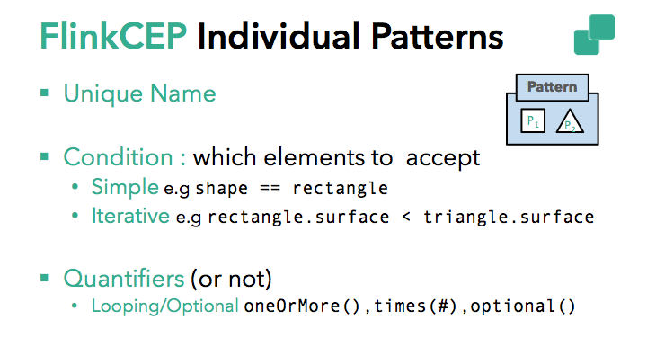
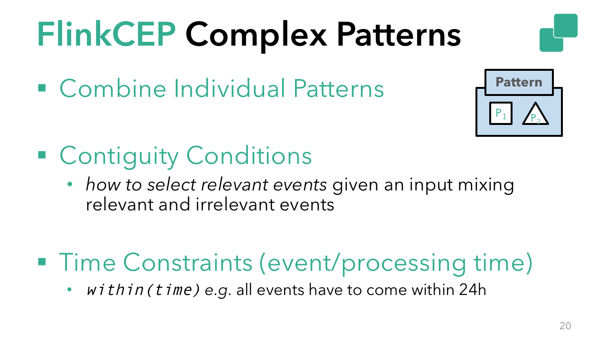
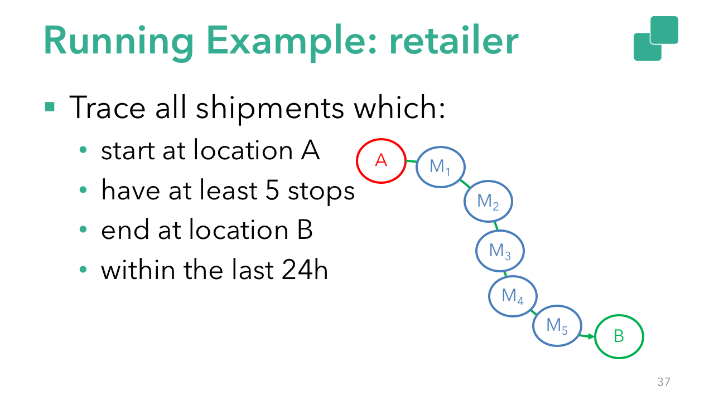
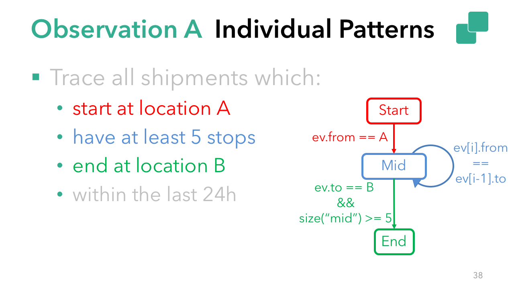
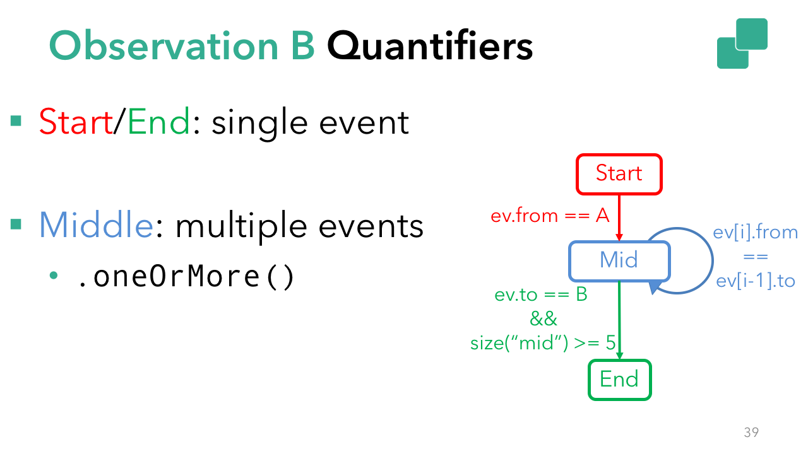
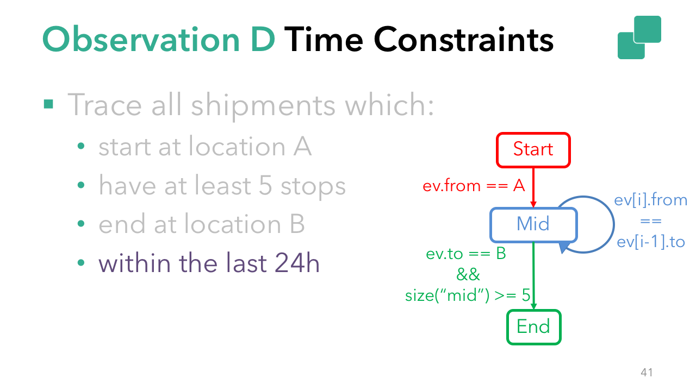

# Complex Event Processing with Flink: An Update on the State of Flink CEP
November 8, 2017 - [Flink Features](https://data-artisans.com/blog/category/flink-features), [Use Cases](https://data-artisans.com/blog/category/use-cases) by [Kostas Kloudas](https://data-artisans.com/blog/author/kkloudas) and [Chris Ward](https://data-artisans.com/blog/author/chris)

现代组织在进行决策时需要依靠及时有效的数据处理，这些决策直接影响到服务和产品的质量。根据用户期望，及时意味着实时，意味着当数据到达时就需要被处理，并为产生洞见提供依据。

实时流处理中的常见用例是在连续到达的数据流上检测预定好的事件序列，连续到达的数据又通常是乱序的。

这方面的例子有：
- 基础架构监控，它用于检测集群中的服务器何时过热。
- 网络入侵检测，它基于异常行为创建预警信息。
- 供应链管理，使其能够检测潜在偷窃行为。
- 趋势检测，基于物理或数字活动信息进行的趋势检测。

这种检测，是匹配预先定义的事件序列，它是在连续不断到来地无界的数据流上进行，这通常被称作是“复杂事件处理”（CEP）。FlinkCEP（是在Flink 1.0中引入的）是在Flink基础上实现的CEP库包，它使在数据上识别重要模式变得容易起来。

与在存储下来的数据上进行查询相对比，FlinkCEP允许你在事件流到达的这一时刻就进行模式的搜索（意味着即时性）。你可以设想CEP是将存储下来的查询语句运行在活数据上。FlinkCEP接收输入，即查找所需的模式，并将结果输出，所有操作都是标准Flink工作流的一部分。

在这个博文中，将重点介绍Flink 1.3.0中FlinkCEP的改进，通过样例代码展示FlinkCEP中支持的不同模式类型，并介绍社区在接下来将要进行的工作。

## FlinkCEP最近的改进

作为Apache Flink的库包，FlinkCEP与Flink丰富的生态系统完全整合，兼容于数据源（data source）、数据输出（data sink）、部署设置（deployment options）。FlinkCEP受益于Flink经过生产环境测试的特性，确保了CEP应用程序可以在事件故障时提供准确的结果。

在Flink 1.3.0中，社区完成了如下工作：使CEP算子可重调整并行度，这意味着用户可以设置保存点（savepoint）并使用不同的并行度参数重启CEP作业（joib），还能使得应用程序状态无损。CEP库包中，对可扩展并行度状态的支持是key特性（feature）的扩展，这个特性是在Flink 1.2.0中对DataStream程序中首次支持的。

Flink 1.3.0 还包括对延时事件更好地处理机制，延时事件不再以静默的方式被丢弃，用户可以选择将其发送到侧输出（side output）。

还有一些API的改进，模式API支持量词逻辑，这扩展了FlinkCEP支持的模式类型。

简而言之，该版本为FlinkCEP带来了最新的可操作性改进，这些改进已经在Flink DataStream API中得到了支持，同时还扩展了库包的功能。

## FlinkCEP模式API

在开始FlinkCEP支持的用例前，我们希望给新读者一点API的背景知识，以及核心概念。

首先是一些定义。当提到独立的单个“pattern”时，指的是“搜索具有相同属性值的单个元素”。例如，`event.getName().equals("start")`指的是单一模式。

“pattern sequence” 指的是在连续数据流上用于搜索的由单一模式组成的模式图，其中从前一模式到下一模式的转换基于用户给定条件进行触发。

流上的有序事件集通过了模式序列（pattern sequence）的所有模式，就发生了一次匹配。换句话说，流上的数据满足了模式序列所规定的条件。



单个模式是构建复杂模式的基石。单个模式必须具有唯一名称，并指定接收特定事件的条件（如 `event.name == "start"` 或 `event.value < avg(prev_events)`）。每个独立模式默认只接收一个事件。如果更改此项设置，需要指定量词逻辑使得模式预期接收多于一个事件，甚至使得这个独立模式变成可选项。



复杂模式序列由一或多个独立模式组成，这些独立模式之间通过邻接条件串联而成，潜在地，也具有时间约束。

时间约束表明一个匹配的所有事件发生需在特定时间跨度内。邻接条件允许定义流模式上的邻接严格性，可以通过如下这些条件对邻接条件做出约束：
- `next()`：匹配事件必须依次发生（严格连续）。
- `followedBy()`：非匹配事件可以插在匹配事件中。该模式将忽略非匹配事件（放松的连续性）。
- `followedByAny()`：通过允许匹配事件上接受非确定性动作，进一步放宽连续性要求。

可以使用`NOT`模式反转非可选连续性条件，这在检测非预期或不需要的事件时十分有用。

例如：
- `notNext()`：事件不能依次发生。

详细了解可参考[FlinkCEP的文档](https://ci.apache.org/projects/flink/flink-docs-release-1.3/dev/libs/cep.html#combining-patterns)。

展望未来，支持FlinkCEP与[Flink SQL](https://ci.apache.org/projects/flink/flink-docs-release-1.4/dev/table/sql.html)整合已经在路线图中。这意味着将来SQL native 模式匹配可以和模式匹配识别（match recognize）子句结合使用，这将使得模式匹配更加强大。

## FlinkCEP用例

为了探索FlinkCEP的潜力，设想自己是在线零售商，希望跟踪所有从一个位置（A）开始，另一个位置（B）结束的所有货物，这些货物沿途至少经过5个站点，并且要在24小时内完成。通过精简的代码示例将展示这个用例中的细节（[完整代码参见这里](https://github.com/dataArtisans/blog-post-code-samples/blob/master/flink-cep-1.3/RetailerExample.java)）。



为简单起见，独立模式间的连接使用松弛的连续性约束，即 `followedBy`。模式的骨架看起来如下所示。

```java
begin("start")
  …
  // Individual pattern
.followedBy("middle")
  …
  // Individual pattern
.followedBy("end")
  …
  // Individual pattern
```

在上面代码片段中，命名了如下独立模式：
- “start”，它接收从位置“A”开始的货物。
- “middle”，它包含了中间的停靠点。
- “end”，它在最终的货物中应用搜索条件(`destination == B`)同时中间的停靠点（被“middle”接收的）数量要多于5。



基于上面的描述，单个独立模式需要一个条件，基于这个条件来接收相关事件（比如，`event.from == A`），同时，可以配置量词使其允许接收超过一个事件（例如，“middle”需要 *一或多（oneOrMore）* 量词）。

聚焦于单个模式的条件上，在“start”的情况下，事件的可接受状态仅依赖于事件自身属性（`event.from == A`）。这种情况被称作是“简单条件（[Simple Conditions](https://ci.apache.org/projects/flink/flink-docs-release-1.3/dev/libs/cep.html#conditions)）”，可以直接用于过滤（filter）。在“middle”和“end”情况下，“当前（current）”事件的可接受状态依赖于前序已接受事件的属性值。这被称为“迭代条件（[Iterative Conditions](https://ci.apache.org/projects/flink/flink-docs-release-1.3/dev/libs/cep.html)）”，允许在前序已接受事件上进行迭代，将此作为模式匹配的一部分（比如，`sizeOf("middle") >= 5 && event.to == "B"`）。

继续说量词，“start”和“end”都预期匹配一个事件，而“middle”条件希望匹配多个（至少是5个）。在这种情况下，“middle”模式需要指定一个`oneOrMore`量词。

有了这些信息，代码片段将变成：

```java
Pattern<Shipment, ?> pattern = Pattern.<Shipment>begin("start").where(new SimpleCondition<Shipment>() {
  …
}).followedByAny("middle").where(new IterativeCondition<Shipment>() {
  …
}).oneOrMore().followedByAny("end").where(new IterativeCondition<Shipment>() {
  …
});
```



最后，在整个复杂模式中加入时间约束。 在示例中定义时间序列执行时间的`within`操作需要匹配模式（“24 hours”）。



```java
Pattern<Shipment, ?> pattern = Pattern.<Shipment>begin("start").where(new SimpleCondition<Shipment>() {
  …
}).followedByAny("middle").where(new IterativeCondition<Shipment>() {
  …
}).oneOrMore().followedByAny("end").where(new IterativeCondition<Shipment>() {
  …
}).within(Time.hours(24));
```

## 将FlinkCEP加入到Flink集群

FlinkCEP与DataStream API进行了集成，这意味着CEP代码中的输入、输出都是DataStream类型，在此基础上，可以应用任何DataStream转换操作。假设一个输入DataStream为“input”，可以应用如下代码的来定义一个模式：

```java
PatternStream<Shipment> patternStream = CEP.pattern(input, pattern);

DataStream<Alert> result = patternStream.select(
        new PatternSelectFunction<Shipment, Alert>() {
            @Override
            public Alert select(Map<String, List<Shipment>> pattern) {
                return parseMatch(pattern);
            }
        }
);
```

## Flink CEP接下来会做什么？

如之前提到的，将进行FlinkCEP与Flink SQL的整合已经在我们的路线图中，另外，社区正在研究动态模式，即能够在没有停机的情况下向CEP中加入新的模式。
