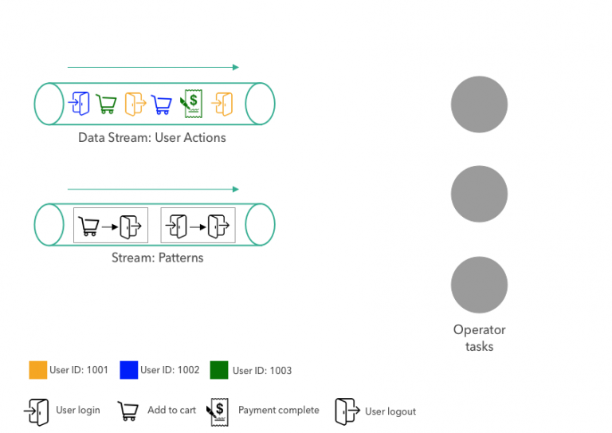
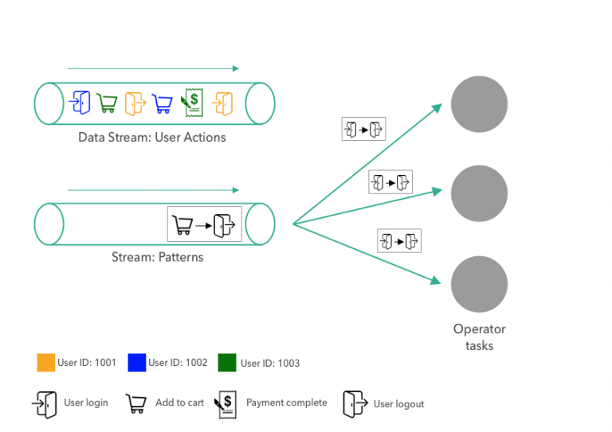
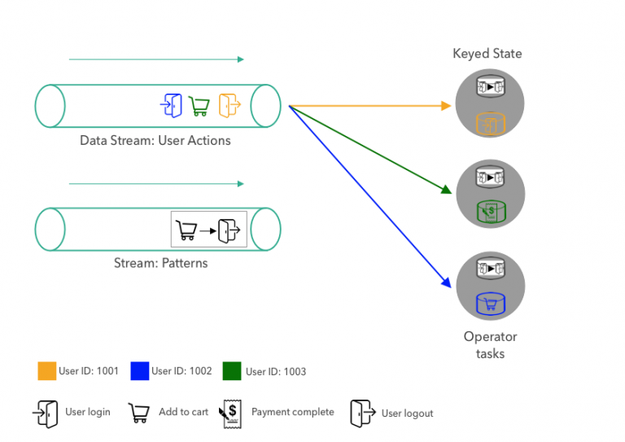
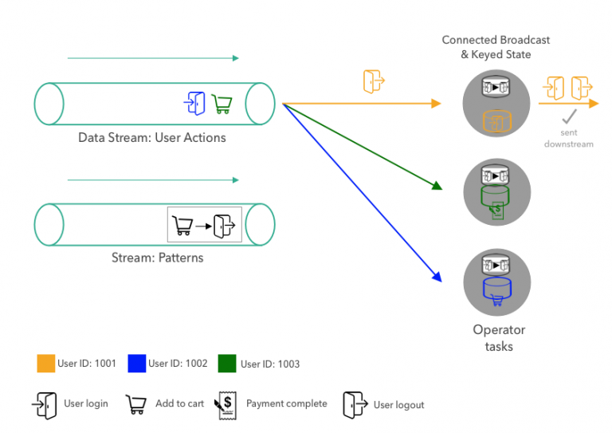
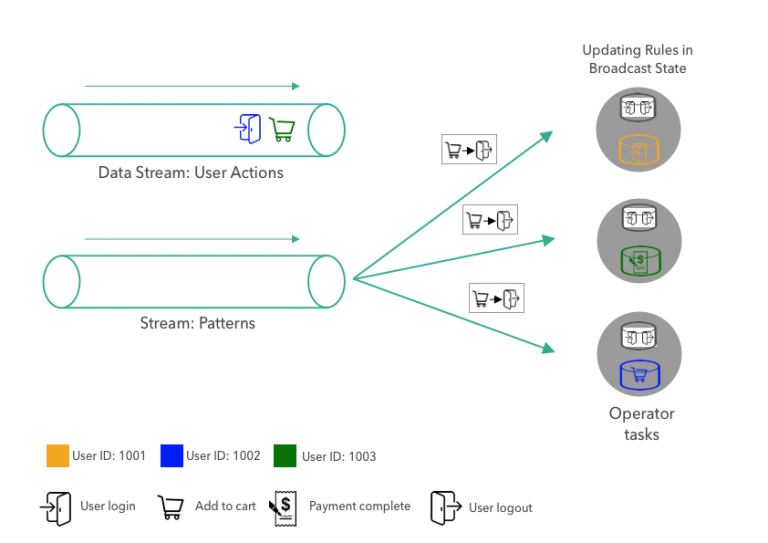
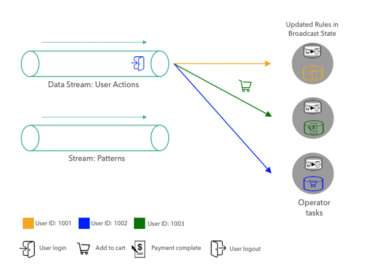

# A Practical Guide to Broadcast State in Apache Flink

August 2, 2018 - [Flink Community](https://data-artisans.com/blog/category/flink-community), [Flink Features](https://data-artisans.com/blog/category/flink-features) by [Fabian Hueske](https://data-artisans.com/blog/author/fabian)

Since version 1.5.0, Apache FlinkⓇ features a new type of state which is called Broadcast State. In this post, we explain what Broadcast State is, and show an example of how it can be applied to an application that evaluates dynamic patterns on an event stream. We walk you through the processing steps and the source code to implement this application in practice.

自从版本1.5.0开始，Apache FlinkⓇ 新增如下新特性：一种被称作广播状态（broadcast）的新状态类型。在这篇博客中，我们将解释广播状态是什么（what），用一个例子展示它如何在应用场景中使用（how），主要是在事件流上评价（evaluate）动态模式。我们将引导你完成处理步骤并走读源码，帮你更好地在实践应用中使用它们。

## What is Broadcast State?

## 广播状态是什么？

The Broadcast State can be used to combine and jointly process two streams of events in a specific way. The events of the first stream are broadcasted to all parallel instances of an operator, which maintains them as state. The events of the other stream are not broadcasted but sent to individual instances of the same operator and processed together with the events of the broadcasted stream.

广播状态（Broadcast State）可以应用在以特定方式合并（combine）和连接（jointly）处理两个事件流（streams of events）的场景中。第一个流的事件将被广播到算子（operator）的所有并行实例中，这个算子将把它们（收到的事件）维护成状态。另一个流的事件并不是被广播（broadcast）而是把它传输（send）到同一算子（*与广播算子相同*）的独立实例中（*通常是hash key完成路由*），与广播流的事件一同处理。

The new broadcast state is a natural fit for applications that need to join a low-throughput and a high-throughput stream or need to dynamically update their processing logic. We will use a concrete example of the latter use case to explain the broadcast state and show its API in more detail in the remainder of this post.

新的广播状态在应用中非常适合使用在 1. join一个低吞吐和一个高吞吐的流；2. 需要动态更新处理逻辑 的场景中。在接下来的内容中，我们将使用一个详细的实例来解释广播状态，并展示其API的更多细节。

## Dynamic Pattern Evaluation with Broadcast State

## 使用广播状态进行动态模式评价

Imagine an e-commerce website that captures the interactions of all users as a stream of user actions. The company that operates the website is interested in analyzing the interactions to increase revenue, improve the user experience, and detect and prevent malicious behavior.

想象一个电子商务网站，它可以捕捉所有用户的交互操作，这形成了用户操作流（stream of user actions）。（*大多数商业网站都在通过 埋点 动作进行这个事情*）

The website implements a streaming application that detects a pattern on the stream of user events. However, the company wants to avoid modifying and redeploying the application every time the pattern changes. Instead, the application ingests a second stream of patterns and updates its active pattern when it receives a new pattern from the pattern stream. In the following, we discuss this application step-by-step and show how it leverages the broadcast state feature in Apache Flink.

该网站实现了一个流应用程序，用来在用户事件流上匹配检测特定模式。但是，公司希望在模式随着时间变化时避免修改和重新部署该应用程序（*通常来讲，流应用程序适合于不间断地运行下去*），而采用下面的实现方式：应用程序从第二个模式流抽取模式，一旦从模式流接收到新的模式将更新其活跃态模式（active pattern）。接下来，我们将一步步讨论这个应用程序，并展示它如何利用Apache Flink的广播状态特性。



Our example application ingests two data streams. The first stream provides user actions on the website and is illustrated on the top left side of the above figure. A user interaction event consists of the type of the action (user login, user logout, add to cart, or complete payment) and the id of the user, which is encoded by color. The user action event stream in our illustration contains a logout action of User 1001 followed by a payment-complete event for User 1003, and an “add-to-cart” action of User 1002.

我们的示例应用抽取两个数据流。第一个数据流提供了网站上的用户操作事件，在上图的左上方展示。用户交互事件由操作的类型（用户登录，用户注销，添加到购物车，完成付款等）和用户ID组成，其中用户ID对应成了颜色。图示中的用户操作事件包括了用户1001的 *注销事件* 接下来是用户1003的 *完成付款事件* ，再是用户1002的 *添加到购物车事件*。

The second stream provides action patterns that the application will evaluate. A pattern consists of two consecutive actions. In the figure above, the pattern stream contains the following two:

第二个流提供了应用程序将要评价的操作模式。一个模式由连续的两个动作组成。在上图中，模式流包括了如下两个模式：

- **Pattern #1**: A user logs in and immediately logs out without browsing additional pages on the e-commerce website.
- **Pattern #2**: A user adds an item to the shopping cart and logs out without completing the purchase.

- **模式#1**：一个用户登陆后，没有在网站上浏览更多页面就立即注销了。
- **模式#2**：一个用户将商品添加到购物车但在没有完成付款的情况下就注销了。

Such patterns help a business in better analyzing user behavior, detecting malicious actions, and improving the website experience. For example, in the case of items being added to a shopping cart with no follow up purchase, the website team can take appropriate actions to understand better the reasons why users don’t complete a purchase and initiate specific programs to improve the website conversion (such as providing discount codes, limited free shipping offers etc.)

这些模式有助于企业更好地分析用户行为，检测恶意行为，并改善用户体验。例如，当检测到商品被添加到购物车而没有后续购买行为，网站团队可以采取适当的措施来更好地了解用户未完成购买的原因并启动特定程序以改善网站转化（比如提供折扣券，限时免费送货等）

On the right-hand side, the figure shows three parallel tasks of an operator that ingest the pattern and user action streams, evaluate the patterns on the action stream, and emit pattern matches downstream. For the sake of simplicity, the operator in our example only evaluates a single pattern with exactly two subsequent actions. The currently active pattern is replaced when a new pattern is received from the pattern stream. In principle, the operator could also be implemented to evaluate more complex patterns or multiple patterns concurrently which could be individually added or removed.

在右侧，图中展示了同一算子并行运行的三个任务（task），它将抽取模式和用户操作流，并在操作流上完成模式评价，并将匹配的模式发送到下游。为简单起见，在例子中的算子仅仅评价了具有简单的连续两个操作的单个模式。当模式流中接收到了新的模式，当前活跃态模式将被替换。原则上，可以实现算子使其能评价 1. 更复杂的模式；2. 可以独立添加或移除的并发多模式 场景。

We will describe how the pattern matching application processes the user action and pattern streams.

接下来我们将展示模式匹配程序如何使用用户操作流和模式流。



First a pattern is sent to the operator. The pattern is broadcasted to all three parallel tasks of the operator. The tasks store the pattern in their broadcast state. Since the broadcast state should only be updated using broadcasted data, the state of all tasks is always expected to be the same.

首先一个模式被发送到算子上。这个模式将被广播到算子的三个并行任务上。单个任务将模式保存成广播状态。由于广播状态只能够使用广播数据更新，所有任务的状态始终是相同的。



Next, the first user actions are partitioned on the user id and shipped to the operator tasks. The partitioning ensures that all actions of the same user are processed by the same task. The figure above shows the state of the application after the first pattern and the first three action events were consumed by the operator tasks.

接下来，第一个用户操作将依据他的ID进行分发，数据将被传送到对应的算子任务。这个分发（partition）将保证同一用户的所有操作将被同一任务处理。上图展示了应用程序在第一个模式和第一批三个操作事件被算子任务消费后的状态。

When a task receives a new user action, it evaluates the currently active pattern by looking at the user’s latest and previous actions. For each user, the operator stores the previous action in the keyed state. Since the tasks in the figure above only received a single action for each user so far (we just started the application), the pattern does not need to be evaluated. Finally, the previous action in the user’s keyed state is updated to the latest action, to be able to look it up when the next action of the same user arrives.

当任务接收到新的用户操作，它将通过查看用户最新和前一个操作，评价当前活跃状态。对每一个用户，算子在键值状态（keyed state）中保存了前一个操作。在上图中，由于任务仅仅为每个用户接收了一个操作（设想下我们刚刚启动应用程序），模式还不需要被评价。最终，在用户的键值状态中前一个操作将被更新成最新的操作，这使得当同一用户的下一个操作到来时可以被查询。



After the first three actions are processed, the next event, the logout action of User 1001, is shipped to the task that processes the events of User 1001. When the task receives the actions, it looks up the current pattern from the broadcast state and the previous action of User 1001. Since the pattern matches both actions, the task emits a pattern match event. Finally, the task updates its keyed state by overriding the previous event with the latest action.




When a new pattern arrives in the pattern stream, it is broadcasted to all tasks and each task updates its broadcast state by replacing the current pattern with the new one.



Once the broadcast state is updated with a new pattern, the matching logic continues as before, i.e., user action events are partitioned by key and evaluated by the responsible task.

## How to Implement an Application with Broadcast State?

Until now, we conceptually discussed the application and explained how it uses broadcast state to evaluate dynamic patterns over event streams. Next, we’ll show how to implement the example application with Flink’s DataStream API and the broadcast state feature.

Let’s start with the input data of the application. We have two data streams, actions, and patterns. At this point, we don’t really care where the streams come from. The streams could be ingested from Apache Kafka or Kinesis or any other system.

```

DataStream<Action> actions = ???
DataStream<Pattern> patterns = ???

```

Action and Pattern are Pojos with two fields each:
- Action: Long userId, String action
- Pattern: String firstAction, String secondAction

As a first step, we key the action stream on the userId attribute.

```java
KeyedStream<Action, Long> actionsByUser = actions
 .keyBy((KeySelector<Action, Long>) action -> action.userId);
```

Next, we prepare the broadcast state. Broadcast state is always represented as MapState, the most versatile state primitive that Flink provides.

```java
MapStateDescriptor<Void, Pattern> bcStateDescriptor =
 new MapStateDescriptor<>(
    "patterns", Types.VOID, Types.POJO(Pattern.class));
```

Since our application only evaluates and stores a singlePattern at a time, we configure the broadcast state as a MapState with key type Void and value type Pattern. The Pattern is always stored in the MapState with null as key.

```java
BroadcastStream<Pattern> bcedPatterns = patterns.broadcast(bcStateDescriptor);
```

Using the MapStateDescriptor for the broadcast state, we apply the broadcast() transformation on the patterns stream and receive a BroadcastStream bcedPatterns.

```java
DataStream<Tuple2<Long, Pattern>> matches = actionsByUser
 .connect(bcedPatterns)
 .process(new PatternEvaluator());
```

After we obtained the keyed actionsByUser stream and the broadcasted bcedPatterns stream, we connect() both streams and apply a PatternEvaluator on the connected streams. PatternEvaluator is a custom function that implements the KeyedBroadcastProcessFunction interface. It applies the pattern matching logic that we discussed before and emits Tuple2<Long, Pattern> records which contain the user id and the matched pattern.

```java
public static class PatternEvaluator
 extends KeyedBroadcastProcessFunction<Long, Action, Pattern, Tuple2<Long, Pattern>> {

  // handle for keyed state (per user)
  ValueState<String> prevActionState;

  @Override
  public void open(Configuration conf) {
    // initialize keyed state
    prevActionState = getRuntimeContext().getState(
    new ValueStateDescriptor<>("lastAction", Types.STRING));</code
  }
  /**
  * Called for each user action.
  * Evaluates the current pattern against the previous and
  * current action of the user.
  */
  @Override
  public void processElement(
     Action action,
     ReadOnlyContext ctx,
     Collector<Tuple2<Long, Pattern>> out) throws Exception {
   // get current pattern from broadcast state
   Pattern pattern = ctx
     .getBroadcastState(
       new MapStateDescriptor<>("patterns", Types.VOID, Types.POJO(Pattern.class)))
     // access MapState with null as VOID default value
     .get(null);
   // get previous action of current user from keyed state
   String prevAction = prevActionState.value();
   if (pattern != null && prevAction != null) {
     // user had an action before, check if pattern matches
     if (pattern.firstAction.equals(prevAction) &&
         pattern.secondAction.equals(action.action)) {
       // MATCH
       out.collect(new Tuple2<>(ctx.getCurrentKey(), pattern));
     }
   }
   // update keyed state and remember action for next pattern evaluation
   prevActionState.update(action.action);
 }
 /**
  * Called for each new pattern.
  * Overwrites the current pattern with the new pattern.
  */
 @Override
 public void processBroadcastElement(
     Pattern pattern,
     Context ctx,
     Collector<Tuple2<Long, Pattern>> out) throws Exception {
   // store the new pattern by updating the broadcast state
   BroadcastState<Void, Pattern> bcState =
     ctx.getBroadcastState(new MapStateDescriptor<>("patterns", Types.VOID, Types.POJO(Pattern.class)));
   // storing in MapState with null as VOID default value
   bcState.put(null, pattern);
 }
}
```

The KeyedBroadcastProcessFunction interface provides three methods to process records and emit results.

- processBroadcastElement() is called for each record of the broadcasted stream. In our PatternEvaluator function, we simply put the received Pattern record in to the broadcast state using the null key (remember, we only store a single pattern in the MapState).
- processElement() is called for each record of the keyed stream. It provides read-only access to the broadcast state to prevent modification that result in different broadcast states across the parallel instances of the function. The processElement() method of the PatternEvaluator retrieves the current pattern from the broadcast state and the previous action of the user from the keyed state. If both are present, it checks whether the previous and current action match with the pattern and emits a pattern match record if that is the case. Finally, it updates the keyed state to the current user action.
- onTimer() is called when a previously registered timer fires. Timers can be registered in any of the processing methods and are used to perform computations or to clean up state in the future. We did not implement this method in our example to keep the code concise. However, it could be used to remove the last action of a user when the user was not active for a certain period of time to avoid growing state due to inactive users.

You might have noticed the context objects of the KeyedBroadcastProcessFunction’s processing method. The context objects give access to additional functionality such as
- The broadcast state (read-write or read-only, depending on the method),
- A TimerService, which gives access to the record’s timestamp, the current watermark, and which can register timers,
- The current key (only available in processElement()), and
- A method to apply a function the keyed state of each registered key (only available in processBroadcastElement())

The KeyedBroadcastProcessFunction has full access to Flink state and time features just like any other ProcessFunction and hence can be used to implement sophisticated application logic. Broadcast state was designed to be a versatile feature that adapts to different scenarios and use cases. Although we only discussed a fairly simple and restricted application, you can use broadcast state in many ways to implement the requirements of your application.

## Conclusion

In this blog post, we walked you through an example application to explain what Apache Flink’s broadcast state is and how it can be used to evaluate dynamic patterns on event streams. We’ve also discussed the API and showed the source code of our example application.

We invite you to check the documentation on the Apache Flink website and provide feedback or suggestions for further improvements through the Apache Flink mailing list.
