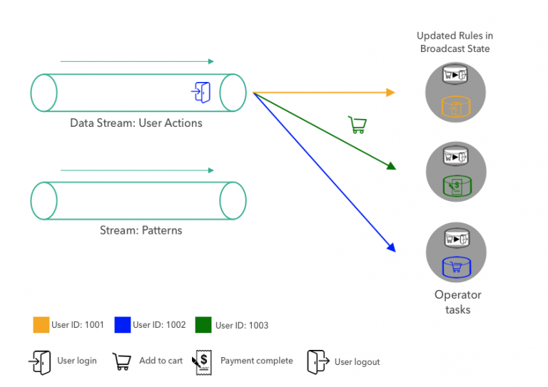

# A Practical Guide to Broadcast State in Apache Flink

August 2, 2018 - [Flink Community](https://data-artisans.com/blog/category/flink-community), [Flink Features](https://data-artisans.com/blog/category/flink-features) by [Fabian Hueske](https://data-artisans.com/blog/author/fabian)

自从版本1.5.0开始，Apache FlinkⓇ 新增如下新特性：一种被称作广播状态（broadcast）的新状态类型。在这篇博客中，我们将解释广播状态是什么（what），用一个例子展示它如何在应用场景中使用（how），主要是在事件流上评价（evaluate）动态模式。我们将引导你完成处理步骤并走读源码，帮你更好地在实践应用中使用它们。

## 广播状态是什么？

广播状态（Broadcast State）可以应用在以特定方式合并（combine）和连接（jointly）处理两个事件流（streams of events）的场景中。第一个流的事件将被广播到算子（operator）的所有并行实例中，这个算子将把它们（收到的事件）维护成状态。另一个流的事件并不是被广播（broadcast）而是把它传输（send）到同一算子（*与广播算子相同*）的独立实例中（*通常是hash key完成路由*），与广播流的事件一同处理。

新的广播状态在应用中非常适合使用在 1. join一个低吞吐和一个高吞吐的流；2. 需要动态更新处理逻辑 的场景中。在接下来的内容中，我们将使用一个详细的实例来解释广播状态，并展示其API的更多细节。

## 使用广播状态进行动态模式评价

想象一个电子商务网站，它可以捕捉所有用户的交互操作，这形成了用户操作流（stream of user actions）。（*大多数商业网站都在通过 埋点 动作进行这个事情*）

该网站实现了一个流应用程序，用来在用户事件流上匹配检测特定模式。但是，公司希望在模式随着时间变化时避免修改和重新部署该应用程序（*通常来讲，流应用程序适合于不间断地运行下去*），而采用下面的实现方式：应用程序从第二个模式流抽取模式，一旦从模式流接收到新的模式将更新其活跃态模式（active pattern）。接下来，我们将一步步讨论这个应用程序，并展示它如何利用Apache Flink的广播状态特性。


我们的示例应用抽取两个数据流。第一个数据流提供了网站上的用户操作事件，在上图的左上方展示。用户交互事件由操作的类型（用户登录，用户注销，添加到购物车，完成付款等）和用户ID组成，其中用户ID对应成了颜色。图示中的用户操作事件包括了用户1001的 *注销事件* 接下来是用户1003的 *完成付款事件* ，再是用户1002的 *添加到购物车事件*。

第二个流提供了应用程序将要评价的操作模式。一个模式由连续的两个动作组成。在上图中，模式流包括了如下两个模式：

- **模式#1**：一个用户登陆后，没有在网站上浏览更多页面就立即注销了。
- **模式#2**：一个用户将商品添加到购物车但在没有完成付款的情况下就注销了。

这些模式有助于企业更好地分析用户行为，检测恶意行为，并改善用户体验。例如，当检测到商品被添加到购物车而没有后续购买行为，网站团队可以采取适当的措施来更好地了解用户未完成购买的原因并启动特定程序以改善网站转化（比如提供折扣券，限时免费送货等）

在右侧，图中展示了同一算子并行运行的三个任务（task），它将抽取模式和用户操作流，并在操作流上完成模式评价，并将匹配的模式发送到下游。为简单起见，在例子中的算子仅仅评价了具有简单的连续两个操作的单个模式。当模式流中接收到了新的模式，当前活跃态模式将被替换。原则上，可以实现算子使其能评价 1. 更复杂的模式；2. 可以独立添加或移除的并发多模式 场景。

接下来我们将展示模式匹配程序如何使用用户操作流和模式流。


首先一个模式被发送到算子上。这个模式将被广播到算子的三个并行任务上。单个任务将模式保存成广播状态。由于广播状态只能够使用广播数据更新，所有任务的状态始终是相同的。


接下来，第一个用户操作将依据他的ID进行分发，数据将被传送到对应的算子任务。这个分发（partition）将保证同一用户的所有操作将被同一任务处理。上图展示了应用程序在第一个模式和第一批三个操作事件被算子任务消费后的状态。

当任务接收到新的用户操作，它将通过查看用户最新和前一个操作，评价当前活跃状态。对每一个用户，算子在键值状态（keyed state）中保存了前一个操作。在上图中，由于任务仅仅为每个用户接收了一个操作（设想下我们刚刚启动应用程序），模式还不需要被评价。最终，在用户的键值状态中前一个操作将被更新成最新的操作，这使得当同一用户的下一个操作到来时可以被查询。


在第一批三个操作被处理后，接下来的事件是用户1001的注销事件，它将被传送到处理用户1001对应事件的任务（task）上。当任务接收到这个操作，它将从广播状态中查找当前的模式以及用户1001的前一个操作。由于模式匹配上了这个两个操作，任务将发射一个模式匹配的事件。最后，任务更新它自身的键值状态，使用最新的操作覆盖掉前一个操作。


当模式流中，新模式到达时，它将被广播到所有任务（task），每个任务通过新模式代替当前模式，更新它自身的广播状态。



一旦广播状态更新成新模式，匹配的逻辑就像之前一样继续，也就是说，用户操作事件通过键（key）进行分区（partition），对应的任务（task）进行评价。

## 如何实现带广播状态的应用程序？

到目前为止，我们在概念层面讨论了应用程序，并解释了它如何使用广播状态在事件流上进行动态模式评价。接下来，我们将展示样例程序来说明如何通过Flink的DataStream API和广播状态特性进行编程实现。

让我们从应用程序的输入数据开始。有两个数据流，分别是操作（action）和模式（pattern）。当前，我们并不关心流从哪里来。它可以从Apache Kafka、Kinesis或任何其他系统中抽取过来。

```

DataStream<Action> actions = ???
DataStream<Pattern> patterns = ???

```

操作和模式作为Pojo各自有两个字段（field）如下所示：
- 操作（Action）：Long型的userId，String型的action
- 模式（Pattern）：String型的firstAction，String型的secondAction

做为第一步，我们指定操作流的键为userId属性。

```java
KeyedStream<Action, Long> actionsByUser = actions
 .keyBy((KeySelector<Action, Long>) action -> action.userId);
```

接下来，准备广播状态。广播状态始终表现成一个MapState，这是Flink提供的最通用的状态基础类型（primitive）。

```java
MapStateDescriptor<Void, Pattern> bcStateDescriptor =
 new MapStateDescriptor<>(
    "patterns", Types.VOID, Types.POJO(Pattern.class));
```

由于我们的应用程序一次仅评价和存储单一模式（singlePattern），因此如下配置广播状态：将MapState的key配成Void类型，value配成Pattern类型。这个Pattern始终存储在MapState的null键对应的位置。

```java
BroadcastStream<Pattern> bcedPatterns = patterns.broadcast(bcStateDescriptor);
```

使用MapStateDescriptor做为广播状态，在模式流上应用broadcast()转换，其接收BroadcastStream类型的参数bcStateDescriptor。

```java
DataStream<Tuple2<Long, Pattern>> matches = actionsByUser
 .connect(bcedPatterns)
 .process(new PatternEvaluator());
```

在获得了指定键值的actionByUser流和设置广播的bcedPatterns流后，通过connect()操作将两个流连接在一起，并在连接后的流上应用PatternEvaluator。其中PatternEvaluator是一个用户自定义函数，它实现了KeyedBroadcastProcessFunction接口。它实现了前面讨论过的模式匹配的逻辑，并发射Tuple2<Long, Pattern>类型的记录，其中包含了用户ID和匹配的模式。

```java
public static class PatternEvaluator
 extends KeyedBroadcastProcessFunction<Long, Action, Pattern, Tuple2<Long, Pattern>> {

  // handle for keyed state (per user)
  ValueState<String> prevActionState;

  @Override
  public void open(Configuration conf) {
    // initialize keyed state
    prevActionState = getRuntimeContext().getState(
    new ValueStateDescriptor<>("lastAction", Types.STRING));</code
  }
  /**
  * Called for each user action.
  * Evaluates the current pattern against the previous and
  * current action of the user.
  */
  @Override
  public void processElement(
     Action action,
     ReadOnlyContext ctx,
     Collector<Tuple2<Long, Pattern>> out) throws Exception {
   // get current pattern from broadcast state
   Pattern pattern = ctx
     .getBroadcastState(
       new MapStateDescriptor<>("patterns", Types.VOID, Types.POJO(Pattern.class)))
     // access MapState with null as VOID default value
     .get(null);
   // get previous action of current user from keyed state
   String prevAction = prevActionState.value();
   if (pattern != null && prevAction != null) {
     // user had an action before, check if pattern matches
     if (pattern.firstAction.equals(prevAction) &&
         pattern.secondAction.equals(action.action)) {
       // MATCH
       out.collect(new Tuple2<>(ctx.getCurrentKey(), pattern));
     }
   }
   // update keyed state and remember action for next pattern evaluation
   prevActionState.update(action.action);
 }
 /**
  * Called for each new pattern.
  * Overwrites the current pattern with the new pattern.
  */
 @Override
 public void processBroadcastElement(
     Pattern pattern,
     Context ctx,
     Collector<Tuple2<Long, Pattern>> out) throws Exception {
   // store the new pattern by updating the broadcast state
   BroadcastState<Void, Pattern> bcState =
     ctx.getBroadcastState(new MapStateDescriptor<>("patterns", Types.VOID, Types.POJO(Pattern.class)));
   // storing in MapState with null as VOID default value
   bcState.put(null, pattern);
 }
}
```

KeyedBroadcastProcessFunction接口提供了三个方法来处理（process）记录和发射（emit）结果。

- processBroadcastElement() 广播流上会针对每条记录都调用此方法。在我们实现的PatternEvaluator函数中，将接收到的Pattern记录放到广播状态中，通过null键进行更新（由于我们在MapState中仅存储了一个模式）。
- processElement() 在指定键的流上会针对每条记录都调用此方法。它提供了以只读模式访问广播状态的途径，这阻止了可能的修改，而带来在并行的函数实例上存在不同的广播状态。PatternEvaluator的processElement()方法从broadcast状态中检索当前模式，从keyed状态中检索用户的上一个操作。如果两者都存在，将检查前一个操作和当前操作是否匹配模式，在匹配的秦光霞将发射一个模式匹配记录。最后，它把keyed状态更新成当前用户操作。
- onTimer() 当之前注册的计时器出发时将调用此方法。触发器可以注册在任何处理方法中，用来执行计算或将来清理状态。在此示例中为保持代码简洁，我们没有实现这个方法。但是，当用户在一段时间内不再活跃（active）时，通过这个方法可以移除该用户的最后一个操作，这将避免因不活跃用户累积带来的状态增长。

你可能已经注意到了KeyedBroadcastProcessFunction的处理方法中的context对象。context对象提供了对其他功能的访问，如：
- 广播状态（读写或只读模式，取决于处理方法）
- TimerService，它提供了对记录时间戳、当前的watermark的访问，还可以在其中注册定时器
- 当前的key（仅在processElement()方法中可用）
- 为keyed state每个注册过的键（key）应用函数的方法（只在processBroadcastElement()中可用）

KeyedBroadcastProcessFunction 可以完全访问Flink的状态和time特性，这就像任何其他ProcessFunction一样，因此它可以用于实现复杂的应用程序逻辑。广播状态被设计成更通用的特性，以适应不同场景和用例。虽然我们仅仅讨论了一个十分简单并且受限的应用，但你可以通过多种方式使用广播状态，来实现应用程序中的需求。

## 结论

在这篇博客中，我们走读了样例程序，借此解释了Apache Flink中的广播状态是什么、它如何在事件流上进行动态模式评价。并且我们还讨论了API并展示了样例程序的源码。
