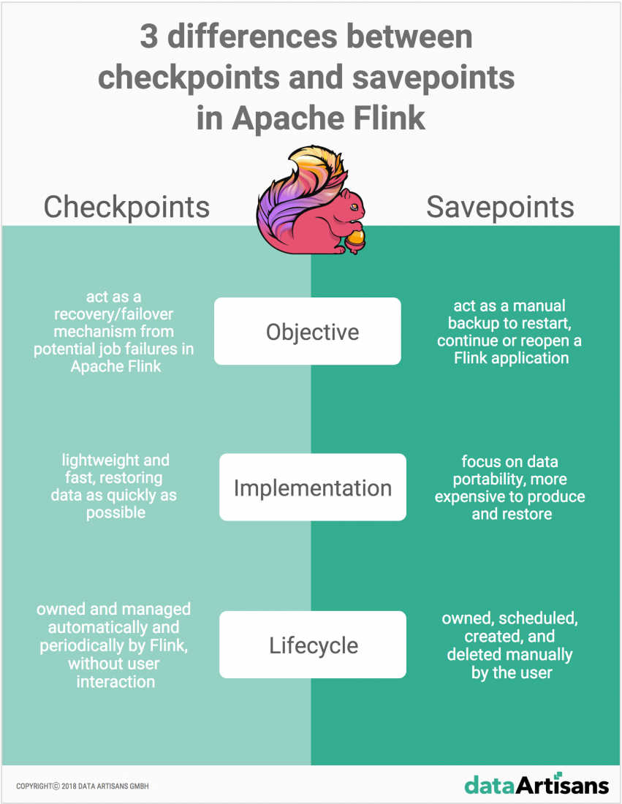

原文 url:	https://data-artisans.com/blog/differences-between-savepoints-and-checkpoints-in-flink

# 3 differences between Savepoints and Checkpoints in Apache Flink

[November 2, 2018](https://data-artisans.com/blog/2018/11/02) - [Apache Flink](https://data-artisans.com/blog/category/apache-flink) , [Flink Features](https://data-artisans.com/blog/category/flink-features)
[Stefan Richter](https://data-artisans.com/blog/author/stefan) , [Dawid Wysakowicz](https://data-artisans.com/blog/author/dawid-wysakowicz) and [Markos Sfikas](https://data-artisans.com/blog/author/markos)

这一期的博文将解释Savepoints和Checkpoints是什么，并验证在[Apache Flink](https://flink.apache.org/)中它们之间的主要不同点。在接下来的段落里，将解释什么是Savepoints，它在什么时候使用，并给出它与[Checkpoints](https://data-artisans.com/blog/how-apache-flink-manages-kafka-consumer-offsets)不同点上的一一对比。

## 在Apache Flink中Savepoints和Checkpoints是什么？

Apache Flink中的Savepoint是这样一种特性：它允许你对整个流应用在某一时点（point-in-time）生成快照（snapshot）。在这个快照中包含如下信息：输入到了哪里-即所有source的当前位置-和整个应用当前的状态。在不停止应用的情况下，我们可以获得完整状态的一致性快照，其中使用到的是Chandy-Lamport算法的变种。Savepoints包含如下两个主要部分：

- 首先，Savepoints包含一个字典，它是一个二进制文件（典型的大二进制文件），保存了这个流应用在Checkpoint/Savepoint镜像时点的完整状态信息
- 其次，一个（相对较小）元数据文件，它包含了指向所有文件的指针路径，用于指明Savepoint的组成部分、选定的分布式文件系统或数据存储的存储位置。

更多信息可以阅读更早的[博文](https://data-artisans.com/blog/turning-back-time-savepoints)，可以教你一步步在流应用中启用Savepoint。

以上这些关于Savepoints的信息听起来与之前[博文](https://data-artisans.com/blog/how-apache-flink-manages-kafka-consumer-offsets)介绍过的Apache Flink中的Checkpoints概念十分相似。检查点是Apache Flink的内部机制，用来进行错误恢复，由应用程序的状态备份组成、包括了输入（节点）的读取位置。在发生故障时，Flink通过从检查点加载应用的状态来恢复整个应用，并从存储中的读取位置继续（执行应用），就像什么都没发生一样。

可以阅读更早一篇的Flink Friday Tips文章一步步完成[Apache Flink如何管理Kafka的消费者偏移量](https://data-artisans.com/blog/how-apache-flink-manages-kafka-consumer-offsets)。

 

## 在Apache Flink中Savepoints和Checkpoints的3点不同

Checkpoints和Savepoints对Apache Flink作为[流处理框架](https://data-artisans.com/resources/stateful-stream-processing-with-apache-flink)来说是两个相互独立的特性。Savepoints和Checkpoints在实现上看起来类似，但在如下三个角度上来看，这是两种不同的特性：

  1. **目的性（Objective）**：概念上来说，Flink中Savepoints（保存点）与Checkpoints（检查点）的不同就像是传统数据库系统中备份与恢复日志之间的不同。Checkpoints的首要目的是在Apache Flink中扮演恢复机制，以确保（Flink是）一个错误容忍的处理框架，使其能从潜在的作业失败中恢复。与之相对的，Savepoints的首要目标是重放机制，可以在手动备份之后继续或重新打开暂停的应用程序，恢复用户行为。
  2. **实现方式（Implementation）**：Checkpoints和Savepoints在实现方式上也是不同的。Checkpoints被设计成轻量级、快速的。它们可能（并不是必须）使用后端保存状态的不同特性，来使得保存数据是尽可能快。举例来说，使用RocksDB作为增量Checkpoints后端状态存储时使用了RocksDB的内部格式而不是使用Flink原生的格式。这是用来加速RocksDB完成检查点处理的，使之成为更轻量的检查点机制的实例。与之相反，Savepoints设计时更多聚焦在数据的移植性上，支持对作业做出的所有更改，这使得产生和存储时保存点时的开销要稍大一些。
   3. **生命周期（Lifecycle）**：Checkpoints是自动（automatic）且定期（periodic）的。它们由Flink拥有、创建并自动定期地删除，而不需要用户的任何交互，确保在作业异常失败时可以完全恢复（full recovery）。相反，Savepoints由用户拥有并手动管理（即，调度、创建、删除）。

## 在流应用中何时使用Savepoints？

虽然[流应用程序](https://data-artisans.com/what-is-stream-processing)处理数据是连续处理（数据在运动中【in-motion】），在某些情况下，应用程序需要重新处理之前已经处理过的数据。在Apache Flink中Savepoints允许你在如下情况中执行此类操作：

- 部署流应用程序的更新版本，包含了新特性、进行了bug修复、或更好的机器学习模型
- 在应用程序中引入A/B测试，使用同一个源数据流对程序的不同版本进行测试，在不牺牲前序状态的情况下，从相同的时点启动测试。
- 在需要更多资源时对应用进行扩容
- 将流应用程序迁移到Apache Flink新的发行版上，或者将应用升级到不同的集群。

[注册Apache Flink的开放教程](https://data-artisans.com/standard-training)获得手把手的指导，习得如何在上述情况下使用Savepoints。

## 结论

Checkpoints和Savepoints在Apache Flink中是两种不同的特性，用以满足不同的需求：确保了一致性、错误容忍并保证应用程序状态在作业意外失败时可以被持久化保存，以上是Checkpoints的用武之地；与之相对的，Savepoints的目标是升级、错误修复、迁移、A/B测试的场景。这两个特性联合起来使得你可以在更多不同的场景和环境中，确保应用程序状态是被持久化的。

学习更多Apache Flink特性，以及如何最好地使用它们，Apache Flink开放教程可以给你一些上手案例来教你如何使用它们来构建基于Flink的一致性、有状态的流应用程序。注册[开放教程](https://data-artisans.com/training#schedule)或[联系我们](https://data-artisans.com/contact)获取更多信息。

Tags: [apache flink](https://data-artisans.com/blog/tag/apache-flink) , [flink state](https://data-artisans.com/blog/tag/flink-state)
