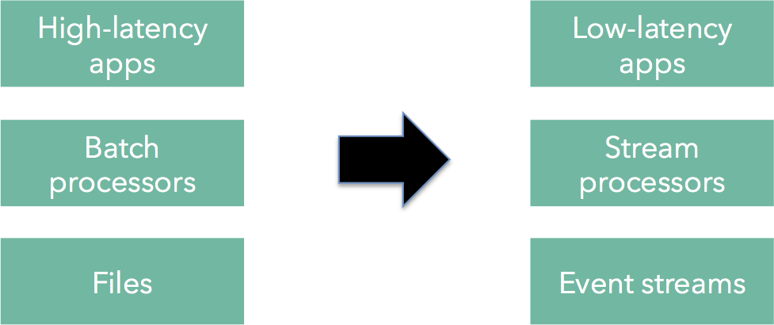
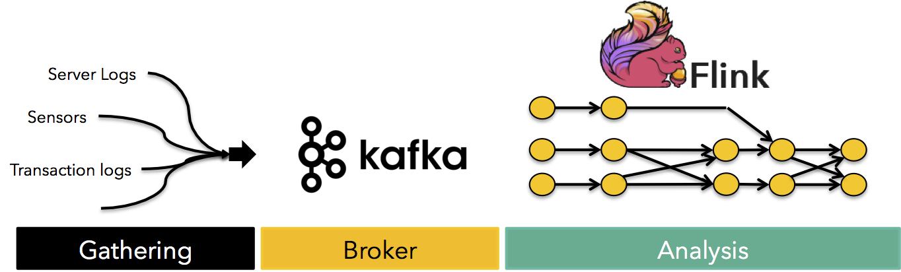

#Real-time stream processing: The next step for Apache Flink™

Posted on May 6th, 2015 by	Kostas Tzoumas and Stephan Ewen

This post also appears as a guest post at the [Confluent blog](http://blog.confluent.io/2015/05/06/real-time-stream-processing-the-next-step-for-apache-flink/).

这篇博文也也被邀请到[Confluent博客](http://blog.confluent.io/2015/05/06/real-time-stream-processing-the-next-step-for-apache-flink/)上。

Stream processing is becoming very popular with open source projects like [Apache Kafka](http://kafka.apache.org/), [Apache Samza](http://samza.apache.org/), [Apache Storm](http://storm.apache.org/), [Apache Spark’s Streaming module](https://spark.apache.org/streaming/), as well as cloud services like [Google Cloud Dataflow](https://cloud.google.com/dataflow/).

流处理在开源项目中已经开始流行，比如[Apache Kafka](http://kafka.apache.org/), [Apache Samza](http://samza.apache.org/), [Apache Storm](http://storm.apache.org/), [Apache Spark’s Streaming module](https://spark.apache.org/streaming/)，同时还有云服务如[Google云数据流](https://cloud.google.com/dataflow/)。

In this post, we introduce Apache Flink™ as a streaming system. Flink fills what we perceive as an open gap in the space of streaming systems, by providing a combination of

1. a proper foundation with a low-latency stream processor,
2. expressive APIs that enable programmers to quickly develop streaming data applications,
3. flexible operator state and streaming windows, and
4. efficient fault tolerance including streams and state.

这篇博文中，我们介绍流处理系统中的[Apache Flink](http://flink.apache.org/)。Flink填充了流处理系统中我们发现的一块空白，通过提供如下特点：

1. 低延时流处理的基础平台
2. 富于表现力的API，它可以允许称许愿快速开发流数据应用
3. 灵活的操作符状态和流处理窗口
4. 高效的容错机制，包含了流和状态

Many companies are transitioning their data infrastructure from a batch architecture to a real-time streaming architecture. Static files in distributed file systems like HDFS and relational databases are being augmented with event streams. Workloads that used to be executed with batch processors can be executed with stream processors delivering lower latency applications.

许多公司在将他们的数据基础设施从批处理架构转换到实时流处理架构。在分布式文件系统如HDFS和关系数据库中的静态文件被事件流大大扩增了。用于执行批处理的工作负载同样可以用于执行流处理，以实现低延时的应用。

There are many drivers for this transition. First, many data and use cases that formed the bulk of the workload in Hadoop clusters were always event-based (for example, machine logs). Second, stream processors are maturing to the extent that they can handle more complex workloads. Stream processors can, in principle, execute most of the workloads that batch processors can with lower latency. Thus, there is little reason to use a batch processor when a stream processor can handle the same workload. Finally, new applications such as processing sensor data often require continuous queries, and can only be served by a streaming architecture.

有很多的驱动可以实现这种转换。首先，许多数据和用户案例显示：Hadoop集群中的被组织的大量工作负载是事件驱动的（如，机器日志）。其次，流处理已经足够成熟，它可以处理更复杂的工作负载。流处理可以，原则上，执行大多数批处理能够完成的工作负载，而且时延更低。这样，当一个流处理可以处理相同工作负载时，就没有理由再使用批处理。最后，新的应用程序，如处理传感器数据，常需要连续请求，而这只能够被流处理框架所满足。

Typically, a stream architecture consists of the following three coarse components:

典型地，一个流处理框架包含如下三个组成部分（粗粒度来看）：

1. A module to gather the event streams from a variety of data sources
2. A module to collect the streams and make them available for consumption
3. A module to analyze the streams creating derived streams

The first step, gathering the streams, depends heavily on the primary data sources. Events coming from databases, machine-generated logs, and even sensors need to be cleaned, schema-tized and forwarded to a central place.

The second step, collecting the streams in one central place is the major focus of projects like Apache Kafka. Kafka offers brokers that collect streams, log and buffer them in a fault tolerant manner, as well as distribute them among the various consumers that are interested in the streams.

The third and final step is actually doing some analysis on the streams. This is the step that for example creates counters, aggregates them, correlates values, joins different streams together, and creates derived data streams that can be further integrated into the platform. This step, the data routing and transformation fabric for streaming platforms that provides the necessary delivery guarantees along with the high-level programmability required by data analysts, is the step that Apache Flink™ implements.

1. 从多个数据源进行收集（gather）事件流的模块
2. 收集（collect）流并提供其可消费能力的模块
3. 分析流并导出（derived）输出流的模块

第一步，收集数据流，这严重依赖上游的数据源。事件可以来自于数据库、机器产生的日志、甚至是来源于传感器，这些事件需要被清洗、绑定模式（）、并进一步传送到一个中心。

Flink primer

At a high level, Flink is a framework for distributed data analysis. The core of Flink is a streaming iterative data flow engine. On top of the engine, Flink exposes two language-embedded fluent APIs, the DataSet API for consuming and processing batch data sources and the DataStream API for consuming and processing event streams. Recent additions to the project are domain-specific libraries and APIs built on top of these APIs, such as a Machine Learning library, a graph analysis library (Gelly), and a SQL-like API (Table). In addition, other projects can use Flink as a backend, currently Google Cloud Dataflow, Apache SAMOA (pending), and Apache MRQL. Flink is also extensible from the backend, being able to run in a variety of environments, such as locally, standalone Flink clusters, embedded in other applications, on top of YARN, and, as of recently, on top of Apache Tez (for batch programs only).

Flink Streaming Stack
Flink can be used for both batch and stream processing. The dataflow runtime treats batch programs as a special case of streaming programs. Confused? You shouldn’t be. Think for example about the fact that even MapReduce reads HDFS files as file streams. Flink’s runtime is following this idea consistently to the end, streaming batch data all the way, including shuffles. Batch data sources are to Flink finite streams, while proper event streams are infinite streams. Admittedly, the batch API and ecosystem of Flink is more developed at this point, but the streaming ecosystem is catching up quickly.

In order to explain this better, let us jump into the details. Instead of talking about how Flink processes data streams in isolation, we would like to present 8 building blocks that, in our experience, are fundamental for stream processors and how Flink supports or plans to support these.

Building blocks for stream processing

While building Flink as a stream processor we have identified eight building blocks that we deem essential for classifying a system as a stream processor. We break these features down to four categories, each category containing two features:

Basics:
Pipelining
Replay
Handling state:
Operator state
State backup and restore
Application development:
High-level APIs and languages
Integration with batch sources
Large deployments:
High availability
Automatic scale-out and scale-in
Pipelining (#1) means that events can flow through the system freely without unnecessary delays. Operator state (#3) means that, unlike batch processing which is based on immutable transformations on data sets, stream operators need to keep state. Stream replay (#2), and state backup and restore (#4) form the foundation of tolerating machine failures. High-level APIs (#5) are needed for productive application development, as well as being able to combine streams with static sources (#6). A high-availability system (#7) is needed when streaming jobs need to run for long time periods, and elastic resource scaling (#8) is needed to run streaming jobs in shared clusters. Let’s drill into each of these features, and discuss how Flink implements those.

Few years back, Stonebraker et al. had proposed 8 system-level requirementsfor stream processing. Interestingly, there is a straightforward mapping of how these requirements can be met by a stream processor that implements the above building blocks combined with a fault-tolerant streaming source such as Apache Kafka. See the end of this post for the mapping.

Basics

Pipelining

The first functionality that almost all streaming systems provide is pipelining. Let us look at a simple windowed count where one operator tokenizes lines of an incoming log, and another operator creates a sliding window over grouped data and counts elements within the window.

Pipelining
Pipelining means that all tasks must be online at the same time and let the data stream through, even if tasks reside on different nodes. For example, the parallel tasks s1, t1, and w2 must all run concurrently, and allow the data to continuously flow through the pipeline even if t1 and w2 reside on different nodes. This requires that network shuffles cannot be performed as in batch processors by letting t1 produce its output before starting w2, but need to be performed in a streaming manner.

Replay

A data streaming system must be able to “replay” parts of a stream, reproducing the results of a user program. Replay is important for several reasons, most notably for recovering from failures, which start to happen frequently when scaling systems to large clusters. In the case of batch operations (finite streams), one can simply store and replay the entire stream and re-execute the entire task. For infinite streams, the system needs to retain a certain history of the stream and coordinate what to retain, for how long, and what to replay.

Basically all systems keep some form of upstream backup and acknowledge (sets of) records. Apache Storm, for example, tracks records with unique IDs. Put simply, operators send messages acknowledging when a record has been processed. Records are dropped from the backup when the have been fully acknowledged.

Flink follows a more coarse-grained approach and acknowledges sequences of records instead of individual records. Periodically, the data sources inject “checkpoint barriers” into the data stream (see figure below). The barriers flow through the data stream, “pushing” records before them and triggering operators to emit all records that depend only on records before the barrier.

Streaming Barriers
Once all sinks have received the barriers, Flink knows that all records before the barriers will never be needed again. They have been fully processed, including all downstream records that operators create from the original records. Flink then “group acknowledges” all those records together by letting the sources discard the backuped streams to the point where the barriers were injected.

In case of an operator failure, the data flow is reset to the last completed checkpoint (point of barrier injection) and simply resumes from there. Note that this mechanism naturally extends to having upstream backup not only at the sources, but also at intermediate operators. In that case, subsets of the dataflow may be reset in case of a failure.

It is also noteworthy that this mechanism never stops the stream from running while checkpointing, because it only inserts some messages into the stream. It is a very lightweight mechanism and thus supports low checkpoint intervals. It is even possible to have multiple barriers in the stream, meaning that multiple checkpoints are concurrently happening.

Note: At this point, Flink does not back up records itself but tightly cooperates with a persistent data source (like Kafka) to retain the records. This is crucial in any case to make sure that failures do not lose the records that are in-between the data source and the upstream backup buffers. We plan on also adding internal upstream backups to Flink, in order to relieve pressure off the sources and recover the parallel data stream in a more fine-grained manner.

Operator state, state backup and restore

Applications that go beyond simple filters or line-by-line transformations of the input need stateful operators. There are three kinds of state that are offered by Flink:

User-defined state: As Flink is a streaming dataflow system, operators are continuously running, and can contain user-defined state in the form of Java/Scala objects. This is the most elementary (but most flexible) operator state, but is not backed up or restored by the system in cases of failures.
Managed state: User-defined operations can use a special interface to put their state into an object that is backed up and restored in case of failures.
Windowed streams: Flink offers the ability to create a finite stream from an infinite stream using (sliding) windows over the stream. The contents of those windows is special form of state that is managed by the system.
State backup and restore refers to the ability of the system to reliably recover the state in the case of a failure. In Flink, we are using a variation of the Chandy-Lamport algorithm for consistent asynchronous distributed snapshots. Here, the state backup works hand-in-hand with the checkpoint barriers, which, when reaching an operator, trigger the backup of the operator state. Restoring the state happens together with resetting the stream to the last checkpoint’s barrier. Because stream- and state restore are aligned by that, this mechanism gives exactly-once processing guarantees.

The nice point of this approach is that state checkpointing may proceed asynchronously without ever interfering with and stalling the actual data flow. The data can keep streaming through the system regardless of the frequency of checkpoints.

Easing application development

We have seen that a stream processing system must keep the data moving, be able to replay streams for recovery, as well as provide an abstraction for state and be able to backup and restore that state.

Equally important is the user experience that a stream processing system provides in terms of high-level programmability. Typically, as stream platforms become more mainstream, users do not want to program applications in terms of low-level message-passing interfaces, but would like to have higher-level constructs to define the content of their applications.

Also, given that many companies nowadays do not employ a streaming system in production, most analysis is currently done using batch processors. It is very important for stream processing systems to offer an easy path for users to transition from batch-oriented to stream-oriented analysis, and also incorporate both batch and stream data sources in their analysis.

The approach that Flink takes is to provide two fluent APIs embedded in programming languages (Java and Scala) The DataSet API, whose main data structure is a distributed collection of objects of finite size. The DataStream API, whose main data structure is a potentially unbounded distribute collection of objects. Both data structures are logical, in the sense that they are merely API concepts. Internally, the system generates streaming dataflows from these programs. The APIs look very similar. Here is, for example, WordCount in the (batch) DataSet API:

public class Word {
    public String word;
    public int frequency;
}
 
DataSet<Word> counts =
  text.flatMap(new Tokenizer())
  .groupBy("word")
  .sum("frequency");
and here is a windowed WordCount in the DataStream API with a sliding window of 5 seconds that triggers computation every 1 second:

DataSet<Word> counts =
  text.flatMap(new Tokenizer())
  .window(Time.of(5, TimeUnit.SECONDS)).every(Time.of(1, TimeUnit.SECONDS)) 
  .groupBy("word")
  .sum("frequency");
Programmers that come from the batch processing world can very easily make the switch to streaming programs. The basic new notions are the one of an unbounded stream and a window (to bound an unbounded stream).

In addition to familiar APIs for developers, Flink also aims to provide libraries and DSLs on top of the DataStream API for data scientists. A first glimpse of this is the Table API, the project’s first step towards SQL support. The Table API supports equally batch and streaming. Thus, people can analyze streaming data with SQL-like syntax, e.g.,

case class CarEvent(carId: Int, speed: Int, distance: Double, time: Long)
 
val carStream = env
  .addSource(new KafkaSource[String](...))
  .map(s => /* create CarEvent object */)
 
val cars = carStream.toTable
 .filter('carId === 0)
 .select('carId, 'speed, 'distance + 1000 as 'distance, 'time % 5 as 'time)
 .toStream[CarEvent]
Large deployments

High availability

We outlined the mechanism to recover from worker failures in the sections above. Compensating for failures of the master is current work in progress. The basic idea is the same as in most other systems: Have multiple masters nodes for failover and use ZooKeeper to elect the leader. The changing state that the Flink master maintains is rather small for running dataflows: It consists mainly of the checkpoint IDs and pointers to the latest backuped state from all operators.

Scale-in and scale-out

For long running jobs, it is often desirable to change the parallelism of operators without losing the operator state. The way we plan to implement this in Flink is by shutting the dataflow down with a checkpoint, and bringing the dataflow back up with a different parallelism. Think of it as a controlled failure and resume operation. The hardest thing here is re-distributing the state over a different number of workers. A typical approach to that (taken for example in Apache Samza) is to always over-partition the state and have each parallel operator handle multiple partitions. Repartitioning means then simple changing the assignment between partitions and operators.

What about the Lambda and Kappa architectures?

When talking about streaming, the Lambda architecture is an oft-mentioned concept. The Lambda architecture uses a batch processor for the “heavy lifting”, and a stream processor in order to keep up with the fresh data, taking care of the updates that the batch processor did not have time to deal with. While the Lambda architecture philosophy contains several concepts that are extremely useful when building large-scale services, we believe that the specific use of a batch and stream processor in this manner is to some extent an artifact of stream processors not being powerful enough when Lambda was proposed.

This is also the idea behind the Kappa architecture, which advocates using a stream processor for all processing. Flink is exactly this, a stream processor that surfaces both a batch and a streaming API, which are both executed by the underlying stream processor. However, we have observed that there are certain additions needed to the Kappa architecture.

While a streaming dataflow system can certainly execute batch programs (this is what Flink does), the framework should include few different code paths for batch and streaming. In particular, Flink includes an optimizer that is only applicable for batch programs, as query optimization is very different for batch and stream use cases. Second, the behavior of batch and streaming is different for moving intermediate data and state out-of-core. When memory runs out, operators in batch programs should spill to disk. In stream programs, spilling to disk is one option, the others being load shedding and scale-out. Finally, fault tolerance is somewhat easier in batch programs, as finite streams (e.g., static files) can be replayed completely, which enables an optimized code path for batch recovery.

History of stream processing in Flink

The relationship between Flink and stream processing has a somewhat funny history. Interestingly, Flink always had pipelining, the first essential feature for stream processing.

The decision to make Flink a pipelined engine rather than a batch engine (such as Hadoop MapReduce) was made for efficiency reasons. Pipelining engines can be faster in executing batch programs than batch engines in a wide variety of use cases. For example, in typical data warehousing scenarios where a fact table is joined with multiple dimension tables pipelining the fact table results in huge savings. This is the reason that subsequent SQL-on-Hadoop solutions, most notably Impala, are pipelined engines instead of batch engines like Hadoop MapReduce. Flink is today in fact a hybrid engine that can support both batch and pipelined data shuffles natively.

Flink’s DataStream API followed later, when we realized that surfacing the underlying streaming capabilities at an API layer would be interesting for many applications. Flink is architected as a layered system, which means that its APIs are exactly this: APIs. Therefore, adding a streaming API did not require changes to the underlying engine. Both the DataSet and the DataStream APIs create dataflow programs that “look” the same to the Flink engine.

Looking ahead

The Flink community is currently very active in further developing Flink as a stream processor, both by fixing missing features, and by adding new functionality. Our goal is to provide both the necessary foundation with a proper stream processor, the high-level programmability needed for productive application development, the ability to seamlessly intermix batch and streaming in applications, as well as the necessary tools for production deployments.

Appendix

Few years back, Stonebraker et al. published a paper that outlined 8 requirements for stream processing. While these are system-level requirements and not individual features, there is a good mapping between Stonebraker’s requirements and the 8 building blocks we define above:

Keep the data moving: This is achieved by feature #1, and implementing feature #4 without blocking the dataflow.
Query using StreamSQL: This corresponds roughly to feature #5. While a variant of SQL is important, we believe that it is equally important to offer language-embedded APIs as well.
Handle stream imperfections: This point refers mainly to handling “straggling” records that arrive late, and offering API constructs to handle those; it does not map to any of our requirements so far. Flink does not offer a mechanism to handle straggling records at this point, but may later adopt a similar way of handling this as Google Cloud Dataflow, via user-defined watermarks and straggler-handlers (see also MillWheels).
Generate predictable outcomes: While global ordering of streams is not commonly offered by distributed stream processors, a variant of exactly-once delivery guarantees is commonly achieved by features #2 and #4.
Integrate stored and streaming data: This is achieved by feature #6.
Guarantee data safety and availability: This requirement is achieved by a fault tolerant streaming source (typically Apache Kafka), a highly available master (feature #6), and a fault tolerance mechanism (comprised of features #2 and #4).
Partition and scale applications automatically: this corresponds to feature #8
Process and Respond Instantaneously: this is a holistic, system-level requirement that is achieved by an efficient implementation of all the above.