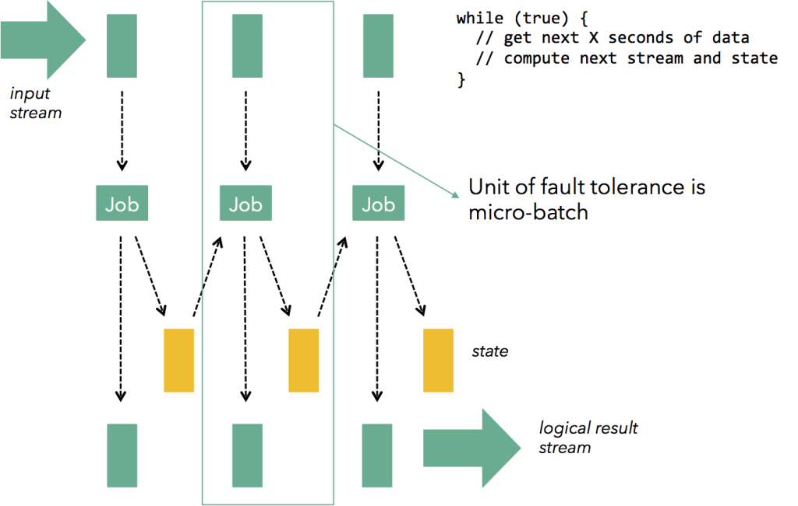
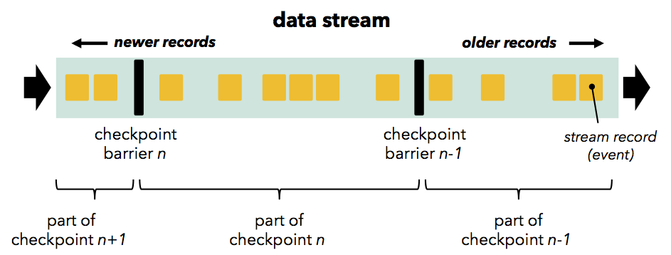
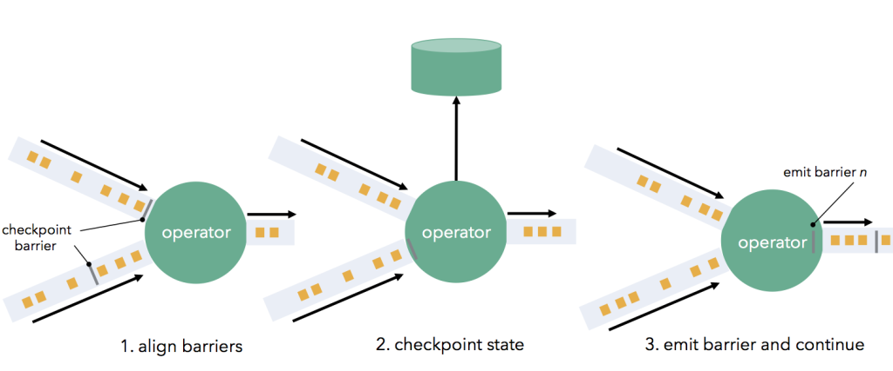
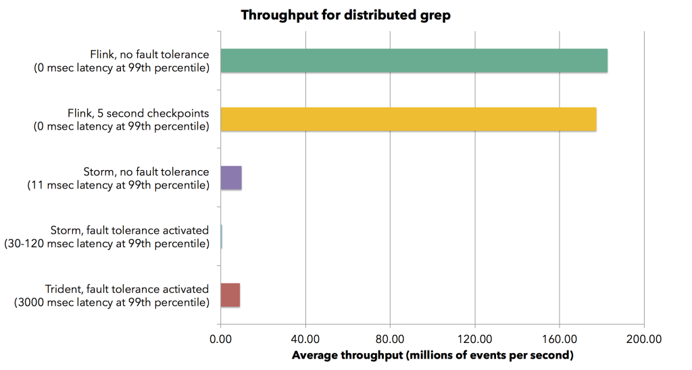
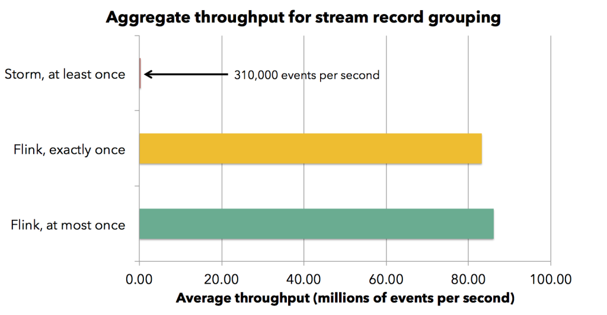
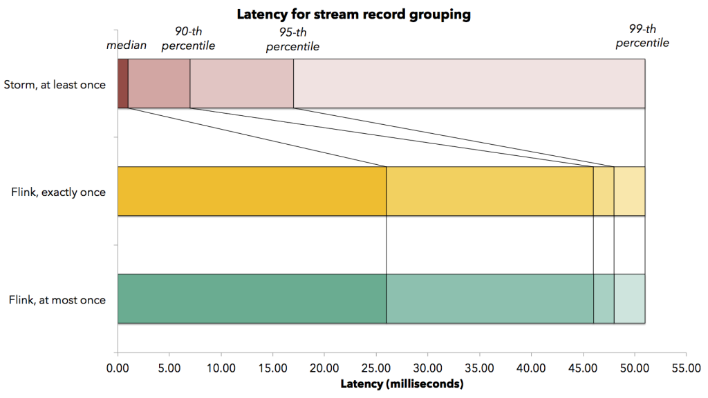
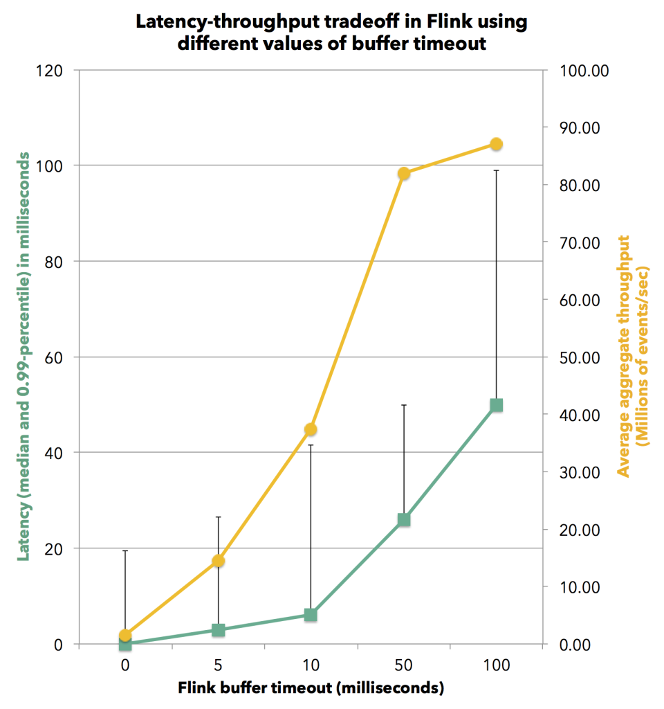
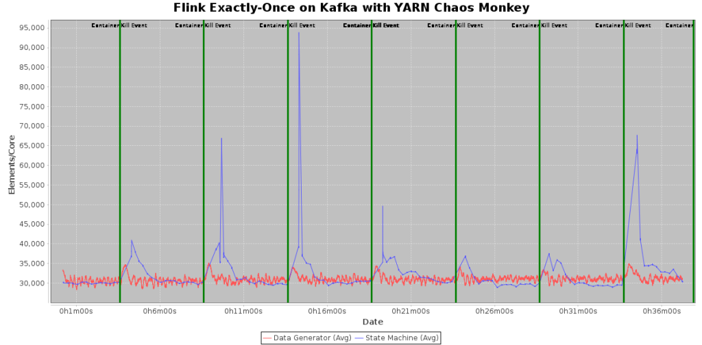

原文 url:	https://data-artisans.com/blog/high-throughput-low-latency-and-exactly-once-stream-processing-with-apache-flink

# High-throughput, low-latency, and exactly-once stream processing with Apache Flink™

[August 5, 2015](https://data-artisans.com/blog/2015/08/05) - [Flink Features](https://data-artisans.com/blog/category/flink-features) , [Resources](https://data-artisans.com/blog/category/resources)
[Kostas Tzoumas](https://data-artisans.com/blog/author/kostas)
[simple and flexible the same time.](http://blog.confluent.io/turning-the-database-inside-out-with-apache-samza/)

## An Evolution of Streaming Architectures


 - Exactly-once guarantees: state in stateful operators should be correctly restored after a failure
 - Low latency: the lower the better. Many applications require sub-second latency
 - High throughput: pushing large amounts of data through the pipeline is crucial as the data rates grow
 - Powerful computation model: the framework should offer a programming model that does not restrict the user and allows a wide variety of applications
 - Low overhead of the fault tolerance mechanism in the absence of failures
 - Flow control: backpressure from slow operators should be naturally absorbed by the system and the data sources to avoid crashes or degrading performance due to slow consumers


### **Record acknowledgements (Apache Storm)**

[upstream backup and record acknowledgements](https://storm.apache.org/documentation/Guaranteeing-message-processing.html)
*not*
[Twitter Heron](http://dl.acm.org/citation.cfm?id=2742788)

### **Micro batches (Apache Storm Trident, Apache Spark Streaming)**

[](https://data-artisans.com/wp-content/uploads/2015/08/microbatching.png)

 - Programming model: to achieve its goals, Spark Streaming, for example, changes the programming model from streaming to micro-batching. This means that users can no longer window data in periods other than multiples of the checkpoint interval, and the model cannot support count-based or session windows needed by many applications. These are left as concerns for the application developer. The pure streaming model with continuous operators that can mutate state provides more flexibility for users.
 - Flow control: Micro-batch architectures that use time-based batches have an inherent problem with backpressure effects. If processing of a micro-batch takes longer in downstream operations (e.g., due to a compute-intensive operator, or a slow sink) than in the batching operator (typically the source), the micro batch will take longer than configured. This leads either to more and more batches queueing up, or to a growing micro-batch size.
 - Latency: Micro-batching obviously limits the latency of jobs to that of the micro-batch. While sub-second batch latency is feasible for simple applications, applications with multiple network shuffles easily bring the latency up to multiple seconds.

```
dataStream .map(transformRecords) .groupBy(“sessionId”) .window(Time.of(5, TimeUnit.SECONDS)) .sum(“price”)
```

**Note:**

### **Transactional updates (Google Cloud Dataflow)**

[here](https://cloud.google.com/dataflow/model/windowing)
```
PCollection<String> items = ...; PCollection<String> session_windowed_items = items.apply( Window.<String>into(Sessions.withGapDuration(Duration.standardMinutes(10))))
```

[at least once guarantees](https://samza.apache.org/learn/documentation/0.9/container/state-management.html)

### **Distributed Snapshots (Apache Flink™)**

[this paper](http://arxiv.org/abs/1506.08603)
[here](http://blog.acolyer.org/2015/04/22/distributed-snapshots-determining-global-states-of-distributed-systems/)
*The global-state-detection algorithm is to be superimposed on the underlying computation: it must run concurrently with, but not alter, this underlying computation.*
*stream barriers*
[Flink documentation](https://ci.apache.org/projects/flink/flink-docs-master/internals/stream_checkpointing.html)
[](https://data-artisans.com/wp-content/uploads/2015/08/streambarrier.png)
[](https://data-artisans.com/wp-content/uploads/2015/08/operatorcheckpoints.png)

### **Summary**


|   | **Record acks (Storm)** | **Micro-batching (Spark Streaming, Trident)** | **Transactional updates (Google Cloud Dataflow)** | **Distributed snapshots (Flink)** |
|:-:|:-:|:-:|:-:|:-:|
| **Guarantee** | At least once | Exactly once | Exactly once | Exactly once |
| **Latency** | Very Low | High | Low (delay of transaction) | Very Low |
| **Throughput** | Low | High | Medium to High (Depends on throughput of distributed transactional store) | High |
| **Computation model** | Streaming | Micro-batch | Streaming | Streaming |
| **Overhead of fault tolerance mechanism** | High | Low | Depends on throughput of distributed transactional store | Low |
| **Flow control** | Problematic | Problematic | Natural | Natural |
| **Separation of application logic from fault tolerance** | Partially (timeouts matter) | No (micro batch size affects semantics) | Yes | Yes |


## Show me the numbers

[here](https://github.com/dataArtisans/performance)
*Trident*

### **Throughput**

*grep*
[](https://data-artisans.com/wp-content/uploads/2015/08/grep_throughput.png)
*the high throughput does not come at the cost of latency*
[](https://data-artisans.com/wp-content/uploads/2015/08/throughput_grouping.png)

### Latency

[](https://data-artisans.com/wp-content/uploads/2015/08/latency_grouping.png)
*stream alignment*
*buffer timeout*
[](https://data-artisans.com/wp-content/uploads/2015/08/buffer_timeout.png)

### **Correctness and Recovery Overhead**

[test program](https://github.com/StephanEwen/flink-demos/tree/master/streaming-state-machine)
[](https://data-artisans.com/wp-content/uploads/2015/08/kafka-throughput-no-red.png)

## What’s coming up


### **High availability**

[Apache Zookeeper](https://zookeeper.apache.org/)

### **Event time and watermarks**

*event time*

### **Improved monitoring of running jobs**

[Flink Forward 2015](http://flink-forward.org/)