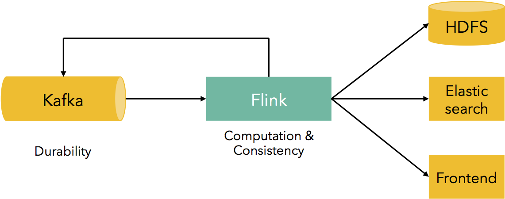
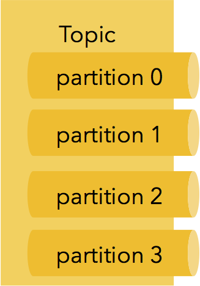
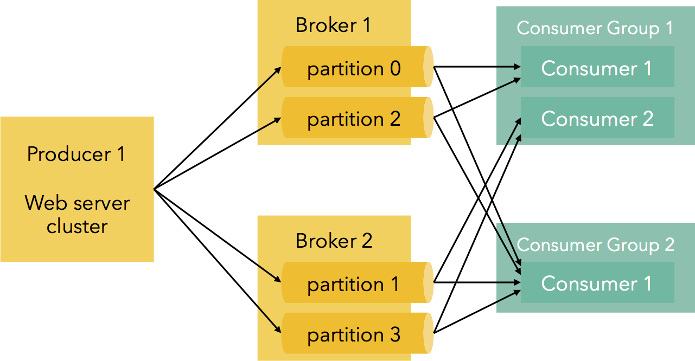
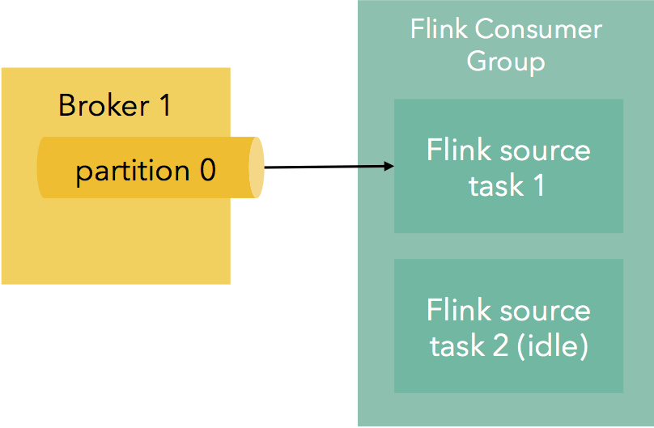
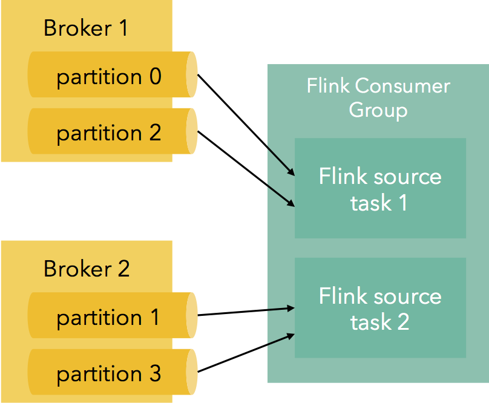
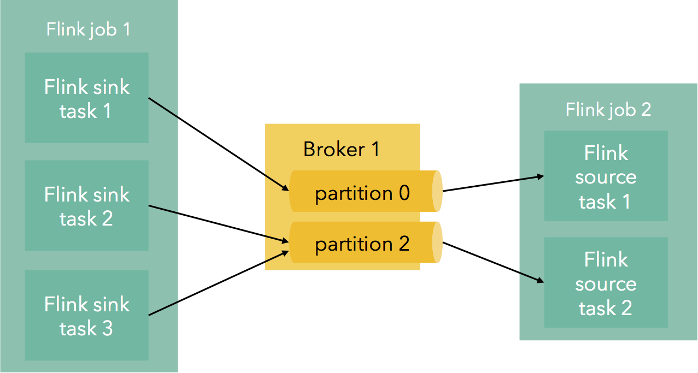

原文 url:	https://data-artisans.com/blog/kafka-flink-a-practical-how-to

# Kafka + Flink: A Practical, How-To Guide

[September 2, 2015](https://data-artisans.com/blog/2015/09/02) - [Flink Features](https://data-artisans.com/blog/category/flink-features) , [Resources](https://data-artisans.com/blog/category/resources)
[Robert Metzger](https://data-artisans.com/blog/author/robert)
A very common use case for Apache Flink™ is stream data movement and analytics. More often than not, the data streams are ingested from Apache Kafka, a system that provides durability and pub/sub functionality for data streams. Typical installations of Flink and Kafka start with event streams being pushed to Kafka, which are then consumed by Flink jobs. These jobs range from simple transformations for data import/export, to more complex applications that aggregate data in windows or implement CEP functionality. The results of these jobs may be actually fed back to Kafka for consumption by other services, written out to HDFS, other systems like Elasticsearch or user-facing web frontends.

In such pipelines, Kafka provides data durability, and Flink provides consistent data movement and computation. data Artisans and the Flink community have put a lot of work into integrating Flink with Kafka in a way that (1) guarantees exactly-once delivery of events, (2) does not create problems due to backpressure, (3) has high throughput, and (4) is easy to use for application developers.
In this blog post, we provide a hands-on guide for developing your first Flink application using the Kafka consumer and producers bundled with Flink.

## A 5-minute Introduction to Kafka

In order to understand how Flink is interacting with Kafka, let us first introduce the main concepts behind Kafka. Apache Kafka is a distributed, high-throughput message queuing system designed for making streaming data available to multiple data consumers. Kafka makes the streaming data durable by persisting incoming messages on disk using a log data structure. This allows various downstream consumers to read the stream at different positions and different speeds and also read messages from the past, i.e., “replaying history”. 
 
  
 

The most important abstraction in Kafka is the
*topic*
. A topic is a handle to a logical stream of data, consisting of many partitions. Partitions are subsets of the data served by the topic that reside in different physical nodes. Services that put data into a topic are called
*producers*
. For example, Kafka comes bundled with a “console producer” which puts the strings from standard input into a topic.
The opposite of a producer, i.e., a service that reads data from a topic is called a
*consumer*
. The individual partitions of a topic are managed by a Kafka
*broker*
, a service that is installed on the node that contains the partition and allows consumers and producers to access the data of a topic. When a partition is replicated (for durability), many brokers might be managing the same partition. Then, one of these brokers is designated as the “leader”, and the rest are “followers”.
Kafka is assigning each message within a partition a unique id, the so-called “message offset”, which represents a unique, increasing logical timestamp within a partition. This offset allows consumers to request messages from a certain offset onwards, essentially consuming data from a given past logical time. 
 


To enable this model for multiple consumers, there is a concept of “consumer groups”. For each consumer group, messages are guaranteed to be consumed at least once.
*all*


## Hands-on: Use Kafka topics with Flink

Let us now see how we can use Kafka and Flink together in practice. The code for the examples in this blog post is available
[here](https://github.com/dataArtisans/kafka-example)
, and a screencast is available below.

### **Preparation: Get Kafka and start it locally**

The easiest way to get started with Flink and Kafka is in a local, standalone installation. We later cover issues for moving this into a bare metal or YARN cluster. First, download, install and start a Kafka broker locally. For a more detailed description of these steps, check out the
[quick start section in the Kafka documentation](http://kafka.apache.org/documentation.html#quickstart)
.
```
#get kafka wget http://mirror.softaculous.com/apache/kafka/0.8.2.1/kafka_2.10-0.8.2.1.tgz
```

```
# unpack tar xf kafka_2.10-0.8.2.1.tgz cd kafka_2.10-0.8.2.1
```

```
# start zookeeper server ./bin/zookeeper-server-start.sh ./config/zookeeper.properties
```

```
# start broker ./bin/kafka-server-start.sh ./config/server.properties
```

```
# create topic “test” ./bin/kafka-topics.sh --create --topic test --zookeeper localhost:2181 --partitions 1 --replication-factor 1
```

```
# consume from the topic using the console producer ./bin/kafka-console-consumer.sh --topic test --zookeeper localhost:2181
```

```
# produce something into the topic (write something and hit enter) ./bin/kafka-console-producer.sh --topic test --broker-list localhost:9092
```


### **Consume data using Flink**

The next step is to subscribe to the topic using Flink’s consumer. This will allow you to transform and analyze any data from a Kafka stream with Flink.
Flink ships a maven module called “flink-connector-kafka”, which you can add as a dependency to your project to use Flink’s Kafka connector:
```
<dependency> <groupId>org.apache.flink</groupId> <artifactId>flink-connector-kafka</artifactId> <version>0.9.1</version> </dependency>
```

First, we look at how to consume data from Kafka using Flink. We will read strings from a topic, do a simple modification, and print them to the standard output. We will use the console producer that is bundled with Kafka. The end result is a program that writes to standard output the content of the standard input.
Here is how you can create a Flink DataStream out of a Kafka topic. Note that both the DataStream and topics are distributed, and Flink maps topic partitions to DataStream partitions (here, we are reading the required Kafka parameters from the command line):
```
StreamExecutionEnvironment env = StreamExecutionEnvironment.getExecutionEnvironment(); ParameterTool parameterTool = ParameterTool.fromArgs(args); DataStream < String > messageStream = env.addSource(new FlinkKafkaConsumer082 < > (parameterTool.getRequired("topic"), new SimpleStringSchema(), parameterTool.getProperties()));
```

Once a DataStream is created, you can transform it as you like. For example, let us pad every word with a fixed prefix, and print to stdout:
```
messageStream .rebalance() .map ( s -&gt; “Kafka and Flink says: ” + s) .print();
```

The call to rebalance() causes data to be re-partitioned so that all machines receive messages (for example, when the number of Kafka partitions is fewer than the number of Flink parallel instances). The full code can be found
[here](https://github.com/dataArtisans/kafka-example/)
.
The command-line arguments to pass to this Flink program in order to read from the Kafka topic “test” that we have created before are the following:
```
--topic test --bootstrap.servers localhost:9092 --zookeeper.connect localhost:2181 --group.id myGroup
```

Since we are reading from the console producer, and printing to the standard output, the program will simply print the strings you write in the console. These strings should appear almost instantly.

### **Produce data using Flink**

Let us now look on how you can write into a Kafka topic using Flink. We will, as before create a StreamExecutionEnvironment, and a Flink DataStream using a simple String generator. 
 

```
StreamExecutionEnvironment env = StreamExecutionEnvironment.getExecutionEnvironment(); DataStream < String > ; messageStream = env.addSource(new SimpleStringGenerator());
```

Then we will put this DataStream into a Kafka topic. As before, we read the relevant Kafka parameters as command line arguments:
```
ParameterTool parameterTool = ParameterTool.fromArgs(args); messageStream.addSink(new KafkaSink < > (parameterTool.getRequired("bootstrap.servers"), parameterTool.getRequired("topic"), new SimpleStringSchema()));
```

The command line arguments to pass to the program in order to write the strings to the Kafka console topic we created above are the following;
```
--topic test --bootstrap.servers localhost:9092
```

Check out a [screencast of running the examples of this section](https://www.youtube.com/watch?v=7RPQUsy4qOM&feature=youtu.be) .
**Running the example in a cluster**
Of course, the Flink code we saw also works in a cluster. To run this code in a cluster, first install Kafka by either using your favorite distribution or follow [Kafka’s documentation](http://kafka.apache.org/documentation.html#quickstart) for setting up multiple brokers
. Make sure that you use the Flink consumer that corresponds to your Kafka version (currently 0.8.1 and 0.8.2 are available).
When creating a new topic in a cluster, it is advised to set an appropriate number of partitions so that all parallel instances of Flink receive data. To achieve that, the number of partitions has to be at least equal to the number of Flink instances.

## Frequently Asked Questions


### **How are Kafka partitions assigned to Flink workers?**

When creating a Kafka topic, the user has to specify the number of partitions. Partitions are assigned to Flink’s parallel task instances.
When there are more Flink tasks than Kafka partitions, some of the Flink consumers will just idle, not reading any data: 
 
  
 

When there are more Kafka partitions than Flink tasks , Flink consumer instances will subscribe to multiple partitions at the same time: 
 
  
 

Flink maintains assignment of partitions to Flink instances also after failures, keeping the partitioning deterministic, which is essential for exactly-once delivery.

### **How does Flink retain the order of messages in Kafka partitions?**

Since Kafka partitions are ordered, it is useful for some applications to retain this order both within and across Flink jobs.
Inside a Flink job, all record-at-a-time transformations (e.g., map, flatMap, filter, etc) retain the order of their input. Partitioning and grouping transformations change the order since they re-partition the stream.
When writing to Kafka from Flink, a custom partitioner can be used to specify exactly which partition an event should end up to. When no partitioner is used, Flink will use a direct mapping from parallel Flink instances to Kafka partitions. This means that multiple Flink jobs that use Kafka as an intermediate pipe retain the order within partitions: 
 
  
 

**How does Flink guarantee exactly-once processing with Kafka?**
Flink’s Kafka consumer integrates deeply with Flink’s
[checkpointing mechanism](https://data-artisans.com/high-throughput-low-latency-and-exactly-once-stream-processing-with-apache-flink/)
to make sure that records read from Kafka update Flink state exactly once. Flink’s Kafka consumer participates in Flink’s checkpointing mechanism as a stateful operator whose state is Kafka offsets.
Flink periodically checkpoints user state using an adaption of the Chandy-Lamport algorithm for distributed snapshots. 
 
 Checkpointing is triggered by barriers, which start from the sources and travel through the topology together with the data, separating data records that belong to different checkpoints. Part of the checkpoint metadata are the offsets for each partition that the Kafka consumer has read so far. Offsets are committed only when a checkpoint has been completed. This means, that the offsets that are part of the checkpoint are consistent with the state backups generated by the same checkpoint, which results in exactly-once state update guarantees when restarting from failures.
On completion of a checkpoint, the Kafka consumer also commits the offsets to Zookeeper. From the offset in Zookeeper, users can still use tools such as Kafka’s
[Offset Checker](https://cwiki.apache.org/confluence/display/KAFKA/System+Tools#SystemTools-ConsumerOffsetChecker)
.
This [Slideshare presentation](https://www.slideshare.net/robertmetzger1/clickthrough-example-for-flinks-kafkaconsumer-checkpointing) shows a step-by-step example of the checkpointing with the Kafka consumer.

### **How does Flink handle backpressure when reading from Kafka topics?**

Streaming systems like Flink need to be able to slow down upstream operators (for example the Kafka consumer) if downstream operators operators (like sinks) are not able to process all incoming data at the same speed. This is called backpressure handling (you can read more about Flink’s backpressure handling
[here](https://data-artisans.com/how-flink-handles-backpressure/)
).
Flink’s Kafka consumer handles backpressure naturally: As soon as later operators are unable to keep up with the incoming Kafka messages, Flink will slow down the consumption of messages from Kafka, leading to fewer requests from the broker.
Since brokers persist all messages to disk, they are able to also serve messages from the past. 
As soon as the operators speed up again, Flink will consume the build up messages at full speed. This behavior makes Kafka a perfect fit as a buffer between streaming sources and Flink, as it provides a durable buffer for events at load spikes 
 

**Want to learn more? Here are some next steps:**

- Check out the source code for the examples in the blog post [here](https://github.com/dataArtisans/kafka-example) .
- Read [here](https://data-artisans.com/flink-at-bouygues-html/) on how people have successfully put Kafka and Flink to work in the real world.
- If you are interested in trying out Flink and Kafka yourself, visit the [Flink documentation](https://ci.apache.org/projects/flink/flink-docs-master/apis/streaming_guide.html#apache-kafka) for more details.
