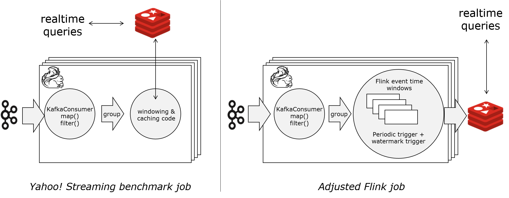
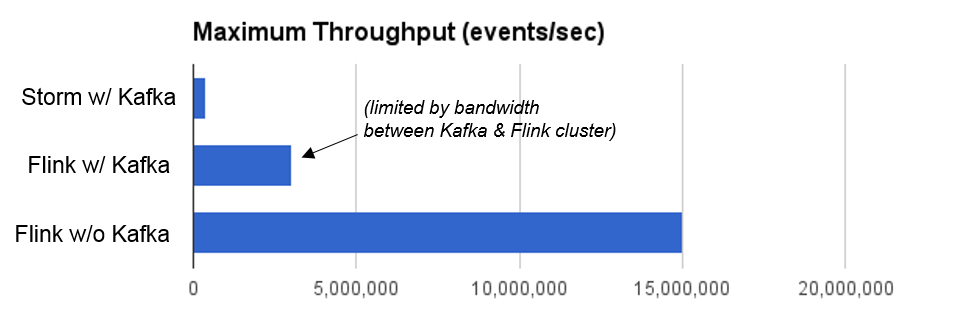
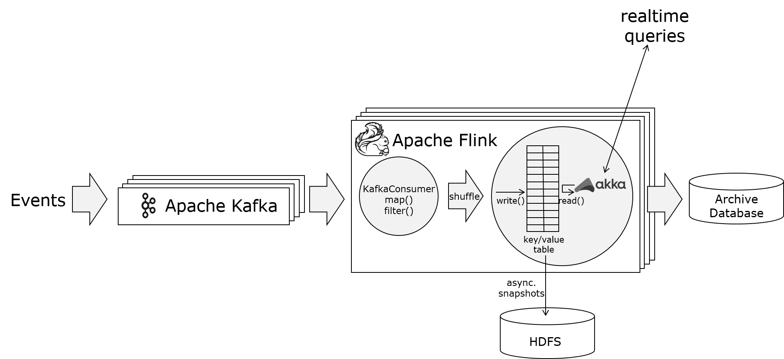
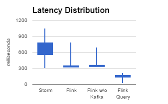

原文 url:	https://data-artisans.com/blog/extending-the-yahoo-streaming-benchmark

# Extending the Yahoo! Streaming Benchmark

[February 2, 2016](https://data-artisans.com/blog/2016/02/02) - [Flink Features](https://data-artisans.com/blog/category/flink-features) , [Resources](https://data-artisans.com/blog/category/resources)
[Jamie Grier](https://data-artisans.com/blog/author/jamie)
**Update December 18, 2017:**  Nearly 2 years after this initial post, [we discussed the Yahoo streaming benchmark in another blog post](https://data-artisans.com/blog/curious-case-broken-benchmark-revisiting-apache-flink-vs-databricks-runtime) where we cover some of the issues we see with modern benchmarking methods.
[Flink Forward 2015](http://flink-forward.org/)
[team](https://twitter.com/jamiegrier/status/678018199569350656)
[Yahoo! benchmark](http://yahooeng.tumblr.com/post/135321837876/benchmarking-streaming-computation-engines-at)
[variants](https://github.com/dataArtisans/yahoo-streaming-benchmark)
[GitHub](https://github.com/dataArtisans/yahoo-streaming-benchmark)

## Benchmarking: Comparing Flink and Storm

[Yahoo! benchmark](http://yahooeng.tumblr.com/post/135321837876/benchmarking-streaming-computation-engines-at)

- 10 Kafka brokers with 2 partitions each
- 10 compute machines (Flink / Storm)
- Each machine has 1 Xeon E3-1230-V2@3.30GHz CPU (4 cores w/ hyperthreading) and 32 GB RAM (only 8GB allocated to JVMs)
- 10 GigE Ethernet between compute nodes
- 1 GigE Ethernet between Kafka cluster and Flink/Storm nodes

## Fault Tolerance and Throughput

- For Storm, we turned acknowledgements on, to make the spouts re-send lost tuples upon failures. This, however, does not prevent lost state in the event of a Storm worker failure. The messaging guarantees provided are at-least-once which means there can be tuple replays leading to overcounting. In addition to that the actual state being accumulated on each node as the 10 second aggregates are computed is lost whenever there is a failure. This leaves the possibility of both lost values and duplicates in the final results.

- For Flink, we changed the job to use Flink’s built-in windowing mechanism. Starting with version 0.10, Flink supports windows on event time. We use Flink’s window trigger API to emit the current window to Redis when the window is complete (every 10 seconds) and in addition we do an early update of the window every second to meet the SLA requirement defined in the Yahoo! benchmark. We also have Flink’s fault tolerance mechanism enabled (with checkpoints every second) which means the window state is recovered in the event of any failure and also guarantees exactly-once semantics with regard to the aggregated counts we are computing. Said another way this means the results we are computing here are the same whether there are failures along the way or not. This is true exactly-once semantics.

- We were actually able to get 400K events/second out of Storm (compared to 170K in the Yahoo! benchmark), presumably because of the difference in CPUs we used and potentially the 10 GigE links between the worker machines. Storm was still not able to saturate the network links to Kafka, however.

- Flink started to saturate the network links to Kafka at around 3 million events/sec and thus the throughput was limited at that point. To see how much Flink could handle on these nodes we moved the data generator into the Flink topology. The topology then had 3 operators: (datagen) -> (map-filter) -> (window). In this configuration we were able to get to a throughput of 15 million events/second.

- We could not see a measurable throughput difference in Flink when switching fault tolerance on or off. Since the state is comparably small, the checkpoints cost very little.

## Winning Twitter Hack Week: Eliminating the key-value store bottleneck

over a million events per second
windows of one hour
hundreds of millions of distinct keys per window
dramatically
immediately

Streaming application querying state in the stream processor
**280,000 events/sec**
**15,000,000 events/sec**

## Latency

- Both the Storm job and the first Flink job write their results to Redis, and latencies are analyzed with the same formula and scripts as in the Yahoo! streaming benchmark. The scripts only see the final write of a window to Redis. We measured a comparable latency distribution for Storm as the one reported in the Yahoo! streaming benchmark. The majority of the latency is caused by the delay of the thread that periodically flushes the results to Redis.

- Flink’s final window write is triggered when the window is closed by the event time watermark. Under default settings, that watermark is generated more frequently than once per second, leading to a bit more compact latency distribution. We also observed that the latency stays low under high throughput.

- The Flink-with-state-query job has no form of periodic flush or delay at all; hence, the latency here is naturally lower than in the other jobs, ranging between 1 and 240 milliseconds. The high-percentile latencies come most likely from garbage collection and locks during checkpoints and can probably be brought even lower by optimizing the data structure holding the state (currently a simple Java HashMap).

## Our takeaway from these experiments

**different generations**

- **Higher efficiency:**  The difference in throughput between Storm and Flink is huge. This translates directly to either scaling down to fewer machines or being able to handle much larger problems.

- **Fault tolerance and consistency:** Flink provides exactly-once semantics where Storm only provides at-least-once semantics. When these better guarantees come at high cost, many deployments will deactivate them and applications will often not be able to rely on them. However, with Flink exactly-once guarantees are cheap and applications can take it for granted. This is the same argument as for NoSQL databases, where better consistency guarantees led to wider applicability. With these guarantees a whole new realm of stream processing applications become possible.

- **Exploiting local state:**  When building streaming applications, fault-tolerant local state is very powerful. It eliminates the need for distributed operations/transactions with external systems such as key-value stores which are often the bottleneck in practice. Exploiting the local state in Flink like we did, we were able to build the query abstraction that lifted a good part of the database work into the stream processor. This allowed us tremendous throughput and also allowed queries immediate access to the computed state.

Special thanks to Steve Cosenza ( [@scosenza](https://twitter.com/scosenza) ), Dan Richelson ( [@nooga](https://twitter.com/nooga) ) and Jason Carey ( [@jmcarey](https://twitter.com/jmcarey) ) for all their help with the Twitter Hack Week project.