原文 url:	https://data-artisans.com/blog/robust-stream-processing-flink-walkthrough

# Robust Stream Processing with Apache Flink®: A Simple Walkthrough

[August 18, 2016](https://data-artisans.com/blog/2016/08/18) - [Flink Features](https://data-artisans.com/blog/category/flink-features) , [Resources](https://data-artisans.com/blog/category/resources)
[Michael Winters](https://data-artisans.com/blog/author/mike)
®
[A recording is available on YouTube](https://www.youtube.com/watch?v=fstKKxvY23c)
For our readers out there who are new to Apache Flink ® , it’s worth repeating a simple yet powerful point: Flink enables stateful stream processing with production-grade reliability and accuracy guarantees. No longer should streaming applications be synonymous with estimates–imprecise systems that must be coupled with a batch processor to ensure reliability–but rather, robust and correct computations made in real-time.
In the demo, Jamie walked through Flink’s most powerful stream processing features and provided a simple visualization showing exactly how Flink enables more accurate and more reliable streaming applications.
Here’s what you’ll see if you walk through the demo yourself (with real-time feedback via a Grafana dashboard):

- **Event time vs. processing time:** Flink makes it easy to work with data on event time rather than processing time. In other words, data that arrives late will be handled accurately according to when events actually occurred.
- **Checkpointing for failure recovery:** In the event of a failure, your Flink applications will be able to recover with a) no lost state and b) negligible impact on latency.
- **Savepoints for scheduled downtime:** The checkpointing feature, designed for fault tolerance, extends to user-initiated savepoints for planned downtime. It’s like git for your Flink application.
- **Data reprocessing after code updates, etc:** Updating your application? Savepoints also enable easy data reprocessing.

In this post, we’ll provide step-by-step instructions for setting up your development environment and replicating Jamie’s demo.
From this point forward, we’re assuming you’ve already downloaded Flink. If you haven’t already, please take a moment to do so. A brief walkthrough is available on the [Quickstart page on the Apache Flink ® site](https://ci.apache.org/projects/flink/flink-docs-release-1.0/quickstart/setup_quickstart.html) .
[1. Clone demo project and install external dependencies 
](#download) [2. Basic setup 
](#environment) [3. Run program in an IDE and examine data in Grafana 
](#grafana) [4. Event Time vs. Processing Time, Illustrated 
](#time) [5. Failure Recovery: Low-cost Checkpointing 
](#checkpointing) [6. Downtime Handling: Savepoints 
](#savepoints) [7. Data Reprocessing: A Savepoints Use Case 
](#reprocessing) [8. In Conclusion](#conclusion)

## 1. Clone demo project and install external dependencies

Jamie’s project is available [on Github.](https://github.com/dataArtisans/oscon) To get started, clone the demo project: user$ git clone https://github.com/dataArtisans/oscon.git . The demo will use [Grafana](http://docs.grafana.org/installation/) and [InfluxDB.](https://influxdata.com/downloads/#influxdb) Grafana and InfluxDB are available via…
```
user$ brew install grafana/grafana/grafana
```

and
```
user$ brew install influxdb
```

…respectively.

## 2. Basic setup

Open a terminal window, change into the oscon directory, and run the InfluxDB script:
```
user$ cd /path/to/oscon oscon user$ bin/influxdb.sh
```

Then open another terminal window, change into the oscon directory, and run the Grafana script:
```
user$ cd /path/to/oscon oscon user$ bin/grafana.sh
```

Your terminal windows should look something like this: 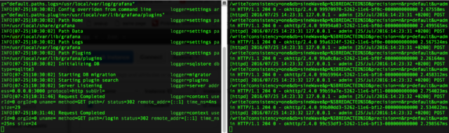 Now we’re ready to dive in.

## 3. Run program in an IDE and examine data in Grafana

Open the oscon directory in your preferred IDE. 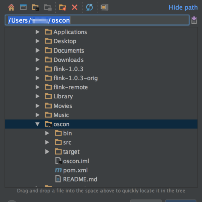 Find OsconJob in the jobs directory then open it in the IDE. 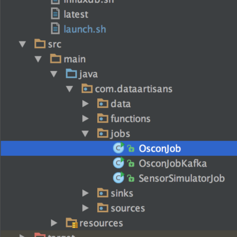 You’ll see that this job creates some test data and sinks it to InfluxDB. For the purpose of this walkthrough, we’re going to look at the “pressure” key, where the test data forms a simple sine wave. Go ahead and run the job in the IDE. Now we can take a look at the data in Grafana. You can access the Grafana dashboard at http://localhost:3000. • (Optional) First, double-check in the ‘Profile’ section that you’re listed as an admin in Grafana. Admin access is necessary in order to set up a new data source. 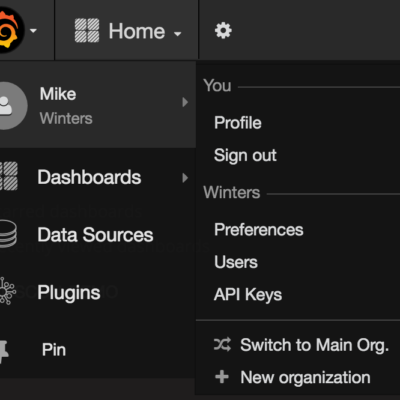 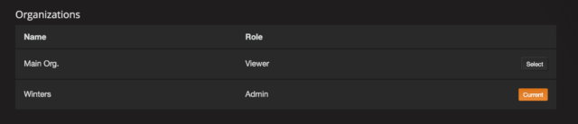 • Go to “Data Sources” then “+Add data source”. A screenshot with proper data source configuration is below. 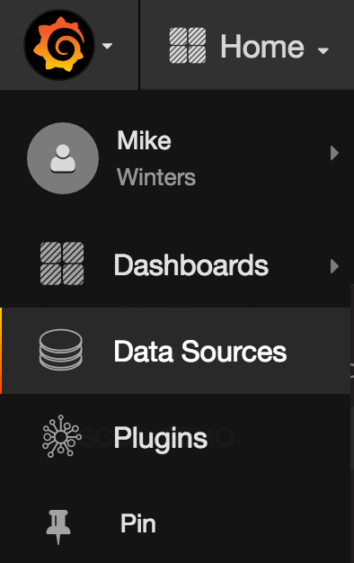 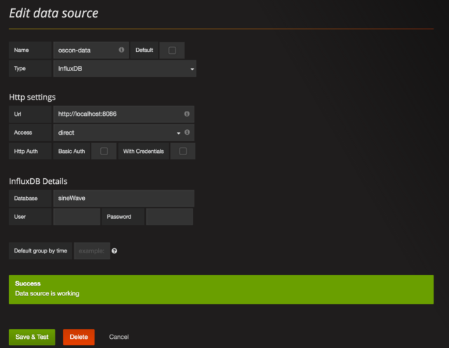 • Click on the Grafana logo in the top left of the screen and create a new dashboard. 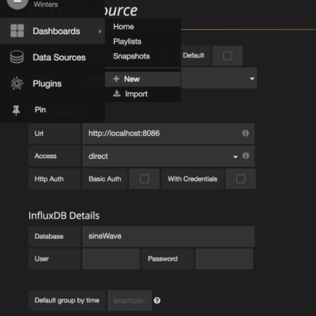 • For starters, configure your dashboard to show the last 30 seconds of data and to refresh every 5 seconds 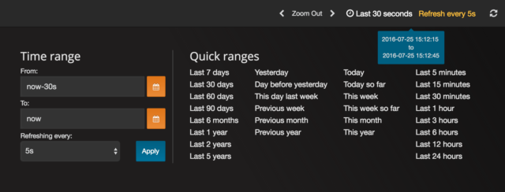 • Add a “Graph” panel and adjust the query so that the graph pulls from “sensors” sink and filters on the “pressure” key. You should see a simple sine wave just like this: 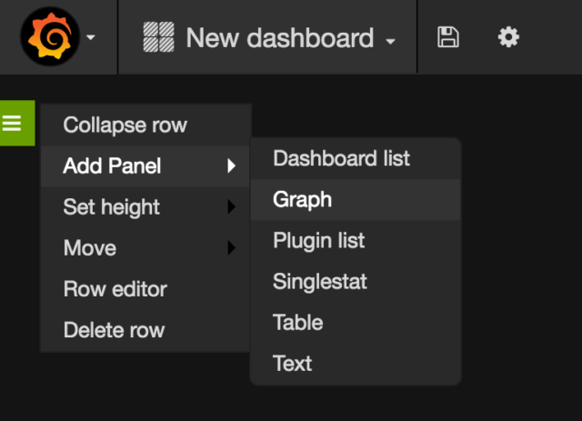 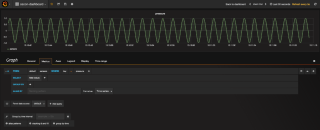 Just as expected, we see our “pressure” sine wave in Grafana.

## 4. Event Time vs. Processing Time, Illustrated

Go back to your IDE, and in OsconJob, you’ll see that we’re also writing windowed and summed sensor data to InfluxDB. That sink is named “summedSensors”. Next, let’s check out what the summed “pressure” data looks like in Grafana. 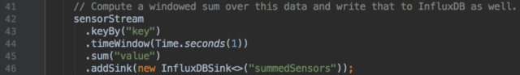 Add a second panel to your Grafana dashboard, and this time, pull from the “summedSensors” sink and filter on the “pressure” key. Your graph and query should look something like the below. 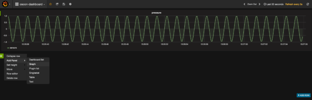 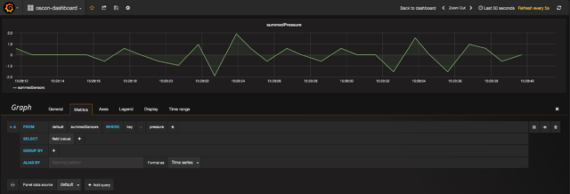 OK, so what’s going on here? We expect the sum of our sine wave to be 0 across the board, but alas, that’s not what we’re seeing. Why not? The errors in the summedPressure graph are a result of a discrepancy between when our event data actually happened (event time) vs. when our program is processing the event data (processing time) within each of our 1s windows. This sort of discrepancy is extremely common in stream data, and if we don’t do anything about it, our applications will be working with inaccurate inputs. Said another way, if you’re not managing the event time vs. processing time discrepancy, you’re data is to some extent wrong. For the sake of clarity, here’s an illustration of an event time vs. processing time discrepancy. If you’d like more detail about this concept, [we recommend reading this post](https://data-artisans.com/how-apache-flink-enables-new-streaming-applications-part-1/) . 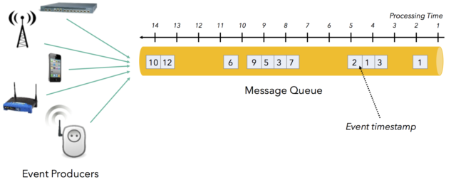   Flink makes it easy to work in event time and to effortlessly manage such discrepancies. Go to your IDE and uncomment the line that will enable EventTime in the program, then rerun the program. 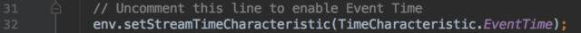 Now take a look at Grafana, and you should see that the summedPressure graph is showing 0, just as expected. Event time vs. processing time problem solved. 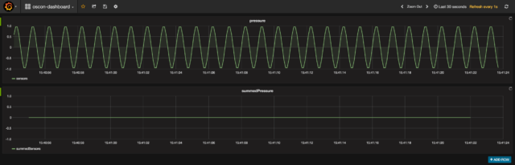

## 5. Failure Recovery: Low-cost Checkpointing

OK, we’re going to move out of the IDE for awhile and submit a Flink job via the command line. If you haven’t yet stopped the program in your IDE, go ahead and do so. Then, open a new terminal window and start a Flink cluster:
```
flink user$ flink bin/start-cluster.sh
```

You can access the Flink web dashboard at http://localhost:8081 . Go ahead and open it, and you should see 1 task manager, 1 task slot, and 1 available task slot. Next, open one additional terminal window and change into the oscon directory. Compile your project.
```
oscon user$ mvn package
```

Build success! Let’s run the program with Flink.
```
oscon user$ </code><code>bin/launch.sh
```

Now you’ll see one running job in the Flink web dashboard. Check to make sure your data is coming through in Grafana as expected, too. 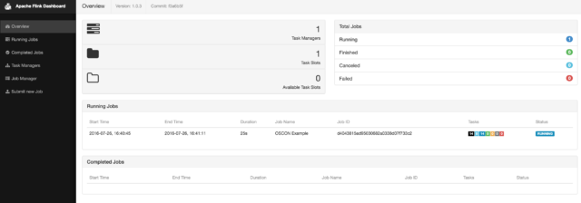 To demonstrate Flink’s checkpointing mechanism, we’re going to simulate a failure by killing the task manager process.
```
oscon user$ ps -ef | grep taskmanager
```

Copy the task manager ID (highlighted in blue in the screenshot below): 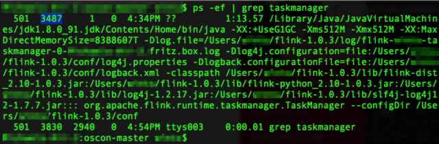 And go ahead and kill it.
```
oscon user$ kill -9 your_taskmanager_id
```

The Flink dashboard will show that Flink is trying to restart the job (unsuccessfully), and behold, data isn’t making it into Grafana. 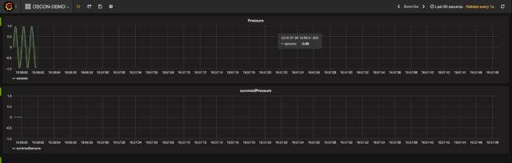 Now, if you were using YARN or Mesos and had task managers to spare, this restart process would happen relatively quickly. For this demo, though, we’ll need to restart the task manager manually:
```
flink user$ bin/taskmanager.sh start
```

OK, we’re back and seeing new data. But there’s also whole lot of data we didn’t process, and as of right now, that data’s lost and gone. Not good. 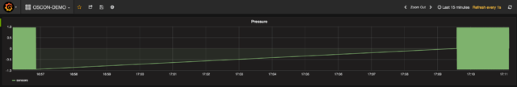 This gap exists because, for the sake of the demo, we’ve had checkpointing turned off in our program. It’s worth noting that in the real world, there’s rarely (if ever) a case where you’d run with checkpointing turned off. Let’s move back into the IDE and uncomment the checkpointing code. What’s particularly cool about the checkpointing algorithm is that there’s almost no latency hit when you turn it on. 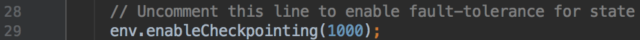 Now we’ll recompile after the edit:
```
oscon user$ mvn package
```

And cancel the job that’s currently running:
```
flink user$ flink list flink user$ flink cancel job_id 
```

Then finally, submit a new job:
```
oscon user$ bin/launch.sh
```

And kill it again (using the same process as earlier in the demo):
```
oscon user$ ps -ef | grep taskmanager oscon user$ kill -9 your_taskmanager_id
```

Check out Grafana, and you’ll see that we’re no longer processing data, just the same as we saw the first time around. Next, let’s bring the task manager back to life:
```
flink user$ bin/taskmanager.sh start
```

Quick, jump over to your Grafana dashboard! As the job starts running again, you should see the job resume from exactly the state it was in before it failed–there should be no missing data. It’s as if no failure ever occurred!
```

```

Again, it’s unlikely that you’d ever run a Flink program without checkpointing turned out. But hopefully you now have a better sense of just how checkpointing works. And it’s important to note one more time: the latency hit that you absorb from having checkpointing turned on is negligible. If you’d like to learn more about how Flink manages state and implements fault tolerance, we recommend [this section of the Apache Flink ® docs.](https://ci.apache.org/projects/flink/flink-docs-release-1.0/concepts/concepts.html#state-and-fault-tolerance)

## 6. Downtime Handling: Savepoints

When we say “downtime handling”, we’re referring to instances when you choose to bring down your Flink cluster for some period of time. Of course, the Flink community strives for a world where stream processing applications are 24×7 reliable and available, worthy of building your business on top of. But the reality is that when you want to update your code, upgrade to a new version of Flink, apply a patch, do machine maintenance and so forth, you need a way to bring machines (or a whole cluster) up and down without losing your state. Flink’s solution to this problem is something called a ‘savepoint’, very similar in nature to the checkpoints we just discussed. From the Flink documentation:
Savepoints are manually triggered checkpoints, which take a snapshot of the program and write it out to a state backend. They rely on the regular checkpointing mechanism for this. During execution programs are periodically snapshotted on the worker nodes and produce checkpoints. For recovery only the last completed checkpoint is needed and older checkpoints can be safely discarded as soon as a new one is completed. Savepoints are similar to these periodic checkpoints except that they are triggered by the user and don’t automatically expire when newer checkpoints are completed.
You could, for instance, run different versions of your application from a savepoint for the sake of A/B testing. Think of savepoints as git for your Flink application. You’re taking a snapshot of the state of the whole distributed computation. So let’s see it in action. First, find the job ID of your currently-running job.
```
oscon user$ flink list
```

Then create a savepoint with the job ID.
```
oscon user$ flink savepoint job_id
```

**Note: the job manager is the default storage location for savepoints, and savepoints stored on the job manager are lost if the job manager shuts down.** Therefore, it’s **not recommended to store savepoints on the job manager in production** even though we’ll do so in this demo for the sake of simplicity. Please see the [‘Savepoints’ section in Flink’s documentation](https://ci.apache.org/projects/flink/flink-docs-release-1.0/apis/streaming/savepoints.html) for more detail. OK, no more scary warnings, we promise. To simulate a downtime, go ahead and cancel your running job.
```
oscon user$ flink cancel job_id
```

You’ll see that data processing stops, just as we’d expect. 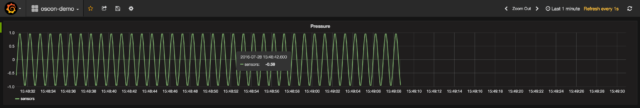 Now bring the job back up referencing the savepoint you just created . The command is a bit different and includes -s to signify that we’re running the job from a savepoint:
```
oscon user$ flink run -d -s jobmanager://savepoints/3 target/oscon-1.0-SNAPSHOT.jar
```

And voila! In Grafana, you’ll see that your data is available just as if the job had never stopped running. 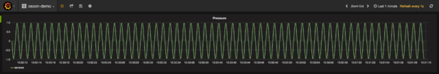 In case it’s helpful, here’s a screenshot of the complete sequence of commands for creating then rerunning from a savepoint: 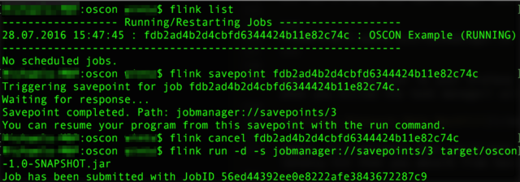

## 7. Data Reprocessing

There will be occasions when you update your code then need to reprocess all of your data with your new program. Flink ensures this can be done seamlessly. To simulate a code change, let’s change the length of the waveforms in our simulated data. Update the length from 10 to 100 in the IDE as shown below.
```

```

Move back to the command line, recompile your code, and cancel the currently-running Flink job. Resubmit the job from the savepoint we’d created in the previous step.
```
oscon user$ flink run -d -s jobmanager://savepoints/3 target/oscon-1.0-SNAPSHOT.jar
```

Now jump into Grafana and check out the last few minutes of data. What you’ll see is pretty interesting. 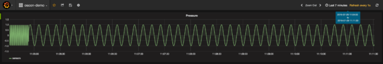 Notice the pre-savepoint data where our job was running with the original waveform length of 10 followed by the post-savepoint data where our job was running with the new waveform length of 100. As you’d expect, there’s no missing data, and the savepoint allowed us to maintain state even when our job wasn’t running for a couple of minutes during the code update. To summarize, we: • changed our code • chose a consistent point in time in the past • reprocessed all of our data from that point forward

## 8. In Conclusion

That’s the end of the walkthrough. We hope you came away from this with a more concrete sense of how Apache Flink ® enables robust, production-quality stream processing applications. If you have questions or are interested in learning more, we recommend you join the Flink  [mailing lists](https://flink.apache.org/community.html#mailing-lists) or spend time with the  [documentation](https://ci.apache.org/projects/flink/flink-docs-release-1.0/) . To better understand how large enterprises are using Flink, you can visit the  [Powered by Flink page](http://flink.apache.org/poweredby.html) .