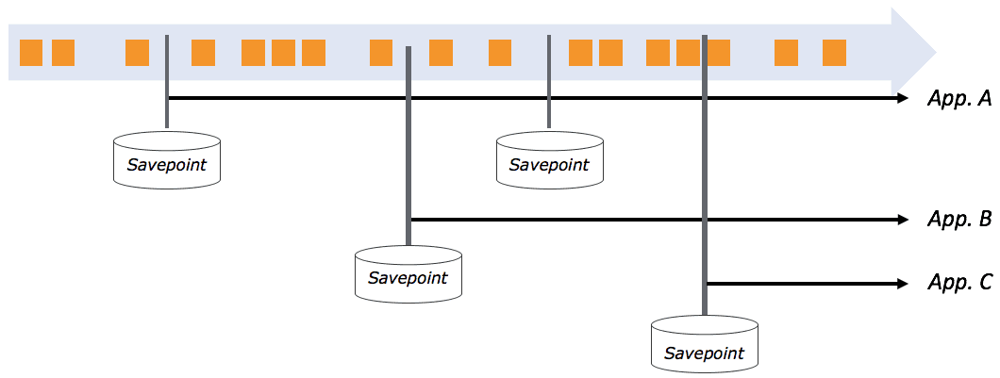

# Savepoints: Turning Back Time

October 14, 2016 - [Flink Features](https://data-artisans.com/blog/category/flink-features), [Resources](https://data-artisans.com/blog/category/resources) - [Fabian Hueske](https://data-artisans.com/blog/author/fabian) and [Michael Winters](https://data-artisans.com/blog/author/mike)

> This post is the first in a series where the data Artisans team will highlight some of Apache Flink’s® core features. By Fabian Hueske ([@fhueske](https://twitter.com/fhueske)) and Mike Winters ([@wints](https://twitter.com/wints))

Stream processing is commonly associated with ‘data in motion’, powering systems that make sense of and respond to data in nearly the same instant it’s created. The most frequently discussed streaming topics, such as latency and throughput or watermarks and handling of late data, focus on the present rather than the past.

In reality, though, there are a number of cases where you’ll need to reprocess data that your streaming application has already processed before. Some examples include:
- Deployment of a new version of your application with a new feature, a bug fix, or a better machine learning model
- A/B testing different versions of an application using the same source data streams, starting the test from the same point in time without sacrificing prior state
- Evaluating and carrying out the migration of applications to newer releases of the processing framework or to a different cluster

Apache Flink’s savepoint feature enables all of the above and is one of the unique points that distinguishes Flink from other distributed open source stream processors. In this blog post, we explain how savepoints are used to reprocess data and give some insight into how this feature is implemented in Flink.

## What exactly do you mean by “reprocessing”?

To make sure the idea of data reprocessing is clear, let’s talk through a business case where you might need to reprocess data. Imagine a social media company that rolls out a paid or promoted posts feature in addition to its standard ‘organic’ posts. The company’s end users have access to a simple, Flink-powered dashboard showing how many times all of their posts, both organic and paid, have been viewed, clicked, etc. A few weeks later, it becomes clear (based on user feedback) that the dashboard would be a lot more helpful if it split out organic vs. paid post data. To make this happen, it’s necessary to go back in time to when the paid post feature was released and then reprocess all post data from that point forward, this time separating views and interactions for paid vs. organic posts. It’d be a big burden to reprocess all of historical data starting from when the company was founded, so being able to reprocess from the point the paid post feature was rolled out while maintaining state on earlier computations is crucial. So when we use the word ‘reprocessing’, we’re talking about returning to a prior, consistent state of the system (as defined by the developer and not necessarily the beginning of the stream) and then continuing to process again from that state, probably after having made a change to your Flink program. Good news for all of our readers out there: reprocessing as defined above comes for free in Flink using a feature called savepoints. When we say ‘comes for free’, we mean that as long as your program is fault tolerant and able to recover from a failure, you’ll be able to create a savepoint and reprocess data in Flink with almost zero extra setup work.

## Savepoints in a nutshell

Put simply, a savepoint of a Flink application is a globally consistent snapshot of both:
- the positions of all data sources
- the state of all (parallel) operators

‘Globally consistent’ means that the state of all parallel operators is checkpointed at exactly the same well-defined position in all inputs. If you have a savepoint of an application taken at some time in the past, you can start a new application from that savepoint. The new application will be initialized with the operator state from the savepoint and will start reprocessing all data from the positions of the sources when the savepoint was taken. Since Flink’s savepoints are completely independent of each other, you can have several savepoints per application, and you can go back to multiple positions and restart several and even different applications from different savepoints (as illustrated by the figure below). This feature is super useful for forking and versioning your streaming applications.



We should mention that [event-time processing](https://data-artisans.com/how-apache-flink-enables-new-streaming-applications-part-1/) is crucial for maintaining accuracy when reprocessing data from a savepoint. Reprocessing essentially means to fast-forward from the past to the present, i.e. reading data at full-speed from some storage system until you reach the present and continuing to process data that arrives in real-time. Since the semantics of applications that operate in processing time or ingestion time depend on the current wall-clock time, using anything other than event time when starting an application from a savepoint leads to results with incorrect semantics.

## This sounds great! What do I have to do?

Not much! Actually, all applications that support failure recovery also automatically support savepoints. Hence, most programs written for stateful computations already meet the required criteria and if they don’t, they can be quickly updated so that they have:
- **Checkpointing enabled**: There’s not really a case where we’d recommend building a Flink application without checkpointing enabled–and adding checkpointing to your Flink program only requires one extra line of code.
- **Resettable data sources (e.g., Apache Kafka, Amazon Kinesis, or a file system)**: Data sources must be able to replay data from the point in time from which you want to re-process.
- **All state stored via Flink’s managed state interfaces**: All custom operator state must be kept in Flink’s fault tolerant state data structures, which makes it ‘resettable’ to a prior savepoint.
- **An appropriate state backend configuration**: Flink offers different [state backends](https://ci.apache.org/projects/flink/flink-docs-release-1.1/apis/streaming/state_backends.html) to persist checkpoints and savepoints. By default, savepoints are stored in the JobManager, but you should configure an appropriate state backend for your application such as [RocksDB](https://ci.apache.org/projects/flink/flink-docs-release-1.1/apis/streaming/state_backends.html#the-rocksdbstatebackend).

If you have a running fault-tolerant application, then creating a savepoint and (re-)starting an application from the savepoint is a matter of a few simple CLI commands in Flink. Let’s walk through it.

## Step 1: Create a savepoint

First, get a list of all running Flink jobs:

```shell
user$ flink list
------------Running/Restarting Jobs------------
10.10.2016 16:20:33 : job_id : Sample Job (RUNNING)
```

(When running the command, your actual job_id will be an alphanumeric string.) Next, create a savepoint using the relevant job ID:

```
user$ flink savepoint job_id
```

Your savepoint is now ready to use. If you plan to immediately restart a job from your savepoint, you often want to shut down the currently running job. You already have the job’s ID, so cancelling it takes just a few seconds:

```
user$ flink cancel job_id
```

## Step 2: Start job from a savepoint
Once you’ve updated your application, it’s time to start a job from your savepoint. `user$ flink run -d -s hdfs://savepoints/1 directory/your-updated-application.jar` If you’d like to reproduce these steps yourself in a demo application, we recommend you check out an [earlier data Artisans blog post](https://data-artisans.com/robust-stream-processing-flink-walkthrough/#savepoints) that’ll give you an opportunity to do so.

## What if I want to update my application?

There are a few things to consider if you want to start a modified application from a savepoint. We can distinguish two cases:
1. changing the logic of a user-defined function, such as a MapFunction
2. changing the topology of an application, i.e., adding or removing operators.

The first case is simple and does not need any special preparation. You can modify the code of user functions as you like. However, if you start an application with a modified topology from a savepoint, Flink must be able to match the operators of the savepointed application to the operators of the new application with modified topology in order to restore the operators’ state. In such a case, you need to manually assign operator IDs to the original and the updated application. Because it is not possible to change the topology of an application without operator IDs, it is best practice to always assign operator IDs. The following code snippet shows how to assign IDs (uid) to operators.

```scala
DataStream stream = env.
 // Stateful source (e.g. Kafka) with ID
 .addSource(new StatefulSource())
 .uid(“source-id”)
 .shuffle()
 // The stateful mapper with ID
 .map(new StatefulMapper())
 .uid(“mapper-id”)

// Stateless sink (no specific ID required)
stream.print()
```

Please the the [documentation](https://ci.apache.org/projects/flink/flink-docs-release-1.1/apis/streaming/savepoints.html#changes-to-your-program) for details about application updates and savepoints.

## Savepoint best practices

To take full advantage of Flink’s reprocessing capabilities described above, you can regularly trigger the creation of savepoints. We suggest both making savepoints on an automated basis according to some schedule (once per day, once per week, etc) and also whenever you shut down a job or release a new version of your application. The optimal approach to savepoint creation will vary based on what you’re trying to achieve with Flink, but as a general rule, you should spend time planning how you might use savepoints when you’re building your program.

## How does all of this work?

Savepoints are really just an extension of checkpoints, Flink’s fault tolerance mechanism. If checkpointing is enabled, Flink periodically creates a consistent checkpoint of all operator state. Checkpointing is described in detail [in the documentation](https://ci.apache.org/projects/flink/flink-docs-release-1.1/internals/stream_checkpointing.html), and this is worth taking a few minutes to review if you’re new to Flink. You might be thinking that taking a consistent checkpoint requires pausing processing because Flink would have to wait until all records currently in flight are processed; take a snapshot; and then get back to processing data after the snapshot is complete. Not so! Flink processes data continuously, even while a checkpoint is being generated. The [‘Barriers’ section](https://ci.apache.org/projects/flink/flink-docs-release-1.1/internals/stream_checkpointing.html#barriers) in the documentation explains how this is possible. The key difference between the two: whereas a checkpoint is generated automatically at some regular interval, a savepoint is triggered explicitly by a user and not [discarded after some period of time](https://data-artisans.com/how-apache-flink-enables-new-streaming-applications/) such as with checkpoints.

## Wrapping up

We discussed savepoints and data reprocessing in Apache Flink because we believe it is one of the features that sets Flink apart in the world of open source stream processors. And best of all, reprocessing almost always comes for free in fault-tolerant Flink programs, with little to no extra work required. The Flink community is actively working to make savepoints even better, including a solution for maintaining state when changing parallelism. Some related features (such as [FLINK-3755](https://issues.apache.org/jira/browse/FLINK-3755)) are already in the master branch and will be included in the next minor release of Flink 1.2.0. So whether you need to deploy a new and improved version of your application or you’d like to A/B test two or more applications from the same point in time, you can do so without losing valuable state. Streaming’s focus on real-time shouldn’t prevent you from winding back the clock when that’s what a real-world scenario requires. Interested in learning more about savepoints in Apache Flink®? data Artisans CTO Stephan Ewen did a [7-minute whiteboard walkthrough on the subject, and you can find it on the MapR blog](https://www.mapr.com/blog/savepoints-apache-flink-stream-processing-whiteboard-walkthrough).
