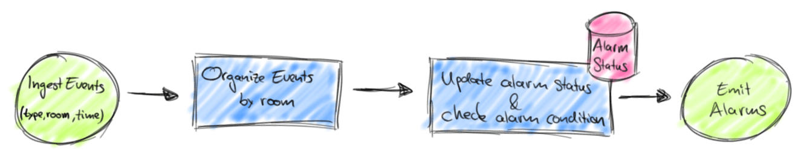

# Savepoints, Part 2: Streaming Applications in the Pit Lane

November 16, 2016 - [Flink Features](https://data-artisans.com/blog/category/flink-features), [Resources](https://data-artisans.com/blog/category/resources) - [Fabian Hueske](https://data-artisans.com/blog/author/fabian) and [Michael Winters](https://data-artisans.com/blog/author/mike)

By Fabian Hueske ([@fhueske](https://twitter.com/fhueske)) and Mike Winters ([@wints](https://twitter.com/wints))

Last month, we gave a [high-level overview of Apache Flink® savepoints](https://data-artisans.com/turning-back-time-savepoints/) and touched on why and how you’d reprocess data in a streaming application. If you haven’t already read that post, or if you aren’t familiar with Flink’s savepoints, we recommend starting there. A common use for savepoints is to fix a bug or make an improvement to a streaming application, which is a task that in some sense has requirements that are similar to an [F1 pit stop](https://www.youtube.com/watch?v=aHSUp7msCIE): every second of downtime counts, and the car needs to be back on the track as quickly as possible without sacrificing the driver’s current position in the race (‘application state’).

In this post, we’ll walk you through the process of updating a streaming application and deploying an improved version without losing application state and with minimal downtime.

## How do I update a running job?

Imagine that you have a streaming application that observes a stream of events sent out by an alarm system. There are three types of events:
1. ActivateAlarm
2. DeactivateAlarm
3. MotionDetected

Each event is associated with a different room in a facility and has a timestamp. The job of our application is to trigger an alarm if a MotionDetection event is observed for a room for which the last received event was ActivateAlarm. The dataflow of such an application implemented as a Flink job would look like the figure below.



Putting this dataflow into Scala source code is pretty straightforward with Flink’s DataStream API:

```scala
case class Event(eType: String, room: Int, time: Long)

object MotionAlarmApp {

 def main(args: Array[String]) {

   val env = StreamExecutionEnvironment.getExecutionEnvironment

   // ingest stream of sensor events
   val events: DataStream[Event] = env.addSource(new AlarmSensorSource())

   val alarms: DataStream[(Int, Long)] = events
     // organize events by room
     .keyBy(_.room)
     // evaluate events
     .flatMapWithState( (e: Event, isActive: Option[(Boolean, Long)]) => {

       e.eType match {
         // activate alarm and set timestamp
         case "activate"   => (Iterator.empty, Some((true, e.time)))
         // deactivate alarm and set timestamp
         case "deactivate" => (Iterator.empty, Some((false, e.time)))
         // trigger alarm
         case "motion" if isActive.getOrElse( (false, -1L) )._1 =>
           ( Iterator(Event(“ALARM”, e.room, e.time)), isActive )
         // do nothing
         case _ => (Iterator.empty, isActive)
       }
     })

   // print alarm
   alarms.print()

   env.execute("MotionAlarmApp")
 }
}
```

Let’s briefly walk through the code. The application starts ingesting a `DataStream[Event]` from an `AlarmSensorSource`. The stream is organized by room `(keyBy(_.room))` and processed in a stateful `FlatMap` function. The `flatMapWithState` method used here is a syntactic shortcut of the Scala API. It requires a function that receives an input record and the current state as `Option` and returns the result of the function as `Iterator` and the new state as `Option` (returning `None` discards the state). Our function receives input records of type `Event` and has a state of type (`Boolean`, `Long`). Since we apply the stateful function on a keyed stream, the operator keeps one (`Boolean`, `Long`) tuple for each key, i.e. room. The `Boolean` flag indicates whether the alarm of a room is activated and the Long value the timestamp of the last (de)activation. Depending on the type of the event `(e.eType)`, the state is either updated (“`activate`”, “`deactivate`”) or we check if we need to trigger an alarm (“`motion`”). In that case we create an Event(“`ALARM`”, `e.room`, `e.time`) and emit it. Finally, the alarm events are printed. Note: To keep the example concise and simple, we assume that events are received in order of their timestamp. Flink also supports out-of-order event streams by [configuring event-time semantics](https://data-artisans.com/how-apache-flink-enables-new-streaming-applications-part-1/). After running this application in production for a few weeks, you start receiving customer feedback that alarms are being triggered too eagerly. Customers would like to have a brief period of time after the alarm is activated during which motions are tolerated and no alarm is triggered. Since you take customer feedback seriously, you need to update your application and deploy the new version into production. Luckily, updating the code is easy. All you have to do is to adapt the alarm trigger case of the stateful `FlatMap` operator and add a condition that checks the timestamp of the “`motion`” event and the timestamp stored in the state against the `tolerance` value as follows:

```scala
case "motion" if
   isActive.getOrElse( (false, -1L) )._1 &&
   // only trigger if time diff exceeds threshold
   e.time - isActive.get._2 > tolerance =>
 ( Iterator((e.room, e.time)), isActive )
```

However, when deploying the new version you do not want to lose the record of which rooms have an alarm activated, i.e., the application state of your currently running first version. If you don’t consider this state, rooms might either be left unprotected, or rooms with deactivated alarms could suddenly trigger unnecessarily. Neither of these are a good outcome for customers. Assume you have your new application (v2) packaged as a JAR file, and version 1 of your application (v1) is running on the production cluster. In order to bring down the v1 job and start a v2 job with the current state of the stopped v1 job you can use Flink’s savepoints feature. All you have to do is to run the following four commands: **1) List all running jobs to obtain the job id of the running v1 job**.

```shell
user$ flink list
------------Running/Restarting Jobs------------
17.11.2016 16:20:33 : job_id : Sample Job (RUNNING)
```

**2) Create a savepoint from the running v1 job**.

```shell
user$ flink savepoint job_id
```

**3) Stop the running v1 job**.

```shell
user$ flink cancel job_id
```

**4) Start a v2 job from the savepoint**.

```shell
user$ flink run -d -s hdfs://savepoints/1 ~/your-updated-application.jar
```

That’s all there is to it. You updated your application, and the new version is up and running. We should mention that it is also possible to restart a job from an older savepoint (e.g. from two weeks ago) to reprocess historic data. This is super helpful if you want to correct previously-computed results. Of course, in our alarm application example, this wouldn’t make a lot of sense because we would re-trigger outdated alarms, which is something both we and our customers would rather avoid.

## Wait, can I completely rewrite my application?!

In the example above, we updated the code of a user function. This was a fairly lightweight and isolated change with few implications on the remaining application code. However, what happens if you want to do a more extensive rewrite of your application? That’s a good question, and the answer is: it depends. Let’s discuss potential modifications case-by-case.

## Changing the data flow of your application

Is it possible to inject a new operator into an application and start the new version from a checkpoint of the original application? An example would be inserting a filter function that can be dynamically configured to remove “motion” events for certain rooms in order to deactivate the result without changing the application state. Could we start this updated application from a savepoint of the previous version? Yes! You can update an application by adding new operators as well as removing existing ones under the condition that no existing operator is affected by the change, i.e., all input and output types must be preserved. When starting an application from a savepoint, Flink has to match the state persisted in the savepoint with the operators of the application. In a case where the topology of the application did not change, this mapping is trivial. However, if the topology did change, Flink requires that operators have a unique id assigned to match state and operators. Assigning a unique id is very simple and done using the uid(String) method as follows:

```scala
val mappedEvents: DataStream[(Int, Long)] = events
  .map(new MyStatefulMapFunc()).uid(“mapper-1”)
```

Since both the original application and the updated application need operator IDs, we recommend that you always assign unique IDs to all operators. This advice applies to operators with and without explicitly-declared operator state, because some operators hold internal state that is not visible to the user. Please note that in versions up to and including Flink 1.1.3, all state of a savepoint must be mapped to an operator in order to restore a job. This restriction was in place to ensure that no state is lost upon restart. With the upcoming Flink 1.1.4, users can explicitly agree to skip state that cannot be matched to an operator when starting a job from a savepoint.

## Changing the type of function state

What happens if you would like to change the type of the operator state in a new program version? For instance, in our alarm application we have a FlatMapFunction with an internal state of type (Boolean, Long), i.e., a tuple containing a flag whether the alarm is activated or not and a timestamp marking the last time that the alarm was (de)activated. Imagine that we’d like to add a third field here with the name or ID of the person who activated or deactivated the alarm. Would that be possible? When it comes to adding the third field directly, the answer is: unfortunately, no, because state that is restored must retain its type. However, there is a workaround! Instead of changing the type of the state you simply add a second state with the new type and then migrate the old state to the new type. In the case of key-partitioned state, this cannot be done during the initialization of the function because it is not possible to iterate over all keys of the state. Instead, you can only migrate the state of a key when the stateful function receives an element with that key. Once that happens, the function can migrate the data from the old to the new state and discard the old state. This approach works well because there is no lost state and no increase of the storage requirements because the old state can be discarded after it’s migrated. However, the approach can result to cluttered code, especially if there are multiple versions of your application. Therefore, it’s a best practice to remove old state types at some point in time when you are sure that all (or most) state has been migrated. This is done by taking a savepoint then restoring a new application that only reads the new state and discards the old. Note that you will lose any non-migrated state if you follow this approach. To support cases like these, the Flink community might add more tooling for state migration in the future.

## Changing the input or return types of user functions

Lastly, we’ll talk about changing the input or return type of user functions, i.e., the types of events that are streaming through your application. This issue is somewhat related to changing the data flow of an application because adding or removing operators often means that data types are changed (unless you add or remove a type-preserving filter as in our example above). So is it possible to change the return type of a function? The answer, again, is that it depends. The issue is that certain operators use internal state that isn’t visible to the user. Consider an application with a running aggregate implemented as ReduceFunction as below:

```scala
val alarms: DataStream[(Int, Long)] = events
  // extract event type
 .map(e => (e.eType, 1))
 // organize events by type
 .keyBy(_._1)
 // running event count per type
 .reduce( (e1, e2) => (e1._1, e1._2 + e2._2) )
```

This code computes a running count (as sum of ones) per event type. Flink’s running ReduceFunction operator stores the last computed result of the function (in this case a single (String, Int) pair) as internal operator state. This internal state is handled exactly the same way as user-defined state. So what would happen if we want to start to track the maximum timestamp per event as well? We would change the code as follows:

```scala
val alarms: DataStream[(Int, Long)] = events
  // extract event type and time
 .map(e => (e.eType, e.time, 1))
 // organize events by type
 .keyBy(_._1)
 // running aggregate per type
 .reduce( (e1, e2) => (e1._1, Math.max(e1._2, e2._2), e1._2 + e2._2))
```

However, the type of the ReduceFunction’s internal state changed from (String, Int) to (String, Long, Int). And because Flink does not (and cannot) know how to transform the state from the original into the new type, it won’t be able to start the new version from a savepoint created by the original version. This is an issue for all operators with internal state. In order to reason about which changes are possible and which are not, you need to know which type of state the operators hold and hence the internal implementations of the operators. We list the state for the most common operators below:

|User-defined Function / Operator	|Type of Internal Operator State|
|---|---|
|ReduceFunction[IOT]|IOT|
|FoldFunction[IT, OT]|OT|
|WindowFunction[IT, OT, KEY, WINDOW]|IT|
|AllWindowFunction[IT, OT, WINDOW]|IT|
|JoinFunction[IT1, IT2, OT]|IT1, IT2|
|CoGroupFunction[IT1, IT2, OT]|IT1, IT2|
|Built-in Aggregations (sum, min, max, minBy, maxBy)|input type|

To summarize, you can change the input and return types of your user functions as long as you do not change the type of the internal operator state (see table above). For example, we could extend our alarm application by inserting a MapFunction before the stateful FlatMap operator that enriches each event with a room-specific alarm threshold (e.g., by looking it up from an operator state or an external database). The MapFunction might return events of type (e: Event, threshold: Int), which would require us to change the input type of the FlatMapFunction to (Event, Int). Since the FlatMap operator does not have internal (i.e., non-user-defined) state, we are free to do this and Flink will be able to start the new version of our application.

## I’m ready to get back on the track! Anything else I should consider?

Alright, you changed the code of your application, built a new JAR file, and you are eager to update your running streaming application. What else should you know before doing so? Even though Flink is able to consistently restore the state of your application, it cannot revert writes to external systems. This can be an issue if you start a new version of your application from a savepoint that was not taken immediately before the original application was stopped. Maybe the timing of the savepoint is intentional because you would like the new application version to reprocess some amount of historic data and fix previously-computed results. Or maybe it is unintentional, and you want the new version of the application to pick up exactly where the original version left off, but the application emitted data after the savepoint was taken. The second “unintentional” case can be prevented by using the new ‘coordinated savepoint and cancel’ action, which is available in Flink 1.2.0. And in case you do actually want to reprocess data, your application will emit results that had been emitted before (or different results, depending on the changes you made to the job), and you should be aware of the implications. Ideally, your application performs idempotent writes to the external data store. However, since you cannot revert data that was written prior, your database will be in an inconsistent state (contain results of the original version of the application as well as earlier results of the new version) until it catches up to the point where the original version left off. In some cases, the database might even remain inconsistent beyond that point, e.g., if you change the key when writing to a key-value store. So it’s always worth taking time to think through the implications of reprocessing data with a new application version.

## Wrapping Up

In this blog post, we walked you through the process of updating an application using Flink’s savepoints and discussed how to make specific types of modifications to applications. We think this is a feature worth highlighting because the extent to which applications can be adapted without losing the application state is unmatched by other open source stream processors. In addition, the ability to go back to a specific point in time and reprocess a data stream from that point forward with updated application code is a unique feature. We hope that after reading the post, you have a clear understanding why savepoints are one of Flink’s most useful and powerful features and how they significantly ease management of streaming applications in demanding production environments.
