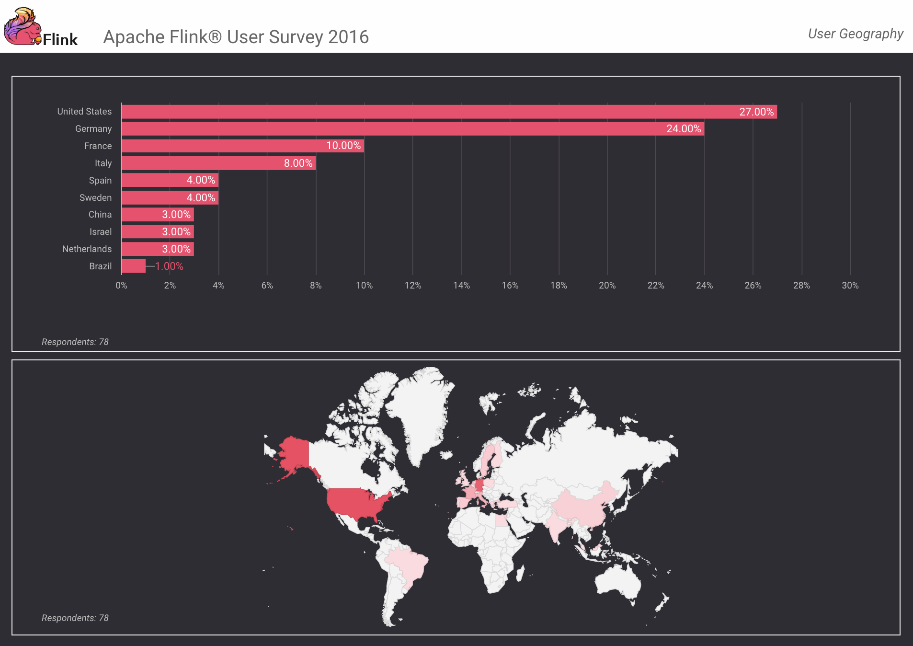
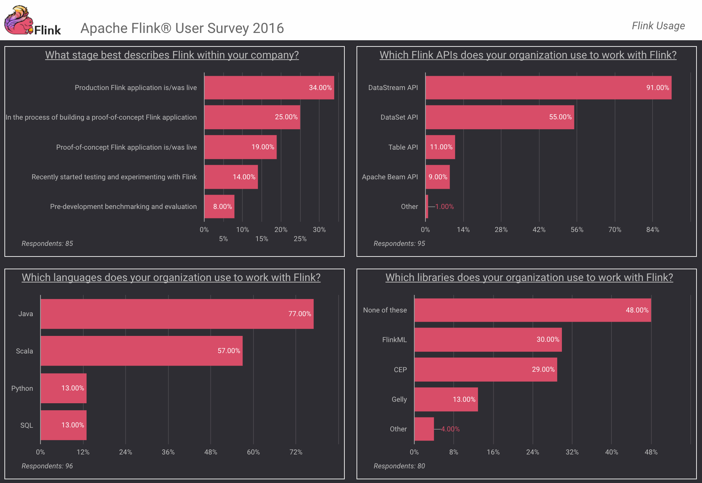
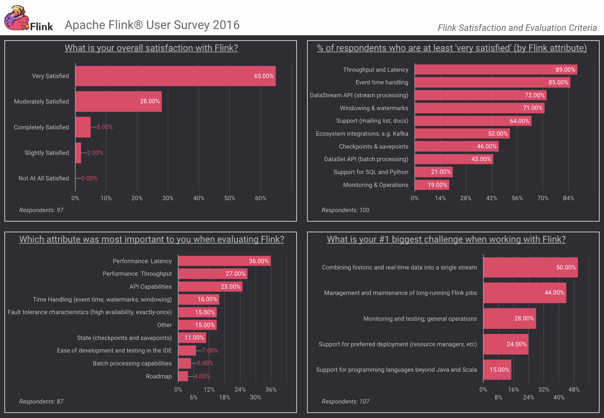
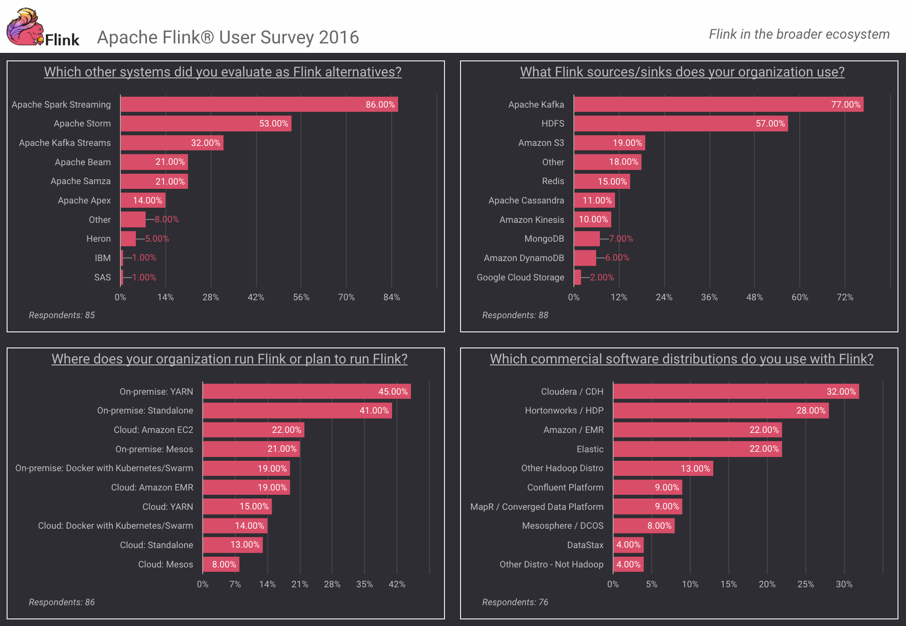
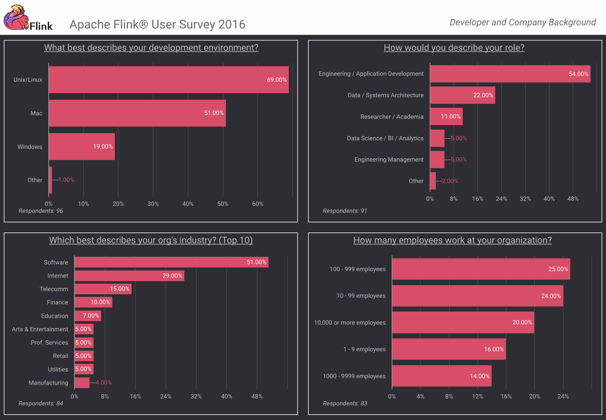

原文 url:	https://data-artisans.com/blog/flink-user-survey-2016-part-1

# Apache Flink® User Survey 2016 Results, Part 1

[January 19, 2017](https://data-artisans.com/blog/2017/01/19) - [Apache Flink](https://data-artisans.com/blog/category/apache-flink) , [Flink Features](https://data-artisans.com/blog/category/flink-features)
[Michael Winters](https://data-artisans.com/blog/author/mike)
You can find [part 2 of survey results here.](https://data-artisans.com/flink-user-survey-2016-part-2/)

- We collected responses between 18 Nov 2016 – 13 Dec 2016
- The survey was distributed via the Apache Flink mailing lists, the data Artisans Twitter account, and Apache Flink meetup groups around the world
- In total, 119 respondents from 21 different countries answered at least 1 question; note that each graph includes a count of respondents for that particular question

[Apache Flink 2016 User Survey Results](https://data-artisans.com/wp-content/uploads/2017/01/Flink_User_Survey_All_Graphs.pdf)
**where in the world are Flink users?**
27% of respondents are based in the United States with many more throughout continental Europe, South America, and Asia.

## Flink Usage

- Just **over ⅓ of respondents** either have or had a Flink application **running in production**
- An **overwhelming majority (91%) use Flink’s DataStream API** , while just **over half (55%) use the DataSet API** as well
- **Java is the most popular language** for developing in Flink (77%), and  **more than half (57%) use Scala**
- And **more than half of respondents (52%)** use at least one of **Flink’s libraries**

## Flink Satisfaction and Evaluation Criteria

- **Overall satisfaction:** 70% of Flink users are either Completely Satisfied or Very Satisfied with Flink
- **Component-specific satisfaction:** **“Throughput and Latency” (89%)** and **“Event time handling” (85%)** led the way with percentage of respondents who are either Completely Satisfied or Very Satisfied . **“Support for SQL and Python” (21%)** and **“Monitoring & Operations” (19%)**  are at the bottom of this list.

**two performance-related criteria,**
**“Latency” (36%)**
**“Throughput” (27%)**
challenges
**“Combining historic and real-time data into a single stream”**
**“Management and maintenance of long-running Flink jobs”**

## Flink Ecosystem

Next, let’s get a sense of how Flink fits into the broader ecosystem.

- When it comes to getting **data in and out of Flink, Apache Kafka is the clear leader** , with 77% of respondents using Kafka as a source or sink. **Next on the list is HDFS** , in use by 57% of respondents.
- First, **what else did users evaluate as alternatives** when choosing a stream processor? **Spark Streaming led the way (86%)** , a logical result given the popularity of Apache Spark as a batch processor, **followed by Apache Storm (53%)** , the first widely known open-source distributed stream processor.
- As of late 2016, **on-premise deployments using YARN (45%) and standalone mode (41%) were most popular among respondents** , but it’s worth noting that the resource manager space is evolving quickly, and Flink 1.2 will introduce improved support for Mesos and other deployment models.
- And **Cloudera (32%) and Hortonworks (28%)** were the two most commonly-used commercial software distributions, with no company holding a clear majority.

## Flink User Profile

Lastly, here are some of the characteristics of Flink users who responded to the survey.

- A **majority of respondents identified their role as “Engineering / Application Development” (54%)** , with “Data / Systems Architecture” next on the list at 22%.
- And **more than ⅔ of respondents (69%) develop on Unix / Linux** , while just over half (51%) develop on a Mac environment–note that it was possible for respondents to submit more than one answer to this question.
- **“Software” was by a large margin the most common industry among respondents (51%)** , followed by “Internet” (29%), “Telecomm” (15%), and “Finance” (10%). The size of respondents’ organizations varies, with **the largest share (25%) in a company with more than 100 but fewer than 1000 employees** . Over ⅓ of respondents (34%) work in an organization with 1000 or more employees.

