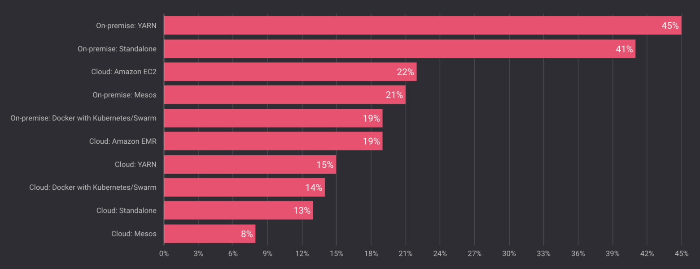
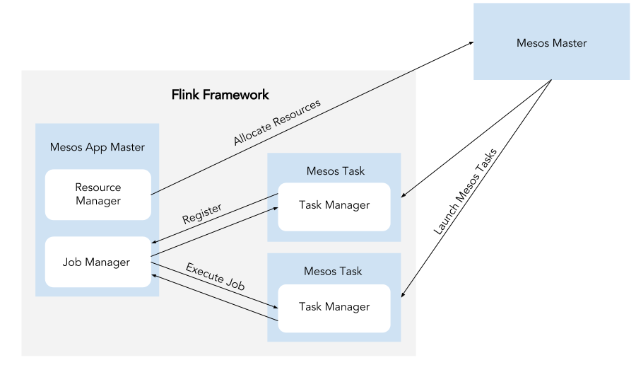
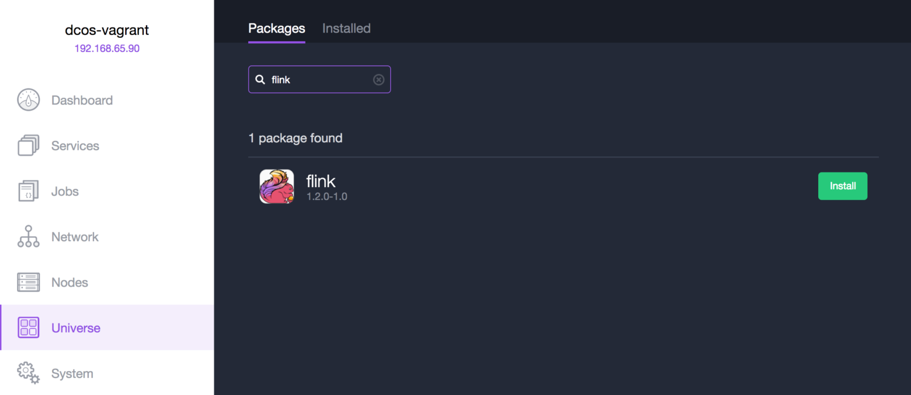

原文 url:	https://data-artisans.com/blog/apache-flink-on-dcos-and-apache-mesos

# Running Apache Flink® Everywhere: Flink on DC/OS and Apache Mesos

[February 28, 2017](https://data-artisans.com/blog/2017/02/28) - [Apache Flink](https://data-artisans.com/blog/category/apache-flink) , [Flink Features](https://data-artisans.com/blog/category/flink-features)
[Till Rohrmann](https://data-artisans.com/blog/author/till)
Till Rohrmann ( [@ stsffap](https://twitter.com/stsffap) ) is an Engineering Lead at data Artisans. This post also appeared on the [DC/OS blog](https://dcos.io/blog/2017/apache-flink-on-dc-os-and-apache-mesos/index.html) . Thanks to Jörg Schad, Judith Malnick, and Ravi Yadav from Mesosphere for their help with writing and editing.
If you’re interested in learning more, check out [this post](https://mesosphere.com/blog/2017/03/14/bringing-production-proven-data-services-to-dcos/?v1)  from Mesosphere about partner integrations in DC/OS 1.9 or [register for this webinar](https://event.on24.com/eventRegistration/EventLobbyServlet?target=reg20.jsp&referrer=&eventid=1386727&sessionid=1&key=8D32061B07CC8DC7D62F895D6470E456&regTag=&sourcepage=register)  co-hosted by Mesosphere and data Artisans to discuss running Flink on DC/OS.
And if you’re interested in this post, you might also like to know more about [Docker images for Apache Flink](https://data-artisans.com/blog/official-docker-images-apache-flink) .
[Apache Flink®](http://flink.apache.org)

[Apache Mesos](http://mesos.apache.org/)
[last November, Mesosphere reported](https://mesosphere.com/blog/2016/11/02/apache-mesos-survey-2016/)
[common feature request](https://data-artisans.com/flink-user-survey-2016-part-2/#new-features)
“Excited for the upcoming Mesos integration.”   
 “Full support for Mesos” 
 “Support to run on Mesos”
[DC/OS](https://dcos.io/)
[Mesosphere](https://mesosphere.com/)
[complete documentation](https://ci.apache.org/projects/flink/flink-docs-release-1.2/setup/mesos.html)

## How Flink interacts with Mesos



## Flink on DC/OS

[Mesosphere found that 87% of new Mesos users are running DC/OS](https://mesosphere.com/blog/2016/11/02/apache-mesos-survey-2016/)
[install DC/OS](https://dcos.io/install/)
[Flink’s checkpoints for fault tolerance](https://ci.apache.org/projects/flink/flink-docs-release-1.2/setup/checkpoints.html)


## Flink on Apache Mesos

[Mesos documentation](http://mesos.apache.org/documentation/latest/)
[install Marathon](https://mesosphere.github.io/marathon/docs/)
node:2181
hdfs://node/
flink-conf.yaml
```
high-availability: zookeeper high-availability.zookeeper.quorum: node:2181 high-availability.zookeeper.storageDir: hdfs://node/flink/ha recovery.zookeeper.path.mesos-workers: /mesos-workers
```

```
{ "id": "flink", "cmd": "$FLINK/bin/mesos-appmaster.sh -Dmesos.master=node:5050 -Dmesos.initial-tasks=1", "cpus": 1.0, "mem": 1024 }
```


## Looking Ahead


 - **Dynamic resource allocation:** In Flink 1.2, it’s not possible to dynamically adjust the number of tasks allocated to a job running on Mesos. [FLIP-6](https://cwiki.apache.org/confluence/pages/viewpage.action?pageId=65147077) will address this issue by separating the concerns of all deployment components. A dispatcher component will receive jobs and spawn Flink clusters, and the new ResourceManager will dynamically allocate new tasks if more resources are needed.
 - **Integration with the Flink CLI:** In the future, it will be possible to start a Mesos cluster per job using the Flink CLI. Right now, a user must first start a Flink cluster on Mesos and then submit a long-running cluster session.

[Apache Flink user mailing list](http://flink.apache.org/community.html#mailing-lists)