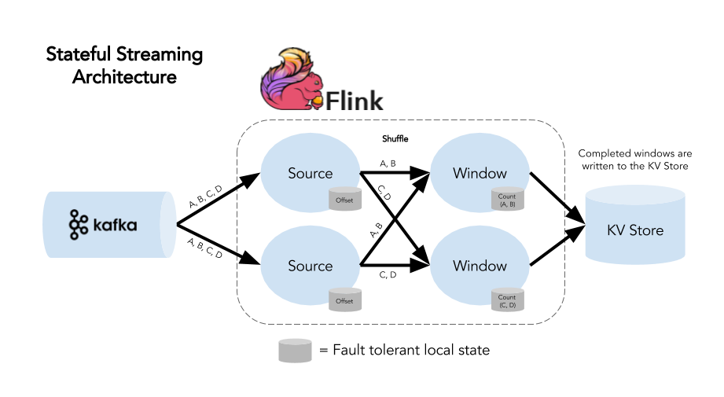
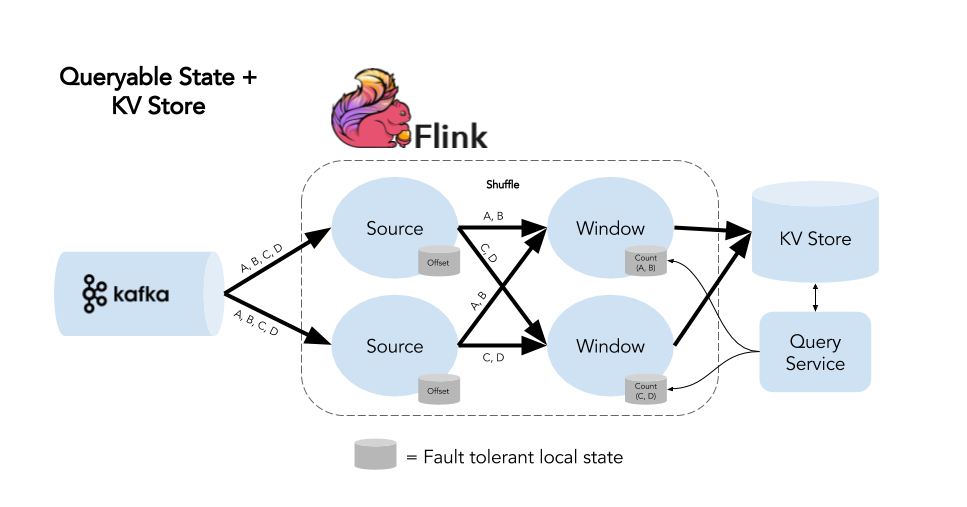
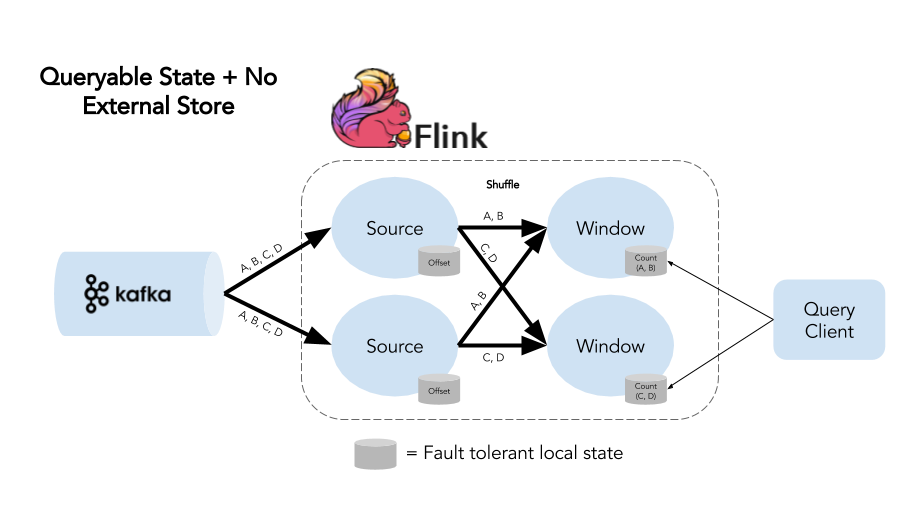
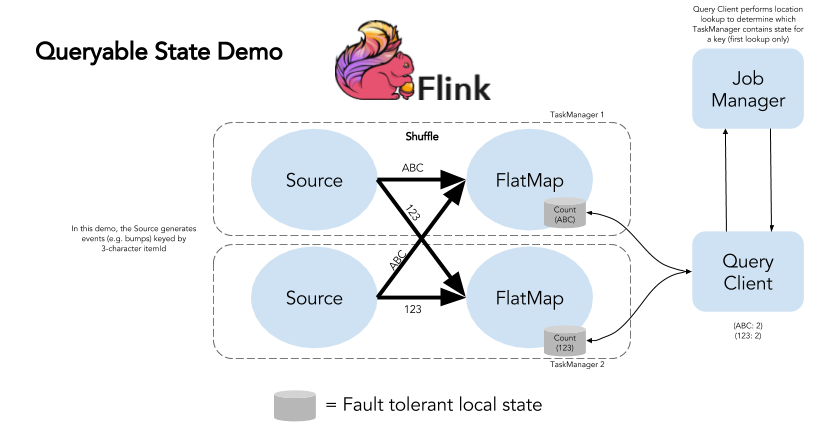
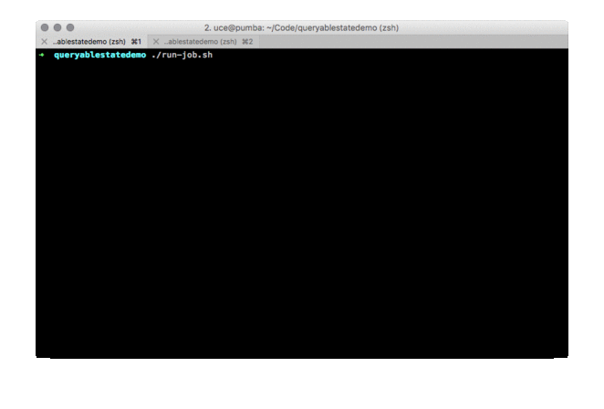

原文 url:	https://data-artisans.com/blog/queryable-state-use-case-demo

# Queryable State in Apache Flink® 1.2.0: An Overview & Demo

[March 24, 2017](https://data-artisans.com/blog/2017/03/24) - [Flink Features](https://data-artisans.com/blog/category/flink-features) , [Resources](https://data-artisans.com/blog/category/resources)
[Ufuk Celebi](https://data-artisans.com/blog/author/ufuk) and [Michael Winters](https://data-artisans.com/blog/author/mike)
Ufuk Celebi ( [@iamuce](https://twitter.com/iamuce?lang=en) ) is a co-founder and software engineer at data Artisans.
[wide range of organizations](http://sf.flink-forward.org/sessions/)
[savepoints](https://ci.apache.org/projects/flink/flink-docs-release-1.2/setup/savepoints.html)
[Apache Flink’s Queryable State](https://ci.apache.org/projects/flink/flink-docs-release-1.2/dev/stream/queryable_state.html)
[
 1. A Use Case Walkthrough](#use-case)
[2. A Stateful Streaming Architecture](#streaming-architecture)
[3. Queryable State As The Real-time Access Layer](#with-queryable-state)
[4. The Logical Conclusion: No External Key-Value Store](#no-external-store)
[5. Queryable State in Flink 1.2.0: A Demo](#qs-in-flink-1-2-0)
[6. Wrapping Up](#wrapping-up)

## A Use Case Walkthrough

[guest post from Aris Koliopoulos of Drivetribe](https://data-artisans.com/drivetribe-cqrs-apache-flink/)
[Drivetribe](http://drivetribe.com)
Drivetribe explained how it uses Flink to compute metrics
[that are exposed to end users](https://data-artisans.com/drivetribe-cqrs-apache-flink/#flink-in-stack)
inside the product, such as impression counts, comment counts, “bump” counts (Drivetribe’s terminology for a “like”), and “bumps per day”.
It’s a common and broadly-applicable use case–counting and exposing end-user-facing metrics, keyed by ID–and so we’ll think through the case in the context of a stateful streaming architecture in Flink both with and without Queryable State.
In doing so, we’ll consider how Queryable State has the potential to provide even lower-latency access to results, and in some cases,
to eliminate the need for an external key-value store altogether.
Note that in its current form, Queryable State does not support querying windows. Adding this support requires only a straightforward addition to Flink’s DataStream API and is likely to be addressed in the near future. Therefore, we’re still going to walk through a use case that queries window state as we explain the feature.
See the “Current Limitations” section further in the post for more detail.

## A Stateful Streaming Architecture



- **Low latency:** [Flink’s performance](https://tech.zalando.com/blog/apache-showdown-flink-vs.-spark/) ensures that our computation happens quickly and that we have fast access to completed windows.
- **Fault tolerance:** [Flink’s checkpoints](https://ci.apache.org/projects/flink/flink-docs-release-1.2/dev/stream/checkpointing.html) manage state locally within the application and ensure exactly-once semantics in the event of a failure. This means we can be confident that our results are accurate (no double-counting, no missing events) even when something goes wrong.
- **Accuracy:** [Flink’s event time handling](https://ci.apache.org/projects/flink/flink-docs-release-1.2/dev/event_time.html) means that out-of-order data is windowed correctly based on when an event actually took place, not when it reaches our processing system. This is particularly important when dealing with delays due in upstream systems.


## Queryable State As The Real-time Access Layer

****

## The Logical Conclusion: No External Key-Value Store



## Queryable State in Flink 1.2.0: A Demo

[https://github.com/dataartisans/flink-queryable_state_demo](https://github.com/dataartisans/flink-queryable_state_demo)

BumpEvent
For the purposes of this demo, the source generates the events itself.
```
public class BumpEvent { // ID of the user bumping the item private final int userId; // Item being bumped private final String itemId; }
```

**three-character alphanumeric Strings**
ABC
1A3
itemId
**queryable state stream**
```
// Increment the count for each event (keyed on itemId) FoldingStateDescriptor&lt;BumpEvent, Long&gt; countingState = new FoldingStateDescriptor&lt;&gt;( "itemCounts", 0L, // Initial value is 0 (acc, event) -&gt; acc + 1L, // Increment for each event Long.class); bumps.keyBy(BumpEvent::getItemId).asQueryableState("itemCounts", countingState);
```

FoldingState
acc + 1L
QueryableStateClient

- The ID of the job to query
- The name of the state instance to query
- The types of the key and values

itemCounts
String
Long
```
./run-query-repl.sh 2488a115d832013edbbd5a6599e49e45 [info] Querying job with ID '2488a115d832013edbbd5a6599e49e45' [info] Executing EventCountClient from queryablestatedemo-1.0-SNAPSHOT.jar (exit via Control+C) $ ABC [info] Querying key 'abc' 446 (query took 99 ms) $ ABC [info] Querying key 'abc' 631 (query took 1 ms)
```

ABC
ABC

[demo repository](https://github.com/dataartisans/flink-queryable_state_demo)
**Current Limitations**

 - This initial version of queryable state only allows keyed streams and manually managed state instances to expose their state for queries. This means that it is not possible to query window contents yet, which would require Flink’s internal window operators to expose their state for queries, too. Since they use the same state abstractions as regular users, this is a straightforward addition to the DataStream API that is very likely to be addressed soon.
 - Right now, queries always go to the live stream. After a failure, Flink will restore the state as of the latest checkpoint, which could reset counts to an earlier value than what may have been queried externally before. A potential solution is to be able to restrict queries to the latest checkpointed state only, which guarantees correctness of the queried counts. This is similar to database isolation levels read-committed (query against the latest checkpointed state) and read-uncommitted (query against the live stream).


## Wrapping Up

[Confluent](https://www.confluent.io/blog/unifying-stream-processing-and-interactive-queries-in-apache-kafka/)
[Codecentric](https://blog.codecentric.de/en/2017/03/interactive-queries-in-apache-kafka-streams/)
[Flink user mailing list](http://flink.apache.org/community.html#mailing-lists)
If you’re interested in the topic and would like to explore it further, you can check out [Jamie Grier’s talk “The Stream Processor as a Database”](http://2016.flink-forward.org/kb_sessions/the-stream-processor-as-a-database-building-online-applications-directly-on-streams/) from Flink Forward 2016 in Berlin. It was inspired by Jamie’s time spent [working on streaming systems at Twitter](https://data-artisans.com/extending-the-yahoo-streaming-benchmark/) and examines a use case with the requirement to:

- Count Tweet impressions for all Tweets, windowed hourly
- Store historical hourly aggregates for all Tweets in a time-series database and provide low-latency access to recent results
- Handle a volume of 1 million tweet impressions (events) per second on approximately 100 million unique tweets (keys) per hour
