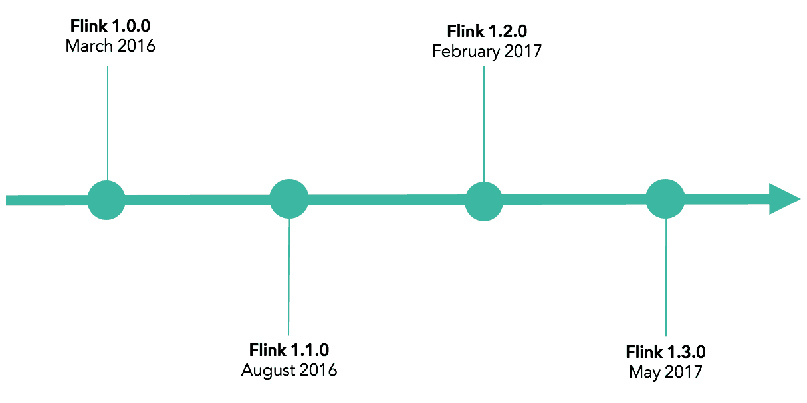
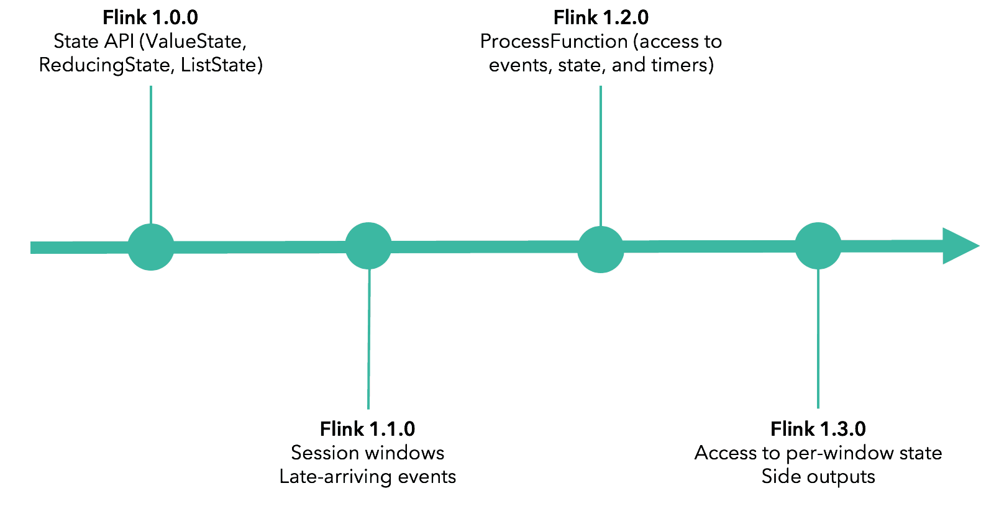
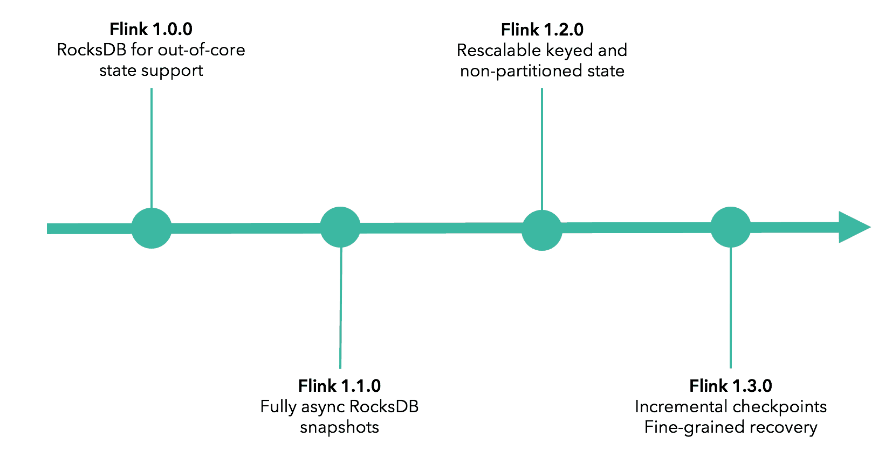
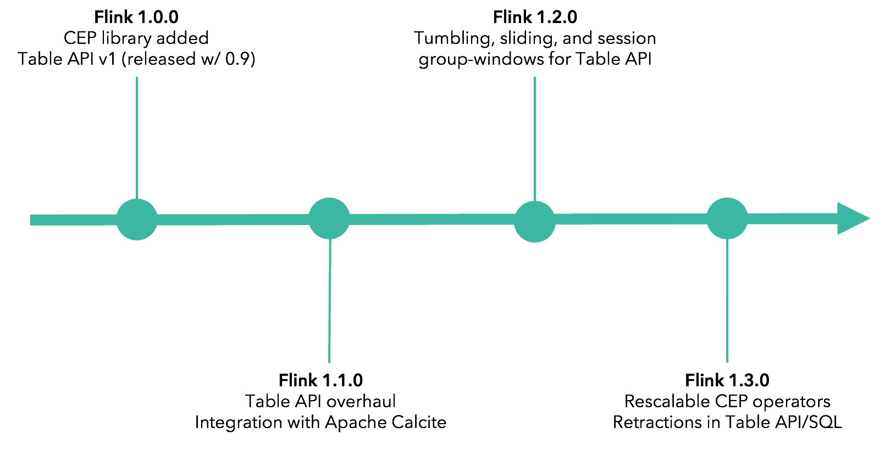
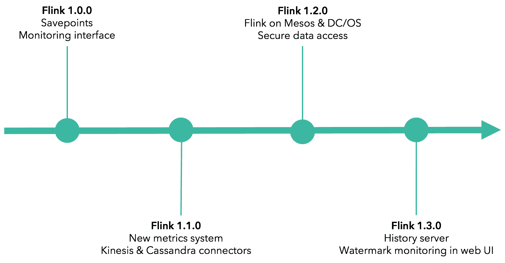
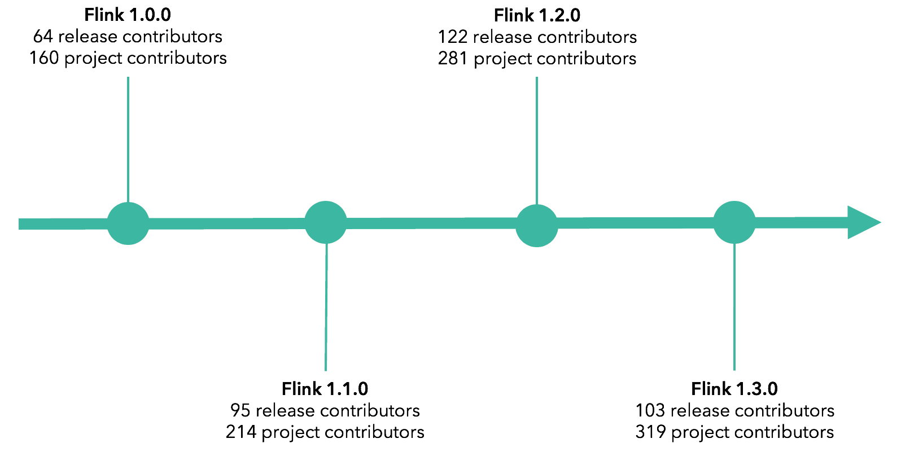

原文 url:	https://data-artisans.com/blog/apache-flink-1-3-0-evolution-stream-processing

# Apache Flink® 1.3.0 and the Evolution of Stream Processing with Flink

[June 1, 2017](https://data-artisans.com/blog/2017/06/01) - [Apache Flink](https://data-artisans.com/blog/category/apache-flink) , [Flink Features](https://data-artisans.com/blog/category/flink-features)
[Michael Winters](https://data-artisans.com/blog/author/mike)
[announcement on the project site](http://flink.apache.org/news/2017/06/01/release-1.3.0.html)
[changelog](http://flink.apache.org/blog/release_1.3.0-changelog.html)

- Applications that go beyond analytics and act on data in real-time
- Applications running at large scale and with very large state
- Applications with a more diverse set of Flink users who require higher-level APIs for interacting with Flink
- Applications that run 24/7 on modern container infrastructures

[APIs for Event-driven Stream Processing](#event-driven)
[Scalability and Large State Handling](#large-scale-state)
[Beyond the DataStream API: High-level & Domain-specific](#table-sql-cep)
[Application Management, Deployment, and Ecosystem](#manage-and-deploy)
[Open Source Community Growth](#community-growth)

## APIs for Event-driven Stream Processing

[applications that act on insights from analytics in real-time](https://www.youtube.com/watch?v=Do7C4UJyWCM&t=438s&index=3&list=PLDX4T_cnKjD2UC6wJr_wRbIvtlMtkc-n2)
[Flink Forward San Francisco in April](https://data-artisans.com/blog/flink-forward-sf-preview-anomaly-detection-mux)

- **Flink 1.0.0** introduced the current state API with ValueState, ReducingState, ListState, and more.
- **Flink 1.1.0** added first-class support for session windows, enabling users to generate windows based on periods of inactivity (representing the end of a “session”) as well as support for late element handling.
- **Flink 1.2.0** introduced ProcessFunction, a flexible operator that provides access to all of the key building blocks of streaming applications: events, state, and timers without imposing a mode of thinking around windowing or CEP.
- **Flink 1.3.0** provides access to per-window state, a feature that greatly increases the utility of ProcessWindowFunction, as well as side outputs, which make it possible to remove corrupted input data while preventing a job from failing and also to remove sparsely-received late-arriving events.

## Scalability and Large State Handling

[increasing size of state and the scale of data processed by Flink applications](https://www.youtube.com/watch?v=Sm5nHu7Mfsk&list=PLDX4T_cnKjD2UC6wJr_wRbIvtlMtkc-n2&index=28)

- **Flink 1.0.0** added RocksDB for out-of-core state support, enabling active state in a streaming program to grow well beyond memory.
- **Flink 1.1.0** added support for fully asynchronous snapshots for RocksDB.
- **Flink 1.2.0** added support for rescalable partitioned (keyed) and non-partitioned state, meaning that a user can restart Flink a job with a different parallelism via a [savepoint](https://ci.apache.org/projects/flink/flink-docs-release-1.3/setup/savepoints.html) *without* losing state. This allows for easily scaling a stateful job to more machines.  
- And asynchronous checkpoints for RocksDB were enabled by default in Flink 1.2.0, reducing the time an operator is not processing incoming data to a minimum.
- **Flink 1.3.0** introduces incremental checkpoints for RocksDB, allowing users to take a checkpoint of state updates only since the last successful checkpoint. This is a meaningful performance enhancement for jobs with very large state–early testing of the feature by production users shows a drop in incremental checkpoint time from more than 3 minutes down to 30 seconds for a checkpoint–because the full state does not need to be transferred to durable storage on each checkpoint.  
- Flink now also has support for asynchronous checkpoints for all state backends. 
- 1.3.0 also adds beta support for fine-grained recovery, meaning more efficient recovery from failure by reducing the amount of state transferred upon recovery.

## Beyond the DataStream API: High-level & Domain-specific APIs

- **Flink 1.0.0** introduced [FlinkCEP](https://ci.apache.org/projects/flink/flink-docs-release-1.3/dev/libs/cep.html) , and the first version of Flink’s Table API had been added in Flink 0.9.
- **Flink 1.1.0** included a Table & SQL API overhaul (along with an [Apache Calcite](http://calcite.apache.org/) integration).
- **Flink 1.2.0** added several Table API & SQL features, including tumbling, sliding, and session group-window aggregations as well as SQL support for more built-in functions and operations, such as EXISTS, VALUES, LIMIT, and more.
- **Flink 1.3.0** Flink 1.3.0 delivers, among other things, support for retractions from [Dynamic Tables](http://flink.apache.org/news/2017/04/04/dynamic-tables.html) as well as many new aggregation types (e.g. SQL OVER windows, GROUP BY windows, user-defined aggregates) for the Table & SQL API and a number of new CEP operators, which are also now rescalable.

## Application Management, Deployment, and Ecosystem

- **Flink 1.0.0** introduced savepoints, a feature that greatly eases the management of long-running Flink applications. Savepoints enable code updates, framework upgrades, A/B testing of different versions of an application, and more–all without losing application state.
- **Flink 1.1.0** added a new metrics system as well as connectors to Amazon Kinesis and Apache Cassandra, two widely-used source / sink systems.
- **Flink 1.2.0** added first-class support for Apache Mesos and DC/OS and the ability to authenticate against external services such as Zookeeper, Kafka, HDFS and YARN using Kerberos.
- **Flink 1.3.0** introduces a history server, making it possible to query the status and statistics of completed jobs that have been archived by a JobManager, as well as web UI tooling to help with the diagnosis of watermark issues.

The Flink community continues to work on a major refactoring of the internal deployment abstractions as part of the
[FLIP-6](https://cwiki.apache.org/confluence/pages/viewpage.action?pageId=65147077)
effort. The effort was started after Flink 1.1.0 and will be finalized with Flink 1.4

## Open Source Community Growth

[Flink 1.0.0 release announcement](http://flink.apache.org/news/2016/03/08/release-1.0.0.html)
Note that Flink 1.1.0->1.2.0 spanned 7 months, while Flink 1.2.0->1.3.0 spanned only 4 months. 

[become a contributor](http://flink.apache.org/how-to-contribute.html#contribute-code)
[via the community mailing list](http://flink.apache.org/community.html#mailing-lists)