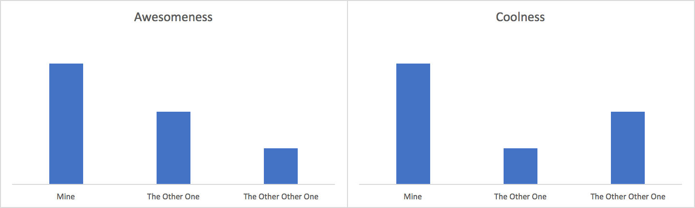

原文 url:	https://data-artisans.com/blog/on-designing-a-stream-processing-benchmark

# On Designing a Stream Processing Benchmark

[July 27, 2017](https://data-artisans.com/blog/2017/07/27) - [Flink Features](https://data-artisans.com/blog/category/flink-features) , [Resources](https://data-artisans.com/blog/category/resources)
[Stephan Ewen](https://data-artisans.com/blog/author/stephan) , [Kostas Tzoumas](https://data-artisans.com/blog/author/kostas) and [Michael Winters](https://data-artisans.com/blog/author/mike)
**Update December 18, 2017:** We wrote a [follow-up blog post about stream processing benchmarks](https://data-artisans.com/blog/curious-case-broken-benchmark-revisiting-apache-flink-vs-databricks-runtime) that goes into more detail about the issues we see with common benchmarking methods. It serves as a useful addendum to this first post. 
 
 There comes a time in the life of every stream processing project when its contributors must decide, “Are we here to solve previously-unsolvable production problems for our users, or are we here to write blog posts about benchmarks?” 

Before we go any further, we should come clean: we’ve indulged in our share of benchmarketing over the years. It’s certainly satisfying to measure a couple of performance metrics out of context and free from the inconvenient realities that accompany any large-scale streaming application in production. Even better: it doesn’t matter whether the benchmark actually captures the nuanced features that enable real-world use cases. Nuance is messy; it’s difficult to put nuance into a pretty bar chart or to convey it in 140 characters. 

That’s not to say that “traditional” performance metrics like throughput and latency don’t have a place in stream processing. Quite the contrary: in the
[2016 Apache Flink® user survey](https://data-artisans.com/blog/flink-user-survey-2016-part-1)
, the Flink community identified throughput and latency as their two most important evaluation criteria when deciding on a streaming framework. 

Alibaba, who’s running Flink on thousands of machines in production,
[also considered low latency to be a key attribute](https://data-artisans.com/blog/blink-flink-alibaba-search)
when they chose a stream processor. 

And performance is a must-have for Netflix, whose Flink-powered
[Keystone streaming platform processes 1.3 trillion events per day](https://youtu.be/sPB8w-YXX1s?t=28m3s)
(or, for those of you keeping score at home, 15 million events per second). 

But after thousands of collective hours spent responding to issues on the Apache Flink mailing list and working closely with companies of all sizes to bring Flink applications into production, we’ve come to learn that there’s only one “benchmark” that really matters: whether or not Flink provides reliable, business-critical stream processing solutions that otherwise wouldn’t be possible. 

Let’s illustrate this idea with an example. When the team at Alibaba let us know that they saw a
[30% increase in search conversion rate](http://www.dataversity.net/year-blink-alibaba/)
on Singles’ Day in 2016 (a day on which the company recorded $17.8
*billion*
in gross sales), and that this increase was made possible by Flink-powered real-time training and updating of search ranking models, we had identified a meaningful benchmark, a benchmark representative of real-world impact. 

In that spirit, here are some of the other “benchmarks” that we think about at data Artisans.

## **When s*** hits the fan, the stream processor should always have you covered**

A large number of Apache Flink users build
*stateful*
stream processing applications–that is, applications that remember information about past input that can be used to influence the processing of future input. State is a fundamental, enabling concept in stream processing that is required for a majority of compelling use cases. 

That’s why the Flink community has invested heavily in making
[Flink state fault tolerant](https://ci.apache.org/projects/flink/flink-docs-release-1.3/concepts/programming-model.html#checkpoints-for-fault-tolerance)
and ensuring that Flink applications provide accurate end results and maintain exactly-once semantics, even when machines fail, or jobs fail, or external services fail. 

*How do we benchmark this?*

 When we hear
[user stories like this one from MediaMath](https://data-artisans.com/blog/apache-flink-at-mediamath-rescaling-stateful-applications)
, who relied on Flink’s support for rescalable state to recover effortlessly–and with complete integrity of their data–from an extended AWS downtime, thus delivering on the promises they’d made to their own customers. 

## **An application’s business logic should be limited only by developer creativity…**

Flink’s APIs enable a new class of event-driven, real-time applications. The community has long made it a priority to provide APIs that are not only powerful and flexible, giving
[low-level access](https://ci.apache.org/projects/flink/flink-docs-release-1.3/dev/stream/process_function.html)
to the core building blocks of a streaming application, but that are
[also enjoyable to develop with](https://twitter.com/kovasb/status/781247485725466624)
. 

*How do we benchmark this?*

 When Global 500 banks like ING describe how they’re able to protect their customers by
[updating their fraud detection models in real-time](http://sf.flink-forward.org/kb_sessions/streaming-models-how-ing-adds-models-at-runtime-to-catch-fraudsters/)
and enterprise software companies like BetterCloud share how they delivered
[dynamic alerting features for their users without making compromises in quality](https://data-artisans.com/blog/bettercloud-dynamic-alerting-apache-flink)
.

## **…but not everyone who needs streaming is ready to write Java/Scala code**

The Flink community has made significant progress this year on the
[Table and SQL API](https://ci.apache.org/projects/flink/flink-docs-release-1.3/dev/table/index.html)
, bringing the benefit of stream processing to a much broader audience. SQL is one of the most (if not
*the*
most) widely-used data analytics languages in the world, and the community has recognized that making Flink accessible to a more diverse user base is one of the most effective ways for the project to deliver value. 

*How do we benchmark this?*

 When Uber discusses how it built a
[SQL-powered stream processing platform](http://sf.flink-forward.org/kb_sessions/athenax-ubers-streaming-processing-platform-on-flink/)
to get Flink into the hands of teams beyond engineering and when
[King rolled its own Flink-powered analytics system](https://data-artisans.com/blog/rbea-scalable-real-time-analytics-at-king)
to provide real-time insights for data scientists (at a scale of
[40 billion events per day](https://berlin.flink-forward.org/kb_sessions/building-and-operating-large-scale-streaming-applications-at-king/)
).

## **It’s a big world out there (but don’t be scared)**

At this point, running seamlessly in a range of modern deployment environments is a baseline requirement for a stream processor. Or,
[to echo the sentiment of an esteemed colleague](http://www.zdnet.com/article/kafka-the-story-so-far/)
in the open source streaming space: building a stream processing application should be just like building any other application, and deployment should be handled by an external resource management layer.
And so Flink supports a range of different deployment options, be it
[YARN](https://ci.apache.org/projects/flink/flink-docs-release-1.3/setup/yarn_setup.html)
,
[Mesos & DC/OS](https://ci.apache.org/projects/flink/flink-docs-release-1.3/setup/mesos.html)
,
[Docker,](https://ci.apache.org/projects/flink/flink-docs-release-1.3/setup/docker.html)
[Kubernetes](https://ci.apache.org/projects/flink/flink-docs-release-1.3/setup/kubernetes.html)
, and more. 

But the stream processing ecosystem touches on much more than deployment, and the ability to get data in and out of the streaming application efficiently and in a range of scenarios is just as important as the capability of the application itself. Hence the thorough collection of
[streaming connectors](https://ci.apache.org/projects/flink/flink-docs-release-1.3/dev/connectors/index.html)
that are a part of the Flink project. 

*How do we benchmark this?*

 When leading infrastructure companies like Mesosphere
[invest in support for Flink](https://data-artisans.com/blog/apache-flink-on-dcos-and-apache-mesos)
and when global enterprises like
[Dell/EMC build Flink connector support for their own streaming storage products](http://www.cio.com/article/3204919/analytics/streaming-analytics-use-cases.html)
(also including Flink at the heart of their own streaming platform), ensuring that users will be able to build and run applications with Flink in just about any environment out there.

## **Closing Thoughts**

Pushing the envelope in what is possible in stream processing has always been at the heart of Flink’s mission, and as members of the community, we can proudly say that Flink has played a leading role in defining what stream processing is today. A few examples:

- Suggesting and being the first framework to provide fault tolerance based on asynchronous snapshots to stream processing
- Introducing snapshots as a tool for users to upgrade, [migrate](https://data-artisans.com/blog/apache-flink-at-mediamath-rescaling-stateful-applications) , [reconfigure](https://data-artisans.com/blog/savepoints-part-2-updating-applications) , clone, or roll back streaming applications.
- Supporting one of the first open-source implementations of stream processing with event time and watermarks (shout-out to [the dataflow model](http://www.vldb.org/pvldb/vol8/p1792-Akidau.pdf) for the inspiration)
- Making very large state efficiently and incrementally checkpoint-able using interweaving checkpoints, state lineage, and RocksDB’s LSM structure
- And also making state smoothly rescalable by large factors, using logical key-groups rather than physical partitions
- Being at the forefront, along with other frameworks, of defining and implementing SQL as a streaming language

All of that is really exciting. 

But as long as Flink users are asking questions on the mailing list and creating JIRA issues with suggested improvements based on their real-world experience with Flink, we can be certain that we still have work to do–because we’re still short of our benchmark. 
Tags: [apache flink](https://data-artisans.com/blog/tag/apache-flink) , [benchmarks](https://data-artisans.com/blog/tag/benchmarks) , [stream processing](https://data-artisans.com/blog/tag/stream-processing)